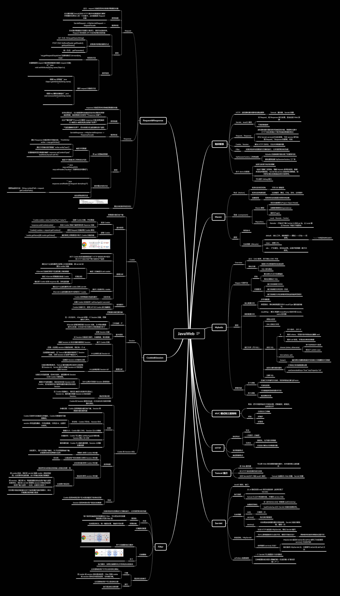
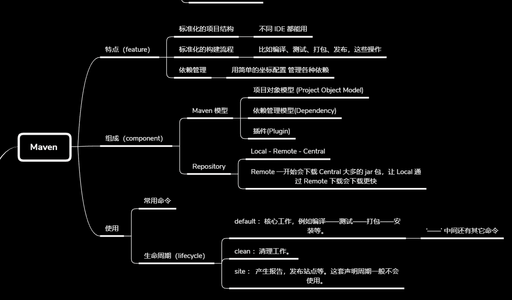
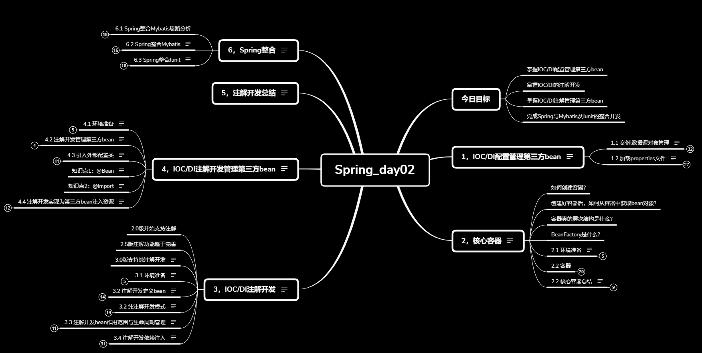

---

title: mindmap 分享
date: 2022-10-25
abstract:  
tags:

---

# mindmap 分享

## 前言

介绍两种笔记形式

列表笔记：如 markdown 文件

思维导图笔记：如 xmind 文件

-   缩小形式：总览知识体系

    -   

-   放大形式：聚焦知识块
    -   

2022-10-24

## 使用方法 1：

-   写 markdown， 写完导入软件输出思维导图
-   学习感悟和 mindmap 的作用：
    -   发现自己对前面知识的印象模糊了不少，还好复习了一遍，以后的学习要进行阶段复习，这样不仅能温故还能知新，在整体的层次看知识总会有新的收获

2022-10-25：使用黑马笔记有感

## 使用方法 2

-   我可以在学习前，把 markdown 形式的讲义通过生成 mindmap 在学习初形对所学在大体上形成一个大概的认知，了解这知识的体系结构
-   比如最近我在学黑马 SSM 课程，它的讲义条理非常好，我生成 mindmap 后的效果如下图
    

## 我感觉 mimdmap 有用的原因：

-   有很大一部分是因为我在复习，其实对着树形列表笔记也有这个效果，这就是阶段复习的好处
-   再加上 mindmap 的图形知识结构，我们跟容易找到知识间的联系，梳理知识间的关系。

## mindmap 和树形列表笔记的区别

-   mindmap 对比树形列表的笔记，其优点在于，它是一张**很大的图**。
    -   很大的图意味着你可以缩小，从整体观看知识的体系架构；你还可以放大，聚焦一个一小块知识点。
    -   这种放大缩小的速度是很快的，而且在放大缩小的过程中，你还能从图中得到知识与知识间的联系
-   如果是树形列表笔记
    -   你也可以通过目录迅速切换你下聚焦的知识，但这种知识与知识间的联系感没有 mindmap 强烈。
    -   树形列表笔记也可以从目录里看到知识结构，但它仍没有 mindmap 直观

## 树形列表笔记的优点，同样是 mindmap 的缺点

-   mindmap 是不利于记录长篇的文字和图片，因为是图结构，长篇的文字很难分解出子主题后，篇幅仍然很长，是不利于观看的，而列表笔记则不同。
-   当然，我们也有折中的办法。当我们在读长篇文字时，可以提取简短的主题，总结出简短的语句，放到 mindmap 中，这能帮助你在长篇文字里找到并建立知识间的联系，这也是使用 mindmap 的主要方法
