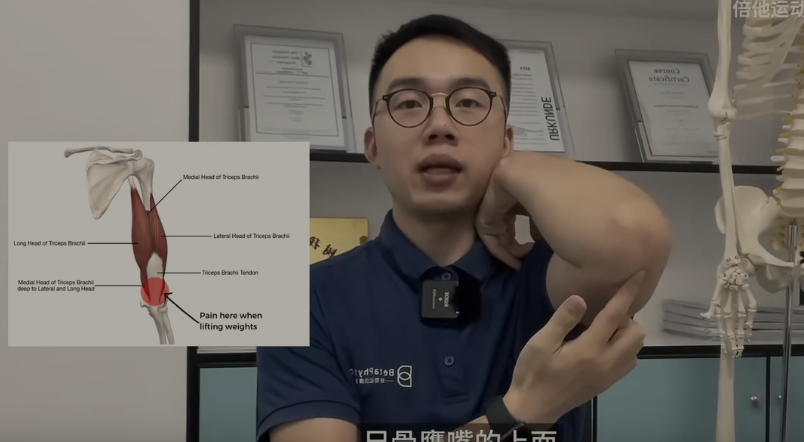
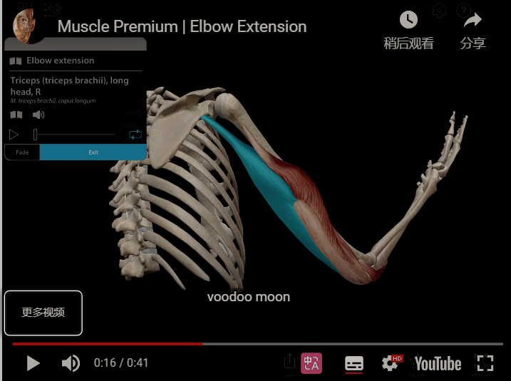
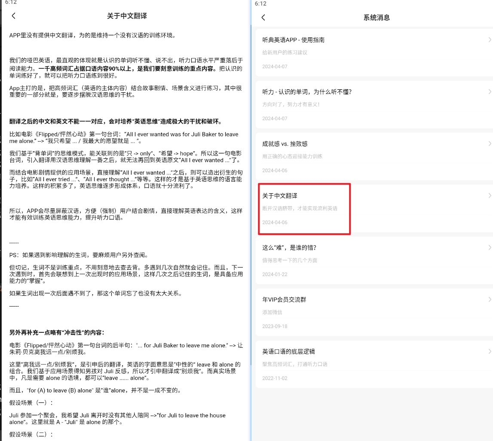
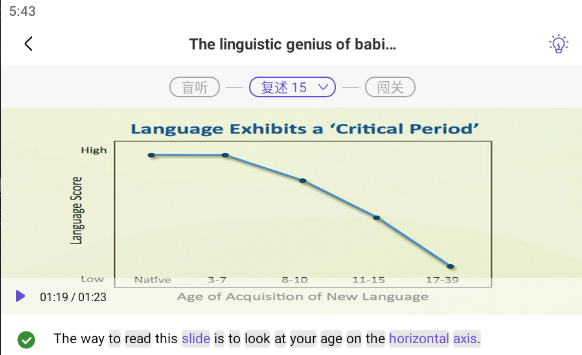

---

title: diary of 2024-6
date:  2024-06-01
abstract:   
tags: 
- 日记
---

# diary of 2024-6

## 2024-06-01

冥想:

时间过得还是很快的，尤其跟着音频，音频时长比平时训练时间短

今天的冥想技巧也新鲜，是旧的知识进行新的组合

增加笔记 [48【跟练】W4-别忘了放松](/posts/冥想/李冉14天冥想笔记.md#_48【跟练】W4-别忘了放松)

明日计划

-   [x] ~~2024-06-02~~ 自我引导 W4-别忘了放松-2

    -   接纳自己的能力、水平，找到平常心，享受冥想的过程
    -   身体扫描——结合专注和开放的冥想 15m——放松——慈心
    -   要点: 轨道的选择

---

英语:

精听 15m

真全是长难句，慢慢来吧，也是锻炼的机会

阅读漫画 15m

---

运动:

俯卧撑 11m

11 12 10 10
做俯卧撑的时候，右肩前束肌肉会痛，不敢多做。

40 40 40 40

## 2024-06-02

冥想:

19m

这个练习方法比想象中难，很自由，但也因为自由而感觉到没有重心，也更加容易走神。

前面我一直都在想着，就随注意力决定吧，注意到哪条轨道就去关注哪条轨道，但其实没想到自己轨道**切换得非常频繁**，而且念头这条轨道经常会时不时的闯进来，有时候你就被念头带走，你就走神了

这个平时练习不一样，他没那么自由。比如我练专注呼吸，走神了，我还是返回到呼吸，再走神，或被身体感受打扰了，我还是回到呼吸，没有接触新事物，处理新事物的消耗。

这么一想，其实我生活中也是，经常**被这种切换消耗**精力、专注力、注意力。比如学习间歇偶尔打开社交平台，从学习切换到社交平台；逛社交平台时，信息太碎片，又切换到下一个信息。还有很多类似的事情

但好的一点是，虽然走神、念头不少，但大部分走神我都能较早意识到，某些还能在很早的察觉到并且快速溯源，可能这也是练到了一些东西的，大脑有点改变了

明日计划

-   [x] ~~2024-06-03 14:41~~ 自我引导 W4-别忘了放松-3

复习 33【讲解】冥想的核心技术 No4 慈心
感觉很受用

---

英语:

精听 15m

听典 app 的手动修改有点痛苦，今天听的本身都是长难句，看起啦进度慢了很多

阅读漫画 35m

---

运动:

篮球 17m 33 个球

还是老问题，新姿势因为缺乏力量所以姿势不稳定。但今天投的时候还是比较追求整体感觉，所以也进了两个三分，还是比较开心的

下次的话就不要一直投中间的角度了，投完了就换下一个角度，不管命中率多低。还是要追求一下新鲜感的

俯卧撑 13 13 13

---

推荐一个视频和一个 up 主

[Calvin 歌唱小教室](https://space.bilibili.com/519910480)，可以帮助推开流行歌人声的大门，视频看下来确实调动了我对听流行歌、唱流行歌的好奇心、兴趣

【记一次躁郁症发作】 https://www.bilibili.com/video/BV1c14y1y75n/?share_source=copy_web&vd_source=cb804c92cb9aca2966f586712caac3aa

精神疾病是很困难的，感兴趣可以了解一下。这也是一个勇敢的 up，暴露这一面在网上

另外，即使正常人也很容易陷入情绪里面拔不出来，基于此我猜测患有精神疾病的一种比较难受的程度会表现成: 失去了肢体和面部了 + 情绪也控制不住了 + 内心的痛苦 + 身体的病痛 ，表现的这么反常 失控的样子。

还是要多一点理解和包容，愿他们多点安详和快乐。

## 2024-06-03

感悟:
如果自己不珍惜时间，把时间和注意力管理起来，而且放任自己的话，那么时间就真的过得很快，离你而去

---

冥想:

2024-06-03

20m

冥想很好，从刚刚坐下来那一段时间就能感觉到了，我想我能明显感觉到**注意力从外转向内**，不再被信息牵着走，开始关注自己内心有什么，然后再到关注自己要什么，然后再进行到今天的冥想练习。 这种向内的关注太少了，我经常就被外部信息牵着走，尤其是平时一直使用到浏览器，打开网页，手机又在身边。

音频选择:
什么声音都没有。会拉近你与周围环境的距离，其实也挺好的，我现在挺享受静静坐着闭眼感受环境

白噪声定时关闭。可以加新鲜感，当冥想环境长久不变时；还可以帮助稳定杂念，减少外部干扰，比如我专注到白噪声声。

另外今天实践: 一是建议不要选择两段以上不同的白噪声做循环播放，一段白噪声单曲播放就好了；二是选尽量简单的音乐，减少联想

明日计划

-   [x] ~~2024-06-04 07:45~~ 自我引导 W4-别忘了放松-4
    -   接纳自己的能力、水平，找到平常心，享受冥想的过程
    -   身体扫描——结合专注和开放的冥想 15m——放松——慈心
    -   要点: 前半段专注选择一条轨道先，让心静下来，等到一个好状态，再去做自由轨道的练习，自由轨道倾向练杂念，因为想让自己生活中的走神也少一些，察觉念头的能力更强一些

---

英语:

精听 15m

**听力训练也是很注重答案的反馈**，但这个是基于经过盲听练习的前提，而大部分人看视频都直接看字幕，相当于不做题直接看答案，所以听力练习效果很差

盲听后再看字幕，看了字幕再听一遍音频。基于语音信息和答案（字幕信息）这两个信息，你对于这个发音的掌握程度就上升了。

所以盲听时听不懂也不用难过，你对了答案后听力水平肯定上升了，每次积累一点，随时间推移能听到的会越来越多，这也是我最近练习听力的感觉

关于答案反馈这个概念可以参考 【【寻径 08】什么才算有效训练，为何一看就“会”，却一做就“废”？】 https://www.bilibili.com/video/BV1KM4y1P7U3/?share_source=copy_web&vd_source=cb804c92cb9aca2966f586712caac3aa

然后这是我关于这套视频的[笔记](https://www.bilibili.com/opus/832102406970933288)，以后有时间了也整理到博客上

---

运动:

俯卧撑 12m

20 12 10 10

7

40 45 40 40

这次俯卧撑的发力感觉好了很多，感觉没有什么短板，是比较整体的发力，后面也是各肌群一起累的

---

视频推荐

【vlog | 趁着闺蜜妈妈不在家，偷溜出来和她体验北京夜店蹦迪夜生活，没想到。。。】 https://www.bilibili.com/video/BV14N411Y7ov

讲了一些酒吧的东西，看的挺快乐的，确实很有活力啊，年轻人

## 2024-06-04

冥想:

23m

放松一分钟的时候，想到了一个比较有意思，好用的想象。想象自己是一个雕像，一切都静止了，连思考也暂停了自己就像一座雕像一样，以这种状态在休息，一些身体活动休息了，念头也休息了，只有呼吸在运动着，**一尊坐着的呼吸着的雕像**
这样搞还真的比较容易放空自己，达到什么都不想的放松效果。

遇到念头比较多的时候，还是需要一段时间去静下来，让风暴的念头、信息平静下来。所以这个静下来的练习，**仍有很长的路**，还是要多练才手熟。生活中也一样

找到了一个好用的[定时器网页](https://clockcn.com/jishiqi/#countdown=00:15:01&enabled=0&seconds=0&sound=custom&loop=0)，有以下好处

-   可选择铃声不重复
-   可自定义铃声
-   可快速测试铃声，调整到合适的音量
-   显示逾期时间

有这个我暂时就不用自己写个小程序了

有个靠谱的定时器的话，在铃声响过后，我基本是有意识的，知道已经过了 xxx 时间。然后我可以根据状态和当时有无要事，**自由的决定是否继续冥想**。 比如这次我就多坐了 8min，这比我感官预计上的时间长，一下子 8m 就过了，但效果也是有的

明日计划

-   [x] ~~2024-06-05 09:06~~ 自我引导 W4-别忘了放松-5
    -   接纳自己的能力、水平，找到平常心，享受冥想的过程
    -   身体扫描——结合专注和开放的冥想 15m——慈心——放松
    -   用定时器网页
    -   要点:
        -   前半段专注选择一条轨道先，让心静下来，等到一个好状态，再去做自由轨道的练习，自由轨道倾向练杂念，因为想让自己生活中的走神也少一些，察觉念头的能力更强一些
        -   先平静下来，再去坐等待念头的练习，等待念头时开放式的注意四条轨道，不拘束，保持开放，也等待念头上门

复习 35【讲解】平衡理性与感性
分享一句话 “与人为敌，痛苦的是自己”，即使是因为上网看到了博主和评论区的网友，然后产生了想对抗的负面情绪，其实这样不值得，没必要太过反对和起情绪，确实痛苦的是自己。另外坏人和说出不好的话的人本身也有自己痛苦的原因，可以尝试理解，也就是起心动念时多一层多别人的理解，少一点对别人的评价和指责

---

英语:

精听 15m

还是难的，但没办法，一句句练吧，花了不少时间才复述成功一个难句后，就先放过，不要再花更多时间在一个句子上了

---

运动:

打篮球 41 球 spot 2-3

今日姿势的稳定性明显提升了，肩部和鼻子两个举球轨迹都是

今日明显卡在了 spot1-4 和 2-3。前面是**三分力量不足**，还是靠肩部举球轨迹才投成功 4 个三分；后面是姿势稳定性下降，一直打铁，也可能和状态下滑、细节丢失有关

不管命中率，投完了就换下一个角度。今天感觉这种训练方法也很好

    ***

俯卧撑
14 12 13

今天的意外之喜，做手掌俯卧撑的时候，右手腕没有因被动不足出现疼痛。

---

阅读:

读 意志力 25m

今天再次感受到读书的快乐，
获得新知识的快乐，感觉自己变新了，
投入书中，被书里有趣的东西逗乐。

## 2024-06-05

冥想:

22m

这次冥想的前半段，还是**常见的要接纳那些身体痒的感觉**，累的感觉，酸的感觉，多少要用到一些意志力的（最近看了意志力这本书），当然可能是有一定练习时长，我现在这个耐受的能力比开始练习冥想强很多了，这次也是接纳着，默默感受，然后等待这些感觉发生变化

有点可惜的是，这次冥想在我把状态调到最好后，没过一两分钟吧，15 分钟就结束了，那个时候状态非常平静，也在等待一个念头，四条轨道的注意力切换也很自由。 其实上面写的这一段就是我在做慈心练习前遇到的最后一个念头
如果我的冥想长期都能稳定到这种状态的话，我感觉我的练习时间的可能可以拉到 30-35m。

明日计划

-   [x] ~~2024-06-06 08:35~~ 自我引导 W4-别忘了放松-6
    -   接纳自己的能力、水平，找到平常心，享受冥想的过程
    -   身体扫描——结合专注和开放的冥想 15m——慈心——放松
    -   要点:
        -   前半段专注选择一条轨道先（推荐呼吸，这个我擅长且好用），让心静下来。等有了一个好状态，再去做自由轨道的练习，自由轨道倾向练杂念，因为想让自己生活中的走神也少一些，察觉念头的能力更强一些

---

英语:

精听 17m

感觉有点适应这个长度的句子的训练强度了

漫画 15m

---

运动:

运动让人一身轻。虽然俯卧撑刚做完之后，肌肉还是有点痛苦，但是熬过这一小段时间就会感受到 refreshing 的感觉，运动值得

打篮球 19m 31 球 2-3

还是卡在了 1-4 和 2-3
1-4 三分球 二十七中五
拍摄时 2-3 14 中一

-   [ ] 录像分析一下两个姿势，感觉好不稳定

    ***

俯卧撑三个 13

## 2024-06-06

感悟: 不重要的东西，脑子过一遍就好，只有那些重复出现的东西才值得思考并记录

---

冥想:

19m

状态一般偏差的一次冥想

下次醒来还是不建议打开手机，还是直接冥想比较好

明日计划

-   [x] ~~2024-06-07~~ 自我引导 W4-别忘了放松-7
    -   接纳自己的能力、水平，找到平常心，享受冥想的过程
    -   身体扫描——结合专注和开放的冥想 15m——慈心——放松
    -   要点:
        -   前半段专注选择一条轨道先（推荐呼吸，这个我擅长且好用），让心静下来。等有了一个好状态，再去做自由轨道的练习，自由轨道倾向练杂念，因为想让自己生活中的走神也少一些，察觉念头的能力更强一些
        -   心不静下来的话，以我现在的水平很难做到在四条轨道里稳定的切换而不迷失
-   [ ] 祈祷冥想

今天还尝试了祈祷冥想，感觉适合现在的我，得搞点能量了
决定加入接下来一周的训练里

---

英语:

精听 19m

今天的听力练习体验也不错

复述时放慢语速和节奏，让自己边思考组织语言边说，会让复述更流畅一些

有时发呆了，点开 app 练上几句的体验也不错。反正手机现在也没有什么娱乐 app 了

    ---

第一次尝试 cambly 30m 的课程

惊喜的，也有有意思。有一些新的认知

---

运动:

篮球 17m

32 球 2-3

1-4 20 中五

整个训练只有两次觉知到向前请个问题。这问题到了 1-3 1-4 2-3 这几个点会影响我的命中率

2-3 这个点本来就很易打铁，然后今天那个球场他篮筐本身就是有点歪的，左边那个框

多次不中后，可以停下来思考一下。
今天 1-4 就是反省出左手稳定技巧，才改善了投篮

    ---

俯卧撑
13 13 13

在瓷砖做俯卧撑的话容易出汗，就影响手掌的抓地力

窄距靠后的俯卧撑相对于宽距，对我右手掌，右手腕的稳定性要求会更高一些
如果我用瑜伽砖的话，根本就不可能出现右手腕疼痛发力受阻的情况。
现在也就因为俯卧撑强度低，所以疼痛可以忽略不计，希望这样子的强度可以让右手腕适应过来

## 2024-06-07

感悟:
把时间留给最重要的事情，找工作。 还有自私点，**把时间留给自己**，而不是社交平台、群聊信息、评论区等各种不重要的信息

---

冥想:

21m

这次冥想杂念很多，杂念大部分都是关于英语口语的学习，那也和我昨天晚上到凌晨还有刚醒来之后投入太多时间在英语口语学习上面导致我现在的状态有点接近于把英语口语学习融入生活的脑袋，大部分的 CPU 都在处理这件事情，比如我今天就很大部分时间想着翻译，因为英语没有汉语熟练，所以我用英语自我引导做调整时，我还要分一部精力去找词，组句，因为我不知道对应的英语表达，脑袋的哈希表没有储存这部分表达，我检索的很慢，以至于我要调用一个中译英的接口尝试找到这个表达，这就让我更分神了

所以当我尝试冥想的时候，我要花更多的精力，是让自己平静下来，找到专注、觉知和自我控制的感觉

其实将 xx 融入生活是一种很好的做法和状态，但如果 xx 不是你想要的方向，这就很苦恼了。比如我冥想的时候想 empty my mind，远离外界信息（一开始是互联网信息，他人的信息，后面是自我的杂念），探索内心，但 `将xx 融入生活` 就是那个“自我的杂念”，这个太难平静了。

关于解决的方法。一是起床后什么信息都别接触，直接冥想，这次就是手贱去点开了英语口语的学习；二是多练，冥想也是技艺，熟能生巧；三是用好默念的力量，他比你单纯的专注复习会更好用一些

During my meditation this time, I had a lot of distracting thoughts, **most of which were about learning spoken English**. This is because I spent too much time on English speaking practice from last night until early morning and right after waking up, which has led me to almost obsess+ over integrating English learning into my daily life, even during my meditation. Most of my **brain's CPU** is focused on this matter.

For example, today, I spent a lot of time thinking about translations because I'm not fluent in English like I am in Chinese. So, when I try to adjust myself using English self-guidance, I also have to spend some energy searching for words and constructing sentences because I don't know the corresponding English expressions.

My brain doesn't store these expressions in the commonly accessed memory areas, so I have to search for the expressions I need in the less frequently used memory regions, which slows down my retrieval process.

Sometimes, I even have to use a Chinese-to-English translation tool in my mind to find the right expressions, which further distracts me.

Therefore, when I attempt to meditate,** I need to exert more effort to calm myself down**, find the feeling of focus, mindfulness, and self-control.

`Integrating something into your life` is usually a good practice and state of being. However, if that something is not what you desire, it can be distressing. For instance, when I meditate, I aim to empty my mind, distance myself from external information (initially from the internet and others' input, later from my own distractions), and explore my inner self. But the concept of 'integrating something into your life' is one of those distracting thoughts that make it difficult to achieve inner peace today.

As for solutions, firstly, I should avoid all kinds of information and **meditate right after I wake up**, but unfortunately, this time I couldn't resist and clicked on English oral language learning. Secondly, practice makes perfect, and meditation is a skill that improves with time. Thirdly, harnessing the power of **silent mental repetition** can be more effective than just focusing on breath

Plan for tomorrow:

-   [x] ~~2024-06-08 11:12~~ 音频【跟练】自我练习（人声）

---

英语:

精听 18m

没办法，难还是难。
但配合上碎片化时间练的几句，这样加起来一天练的也不少了。

    ---

gpt 辅助写日记

-   这里介绍一下方法

-   如果有很多表达都不知道怎么说

    -   把自己想说的话让 gpt 先翻译为英文，然后自己读一遍。把自己不熟悉的表达在 `WordMeaning` gpt 里学一遍；把意思表达不准确的尝试用自己的话去修改，然后发给 `Suggestions for English phrasing.` gpt，尝试得到准确且和适的表达

-   如果能大概用自己的话说出来

    -   直接用自己的话发给 `Suggestions for English phrasing.` gpt，让他帮忙修改，得到更准确和地道的表达

-   If there are many expressions you are unsure of how to phrase and express

    -   Let GPT translate what you want to say into English first, then read it yourself. Learn unfamiliar expressions through `WordMeaning GPT`; if the meaning is not accurately conveyed, try to rephrase it in your own words, then send it to `Suggestions for English phrasing GPT` to get accurate and appropriate expressions.

-   If you could roughly put it in your own words

    -   send it to`Suggestions for English phrasing GPT`, asking for help with modifications, you would get a more accurate and authentic expression.

-   Just try this study method for one week first to see if it works well.

---

运动:

篮球 18 分钟，

33 球

卡在 1-3 1-4 2-3 这三个点
1-4 的问题就是需要的力量大之后，对球方向的控制感就降低，右手还能勉强控制主，但左手就随缘了

Stuck at points 1-3, 1-4, and 2-3.
The issue at point 1-4 is that when a greater force is needed, the sense of control over the direction of the ball decreases. The right hand can still control it reluctantly+, but the left hand just goes with the flow.

俯卧撑

14 14 14

因被动不足导致的右手腕痛的问题还存在
"The problem of right wrist pain caused by insufficient passive movement still exists.

---

阅读:

看回网文 罪恶之城，不记得第几次看这本书了，主要还是想看看流砂

有种感觉，假如我看了一定程度的英语网文，我自然也会积累很多表达。确实 是阅读量会改变阅读能力

还是依旧选择跳读式浏览，只看自己感兴趣的内容。和看三体时一样，但真希望有一天自己看英文时也能这么熟练

## 2024-06-08

感悟:

🎇 不能想太多，做太少。这是我非常明显的缺点，平时要多察觉，拉回来。

社交平台的坏处啊

-   完了，本来要搜一个问题的，但看完一个知乎的回答及评论区之后，忘了自己要搜什么。还是有点难受的，不受控制

---

冥想:

15m

今天冥想状态和效果一般，但有音频引导，其实难度比较简单，而且时长也降低了

Plan for tomorrow:

-   [x] ~~2024-06-09 15:55~~ 音频【跟练】自我练习（自然）-无引导 12m
    -   尝试默念时放大脑中的声音来帮助应对杂念和走神
    -   练呼吸吧，最后来点 meta meditation
    -   从这节笔记中选择一两个要点放入练习
        -   标记来处理专注呼吸时遇到的走神
        -   不管如何在后半段要求自己彻底的专注和投入

增加笔记 /冥想/李冉冥想.md#50【跟练】自我练习（人声）

---

英语:

精听 18 m

最近练的是 `TED Why 30 is not the new 20 by Meg Jay `

继续练吧，今天在复述流畅度和重听细节发音花的时间多了一点，所以影片进度慢了一些。

没办法，句子有点长，然后自己一次只能注意 1-2 个新的发音细节，所以就得听多词，而且复述练习新的发音细节也花时间，所以时间就花的多了

    ---

和 gpt 练了一下口语
尝试了 monkey.app 聊天平台，遇到一个和善有耐心的小哥 来自 Sweden stockholm，聊了一些冥想的东西

感觉创造英语环境还是值得试一下的，毕竟输入越多输出越从容，把英语融入生活应该是从这里着手

---

运动:

打篮球
18 分 40 秒

31 球

1-4 5/16 这是进步的，比较感动。确实是左右手对方向的控制提升了，主要还是左手提升比较明显

后面命中率下降和换姿势有一定关系，1-4 时因为出于兼顾方向控制和力量的想法，我让肩部的举球轨迹更直（这个技巧叫 **近身直线举球**，B 站上学的），接近垂直地面，希望这样能省力，但明显因为熟练度不足，反而命中率下降了。

先把现在的技巧练熟练了，达到一个稳定的命中率且遇到瓶颈后，再练习新技巧吧。

最近确实都下雨，有点可惜

    ---

俯卧撑，3 组 14

真的不敢一组俯卧撑，做太多次数，怕右手腕受不了，现在每次训练到第二组，第三组都感觉到疼的感觉，但训练后恢复的很快

---

阅读

看网文 罪恶之城

看到阿克蒙德的训练营又想起了水花，又想起来了，以前读书的时候看网文产生的后宫的幻想

---

推荐

分享两个关于夜场酒吧的视频。两个视角

【我的夜场人生】 https://www.bilibili.com/video/BV1eT421Y7FQ/?share_source=copy_web&vd_source=cb804c92cb9aca2966f586712caac3aa

【vlog | 趁着闺蜜妈妈不在家，偷溜出来和她体验北京夜店蹦迪夜生活，没想到。。。】 https://www.bilibili.com/video/BV14N411Y7ov/?share_source=copy_web&vd_source=cb804c92cb9aca2966f586712caac3aa

## 2024-06-09

改进:
🎇 我要做减法，我要把时间留给自己，留给找工作

---

冥想:

22m

其实前半段体验不好，主要和音频（【跟练】自我练习（自然））不好用。

-   练到一半还没开始投入进去的时候铃声就响起来了，然后纠结了一回，睁开眼睛一看进度条，原来才过了 7 分钟，然后他好像到 10 分钟铃声又响了一下，感觉就很短了，都没怎么练过就结束了，反正用这个音频不如自己开个闹钟。

念头游戏

-   到冥想后半段的时候，我用等待下一个念头这种技巧来手尾，然后想着自己再等两个念头就结束这次冥想的主要内容。然后练到最后的时候想起来其实这种技巧很像游戏，而且这游戏还挺有意思的，你就搁那保持开放，在这 4 条轨道里随注意力切换轨道，然后等念头来的时候就是像猫抓老鼠一样把他抓住，你抓得越快就说明你游戏得分越高，当然得分也不重要啊，其实更有意思的是你去体验自己这种抓到念头的能力，还有抓到念头的时候，那种当下的感觉是很复杂的，也不好用，言语说出来反正就很有意思。

而且这种能力运用到日常生活里面也很好用，能帮助我解决走神做事容易切换到不重要的事情的问题，这个能力越强，我就可以在做事的时候更多的保持在主线上，然后把途中遇到的一些相对没那么重要的事情，存档搁置下来，来提高自己做事的效率，保证自己时间投入到最重要的事情上

慈心 快乐
这次慈星我还去祝福自己，今晚困的时候就直接躺床，不要硬撑着继续娱乐，祝福自己，今天走神更少，更能专注于工作，祝福自己，找工作一切顺利，这几个定制化的祝福，确实，在祝福之后让我感受到一些**开心的感情**，很微妙的开心，但确实是新的体验，真正感受到了李冉说的类似的那句话，不需要神佛贵人帮忙，自己就能给自己随时补充积极能量

Plan for tomorrow:

-   [x] ~~2024-06-10 07:24~~ 尝试纯静坐 10m 15m
    -   > 建议每个人都试一试纯静坐的体验，也就是不用任何技巧，只是坐着。这就是早期道家和禅宗的练法——只是坐着。 - 李冉
    -   通过分屏（尝试设置两个不重复铃声的**计时器**，测试后，就计时器稳定）

---

英语:
精听 18 m

---

运动:

篮球 21 分钟

里程碑 投完了 2-4

2-4 5/12 很开心
一杆四比较可惜，因为命中率太低了，投了三球三分内的，只投中了两球一杆四

二干四的突破，感觉是因为找到了发力的感觉，出手点的感觉会更低的一点，但是感觉力量传导更顺畅一些，然后左右手的控制力因力量的提升而提升

俯卧撑
五分钟做三个 15 ，

做的满头大汗

感觉这次手掌俯卧撑能力明显提升了，然后右手腕的疼痛也没那么明显

但是遇到一个问题，就是做窄距靠后的俯卧撑时
偏向桡骨方向的右手腕上的骨头会受力更多，然后感到疼痛

-   [ ] 下次出门前带纸巾，运动后擦脸擦手

## 2024-06-10

冥想:

纯静坐 18 min

体验很好，但是今天明显的途中也遇到了很多有意思有价值的念头，这里我就捡几个我现在还记得的说吧

一是其实**其他冥想技巧可能就是来源于纯静坐**，

比如今天练习我只是坐着帮我念头没有什么东西的时候，也没有什么身体上的痛苦，环境也很舒适，这个时候整个人是比较近的，但是你能很明显的发现，你的呼吸是一直在运动的，你的腹部你的胸腔是在活动的，气流一直在你的呼吸道系统里面流动，整个人活的地方很明显能从呼吸中感受到，我猜他就是从这里悟到了，把呼吸作为冥想对象，因为它确实很好

还有就是纯静坐啊，你有时确实会遇到一些身体上的痛苦，比如蚊子叮咬，还有坐的腰酸屁股酸了，那怎么办呢？如果还想维持这个进出的状态，那肯定得想办法，那么一个办法就是接纳，等待变化发生，可能这个痛苦还在那里接纳了，或者随时间推移，痛苦转移了或消失了

说实话，现在暂时也不记得了其它念头了，其实纯静坐一开始念头还比较少，到后面其实是没办法，会遇到念头的，你想到呼吸你就会联想到其他东西，因为你又不用技巧，其实你的专注力确实会降低一些。

然后自己又希望自己能遇到念头时能 go deeper，放下念头，这也是我一个练出来的冥想的习惯，然后很多东西就真的放下了，记不起来了，当然也没事啊，本来冥想这么做也没错。

祝福大家都有从容的心态，把我现在放松，安详的状态祝福给大家。

想起来了一个，提一嘴，就是纯静坐中念头的发生，因为这次的念头整体都在控制内，所以我也没有太过控制，要放下他，然后我在途中就想起来，其实这些念头都是我平时生活里内心深处的一些想法，**其实你去思考这些念头，你就是在探索内心，**

这个好像也是一个名人的冥想方法，忘了名字了。就是不太拒绝推开杂念，就是坐着整理一下自己一天的商业思路什么的，想想自己要什么

另外一个念头就是纯静坐也是**做减法**，前面的练习是做加法，这里就提一嘴吧，不展开了，不然时间又用多了

Plan for tomorrow:

-   [x] ~~2024-06-11 08:31~~ 尝试纯静坐 15m 20m
    -   昨天实践证明 10m 15m，没什么阻力啊，所以想再做多一款，看看有什么新的感受。这也是一种新鲜感，没想到我真的练出新鲜感了

补充:

早餐后回家的路上，感受了一下行禅，也叫正念行走。
发现练过冥想的自己，现在感觉**慢慢的走也很有意思**，有很多丰富的感受，只是慢慢的走着，很有意思，慢慢的走，慢慢的感受。
原来双脚也有这么多感受，这是平时忽略的。
再结合对身边环境的感受 感觉到了走路的快乐。

---

英语:

精听 19 m

---

运动:

2024-06-10

篮球 18m 32 球

1- 4 5/30 又 g 了，但最后几球发力比较舒服，整体动作流畅自然

俯卧撑 4m 3 个 15

## 2024-06-11

感悟:
身体健康是根本，不然其它都开展不了。多注意一下久坐和健康用眼

尝试远离互联网信息的第一天，感觉更 grounded，focused 了，把时间都留给自己

和 gpt 学习某一块知识其实也不是不行，主要是你得能**问出好问题**，而问出好问题的前提是，你有一定**实践经验**，还有相关的**最基础的知识**，有能力去验证，或者理解 GPT 给出的回答

---

冥想:

纯静坐+慈心 21m

今天的状态比较一般，念头也是比较多，感觉都在吃以前的老本，所以才能坐得住，坐的没有太难受。纯静坐还是比较难的，时间一长更是

Plan for tomorrow:

-   [x] ~~2024-06-12 11:17~~ 尝试纯静坐 12m 17m，慈心
    -   再练多几天吧，看什么情况。有什么新鲜的东西，认真堆待就好
    -   另外根据李冉所说，如果练的挫败了，那就停下纯静坐吧，可能就是不合适或时机不到。

---

英语:

精听 19 m

---

运动:

20 分钟 32 球

哪个点命中率都很差，可能眼睛太疲劳是其中一个原因

俯卧撑三个 15

## 2024-06-12

冥想:

纯静坐 20m

虽然身体上是生理上是适应了，但是其实脑子里的念头情况很看状态，如果不用冥想技巧的话，就容易冥想时胡思乱想，进而迷失走神，所以我决定还是给自己的纯静坐加一个要求吧。

Plan for tomorrow:

-   [x] ~~2024-06-13~~ 尝试纯静坐 12m 17m，慈心
    -   留一个心眼，让自己的思维处于更高一层，从更高一层去留意、观察自己的念头，而不是让自己的思维随着念头走

补充:
对下面句子的感悟

> Watch your thoughts, for they become words。
> Watch your words, for they become actions。
> Watch your actions, for they become habits。
> Watch your habits, for they become character。
> Watch your character, for it becomes your destiny。 - 前英国首相撒切尔夫人，

-   洗澡时联想到的这一句，洗澡时我回想到我在路上对陌生人打招呼，可以归为 word 或者 action，其实这很大程度上源于我坚持做慈心的冥想练习，一部分源于我不排斥与人交流的性格，这两个是 thoughts。
-   其实一开始我也没有和陌生人打招呼的习惯，或者跟朋友、熟人告别时祝福他们的习惯，刚接触慈心练习时，我有想过要不要在告别时祝福他人，出口前其实是有点纠结的，但 thoughts 多了，words 就很自然的说出来了。其实现在也有点 habits 的感觉了，期待后面的变化吧。
-   如果可以把这个运用到和父母的沟通上，可能我就真的变了。

---

英语:

精听 18 m

阅读
视觉小说 50m
Avatar: The Last Airbender Season 1 e1-3

---

运动:

15 分钟 35 球

1-4 5/29

后半段回忆起瞄准钩子的技巧，很好的配合压腕技巧。其实这个很适合这个投篮练习，很直接的就能提升 accuracy and consistency，因为投篮角度都是一致的嘛

另外还可以练习自己对钩子的敏感度

三分发力:
发现了还是肩膀出发力稳定和自然，可以尝试把出手点降低，动作做连贯，上下肢发力传导做顺畅，然后在注意一下钩子、压腕和左手细节，三分并不难

俯卧撑三个 15

## 2024-06-13

冥想:

纯静坐 20

今天也是各种杂念不断。
但感觉比昨天进步的地方就是自己确实是有留意自己的念头，留意到自己念头的起源，留意到后让自己拉回来，这是好的。

慈心也是和以前的好处。

继续冥想吧

Plan for tomorrow:

-   [x] ~~2024-06-14 10:34~~ 尝试纯静坐 5 7m 11m，慈心

    -   留一个心眼，让自己的思维处于更高一层，从更高一层去留意、观察自己的念头，而不是让自己的思维随着念头走
    -   试一下更短的冥想，看行不行。这段时间想减少冥想练习和冥想记录的耗时了，后面再恢复回来吧

---

英语:

精听 16 m

完成 `TED Why 30 is not the new 20 by Meg Jay `

阅读
Avatar: The Last Airbender Season 1 e4

---

运动:

篮球 17m
25 球

1-4 5/16 最后几球好像把手肘投伤了，发力没做好，也可能是偷懒了，让手肘负荷过大

玩了一下转胯突破上篮

俯卧撑三个 15

## 2024-06-14

冥想:

纯静坐 12m

感觉已经慢慢适应纯静坐了，知道这个时候应该怎么做。其实就是多和自己相处，静坐时出现的念头里面，分离出那些告诉自己真正想要的，能告诉我是谁的念头，就更了解自己了。
这就很需要自己在冥想中保持**清醒**，不被念头带着跑

今天的时间过得也很快。

Plan for tomorrow:

-   [x] ~~2024-06-15 14:11~~ 尝试纯静坐 6 7m 11m，慈心

    -   留一个心眼，让自己的思维处于更高一层，从更高一层去留意、观察自己的念头，而不是让自己的思维随着念头走

---

英语:

阅读

用 gpt 和词典查 `TED Why 30 is not the new 20` 不懂的意思 20m

Avatar: The Last Airbender Season 1 e5

-   只要去掉中文字幕，留英文字幕，就变成几乎无痛的练阅读了

---

运动:

俯卧撑 10m

15 15 15 13 10
40 40

正常吧，慢慢进步

## 2024-06-15

冥想:

纯静坐 12m

一般的一次冥想，但也遇到了两个新鲜的念头或者我真正想要的东西，也和最近的自己有关

一是状态的迷失和身体健康。其实熬夜娱乐时的状态，和平时干活、冥想后的**两个不一样的状态**，没那么清醒了，也不会很快的把身体健康放到第一位，有点陷进那个状态了。 一个极端的例子就是贤者时间前几分钟和贤者时间刚开始那一刻，这两个时刻是完全两个状态，其实你很难从第 1 个状态拔出来。

所以我现在的一个解决办法是在白天需要干活**避免进入和接触娱乐状态**，尽量减少无用信息的接触，借助冥想的 10 次呼吸和行禅在间隔休息时**维持住好状态**。

二是杂念和注意力。冥想中走神陷进杂念，其实和干活时注意力放松，做了不重要的事情有点类似。 下次遇到再展开说吧。今天写了 5+m 了。

Plan for tomorrow:

-   [x] ~~2024-06-16 12:25~~ 尝试纯静坐 7 7m 11m，慈心

    -   留一个心眼，让自己的思维处于更高一层，从更高一层去留意、观察自己的念头，而不是让自己的思维随着念头走

---

英语:

精听 10m
​

在 monkey.app 聊了一会儿，听力口语水平有限，但也是一次练习英语的激励。

---

运动:

运动还是快乐

篮球

15 分钟，32 个球

1-4，好像是 17 中五来着

-   如果不注意往前跳的话，只是向上跳，感觉会对球的方向有更多掌控力

三个 15 俯卧撑

## 2024-06-16

冥想:

纯静坐 13m

今天过得很快，主要原因时念头多，而且忘了要有一个心眼，有点被念头牵着走了，都是一些昨天的思绪。 第一个钟声响起后才清醒的拉回来

---

英语:

精听 12m
难，不熟悉这个口音和节奏，修改文本也花了时间

Avatar: The Last Airbender Season 1 e6

---

运动:

篮球
16 分钟 30 球

1-3 5/21
1-4 5/12

俯卧撑

十分钟，三个 15，

下次可以挑战一下 16

## 2024-06-17

冥想:

14m 音频跟练 D1-清醒，既是目标，也是起点

身体挺直转换为意识的清醒

所以我日常十次呼吸可以多注意身体挺直的细节。

还有状态低落和迷失也可以通过调整身体，来帮助自己拉回来

Plan for tomorrow:

-   [x] ~~2024-06-18~~ 自己练 D1-清醒
    -   冥想前又改了，改为自由冥想 10m，可以用任何技巧，动态调整。目标是获得清醒，最低限度的技巧是留一个心眼，避免自己的思维随着念头走

---

英语:

精听 10m
时间太短了，就当作维持熟练度了，进步是很难求了

## 2024-06-18

冥想:

自由冥想 11m

冥想可能要学习一下**狗熊掰棒子**，在冥想里面棒子就是念头，而我今天做的明显就是不断的把遇到的念头抛下，不断遇新的然后去清空，然后等到闹铃响起的时候前面丢掉的我基本都会遗忘，或者即使花很大力气去回想，也未必能想起来，然后我现在留下的几根玉米棒子、这几个念头一般来说也是更好的

心眼很好很好用，帮我做到不陷入念头里面，能一直去向前走，go deeper，不断丢棒子。

慈心的效果今天出乎意料。
昨天和我爸在某些事情上观点有冲突，聊、或者争辩了接近半小时吧，虽然我当时情绪算平静，但是我事后能明显感觉到当时我爸是在释放以前积压的情绪，聊到最后我们也未能在最重要的事情达成一致。然后昨天我复盘时，也尝试用理性去理解我爸，也确实成功了。
但今天这种慈心练习其实是偏向非理性的，在我默念这几句熟悉的话语后，我很自然的想起了我爸对我的好，再加上昨天的复盘得到的理解，我从平静面对变到有点感恩我爸，这是我没想到的。**慈心令我柔和，拥有跟多善良，感性的一面**

冥想也好用，坚定了我未来一段时间坚持每日冥想的想法，其实最近跟练练完，第二轮也练过了，不知道练什么来着，但其实抛去冥想技巧，冥想本 ss 身就能带来好处。

---

英语:

精听 15m
难，这个口音确实不适应

这几天练的是 `TED how to speak so that people want to listen`

阅读 10m
只是读了半章英语版诡秘，开始觉得难了。 真的是中英文阅读水平差距好大

---

运动:

10m

Exercise is indeed enjoyable, it refreshes me.

俯卧撑 16 16 16 14
自重深蹲 20 20 20
平板支撑 60

明显感觉到了进步，另外今天这么训练容量确实大了很多

## 2024-06-19

冥想:

自由冥想 12

做完冥想身心舒畅，自我引导的冥想还是挺爽的。

今天又体验到那种眼前变小的感觉，很奇妙。而且这种状态一般来说都会更加静，很容易就会进入定住的感觉

说说冥想的好处吧
一是上面说的好处，也就是你会得到新鲜的体验。
二是冥想是难得的一个可以打开脑子，看看里面想什么的时候，当你用上冥想技巧（基本功吧，呼吸，念头调整，坐姿什么的）静下来后，你更容易去接触内心的世界

Plan for tomorrow:

-   还是做自由冥想，这个有意思，又有用
-   方向的话，可以参考四条轨道那个训练模式，然后前提还是先想办法静下来，接着留个心眼，避免迷失。

---

英语:

精听 18m

只能慢慢适应，有些发音根本就没在脑子里建立连接

---

运动:

俯卧撑 10m

15 15 15 12 11

平板支撑 40s

没想到第二天下肢酸痛这么明显，才三组

## 2024-06-20

冥想:

把起床活动改为直接干活后，这一天居然忘了冥想.

虽然说这一天日常也有在做行禅，好几次 3-5m 的静坐休息，睡前还做了躺平冥想。 但真没想到正经练习给忘掉了。

说一个有意思的吗？前两天不是深蹲练腿了吗？其实到今天还没有恢复过来，然后我就会被迫放慢走路的速度，没想到这也有一点接近行禅的感觉，很有意思，这种放慢速度还会带有肌肉酸痛的感觉，本体感受更明显了

---

英语:

精听 15m

每天练，一点点积累。精听是适合我现阶段的方法

---

运动:

2024-06-20

10m

俯卧撑 20 15 12 12 12

平板支撑 30 40

## 2024-06-21

英语:

精听 18m

慢慢来就好，今天遇到一句又短又快的。这个水平去干其他的练习也没这个效果好

## 2024-06-22

冥想:
13m

一开始有杂念，入定+带心眼后，就很方便开始自己交流，认识自己了。

冥想确实是难得的认识自己的一个方式，他可以给你一个清醒的状态，这个清醒的程度是日常达不到的。也不是说这种清醒要追求一直维持啊，这也太难了，而是说假如每天有这么一段清醒的时间，或者说即使每个星期有一段这样清醒的时间，都是非常好的，你会找到中心感，一个俗套的说法就是不容易忘记初心，

因为你每一次做冥想的时候，你都会去想一想你自己是谁，你在哪里你真正想要什么

从这个角度看，冥想就是已经带给我初学时完全想象不到的体验

---

英语:

精听 18m

-   结尾盲听时好奇多听了一下后面的句子，发现好难 😂，听力训练之路还很远啊

---

运动:

篮球 14 分钟 31 球

1-4 5/23

-   主要问题还是方向，先尝试把右手的发力找到，然后再慢慢用上左手的技巧。不要在意出手点低，能中就是好球，况且我的姿势其实还行，不会太像 大炮

俯卧撑五分钟
三个 16

---

编程:

看了一下 CS50，w0 w1 都过了一遍。发现国外的公开课果然是有意思，而且配套资源很舒服

一个很好用的学习方法
沉浸式翻译插件直接把视频字幕、文档机翻为中文，中文看不懂就看一下英文（我现在的阅读能力读个几句还是很快的），还看不懂就问 gpt
确定学习目标不是学英语的，而是学计算机的

同样用这个方法，后续搜索引擎里尽量多用英语提问了，反正看英语文档也没太大压力，现在的翻译工具太强大了

-   [ ] 这个方法后续实践比较多之后，我就写篇博客。又挖一坑 :)

## 2024-06-23

感悟:
一个可以不断在生活中强化的一个观念，“没有事情比当下的要事重要”

---

冥想:

冥想 12m

时间感觉还是短，刚静下来没多久就结束了。
但也好吧，每天静下来一会儿

---

英语:

精听 18m

今天练习的感悟比较多，有以下几点

长句现在仍需要拆分才能有余力去听清楚并理解，还有很长的路要走啊

听懂了，并不意味着能完全一字一句的复述出来，因为听懂是把句子结果瞬间理解并记下重点，记下重点后完整的句子就会很快的忘掉了。这一句就很明显的体现了这一点。
所以这又把听力分为两个阶段，一是听懂了 二是听懂且能完整复述

再次感慨 ai 发音确实标准和轻松很多啊，但是听力还是要练真实语境

0.5 倍速和 ai 发音的选择:  
有一些句子听 0.5 倍速比听 ai 发音好，尤其像这个演讲者的咬字其实比较清晰的情况

这个演讲者一开始被他的语速和发音搞得有点不适应，现在有点适应后，突然发现他的各种说话、演讲技巧好强，讲到 silence 时就自己的变现也会带上 silence，讲到 pitch and pace，prosody 等都是这样

---

运动:

10m

俯卧撑 16 16 16 16 16

深蹲 20 20 20 20

一开始感觉身体僵硬做了一点拉伸，开始训练后前几组状态不行，后面就好起来。

腿好了过了一天，来第二次深蹲训练，期待自己腿部快点适应训练。

## 2024-06-24

冥想:

自由冥想 15m

今天状态确实不太好，杂念有点多了，然后心眼也没有做得比较好，前面几乎有点迷失在杂念了。

确实就是一是和信息过载有关，这时不是我想放下就能放下的，念头自然而然的在脑子里诞生。
二是最近冥想的时间也比较短，时间长一点我看你会更能静下来。
三是今天冥想时间放到了 17:27:48，这个时间段说实话已经接触了不少现实世界的信息，除非那天状态，或者那天、那段时间生活方式、生活环境非常好，不然就是更难静下来。

关于信息过载，和它相关的戒律，我在昨天发的 [一日静修-为什么/如何闭关](/posts/冥想/李冉14天冥想笔记.md#为什么-如何闭关) 里面也有说。

今天补充一点个人的理解:
严格选择你要摄入的信息。You are what you eat. You are actually also what Information you have Received.
所以一定要注意信息总量 信息类型 信息完整度的摄入。如果想获得专注 强的意志力 好的影响效果。这真的是一个很好的办法。

Plan for tomorrow:

-   生活方式多做点改变
-   冥想开始后，观察杂念的心眼要留
-   冥想前段投入更多专注，帮助静下来

---

英语:

精听 18m

今天突然意识到的学习方法，补充 `**语块**: match the phrase with a scene `

-   语块是由一系列单词组成的一个容易理解的单元
-   能识别语块，脑补语块才能流畅的听，可以对比自己听中文时的经历，这个就能轻松理解了。
-   不然只是听出一个句子的全部单词，但是不熟悉愉快的话，就要**花很多额外的时间去把单个的单词连起来**后才能做进一步的理解，这里连起来的步骤正是要攻克的难点，攻克的方法就是 熟悉语块，锻炼识别语块的肌肉记忆

-   [ ] 其实精听也练了有好几个月了，也有一些练习经验，后面我找时间写下博客。

---

运动:

10m

俯卧撑 15 15 15 15 12

平板支撑 40 40

自重小腿提踵 10 10

## 2024-06-25

改进:

---

找工作:

---

冥想:

自由冥想 13m

最近这种明显都是，前面主要为了静下来，然后就会做身体扫描，还有呼吸的练习，后面可能会转到 4 条轨道的练习，也可能会按当时的情况用做其它的冥想练习，比如开放式冥想，然后结束之前一般都会做慈心，慈心做完可能会放松一下

比如今天就是前 7 分钟做身体扫描和呼吸练习，然后几分钟的 4 规定，然后慈心，最后放松。

就这样吧，每天静一静，也能稳定状态，每天给自己调整自己大脑的机会，有时候状态好还能观察到自己。

Plan for tomorrow: 自由冥想

-   生活方式多做点改变
-   冥想开始后，观察杂念的心眼要留
-   冥想前段投入更多专注，帮助静下来

---

英语:

精听 17m

At the end of the training, watching part 3 of the video from 0.29 to 1.48, it's really fun to see how he warms up his voice.

Besides,now I'm getting used to the speaker's accent and the way he speaks a bit. At first, it was really difficult to adjust.

### 运动: 肱三头肌肌腱炎学习

10m

俯卧撑 16 16 16 16

卷腹 20 15 15
平板支撑 42

今天状态明显比昨天好很多，舒服很多。

但和昨天有同样的问题，右手肘后侧靠大臂的方向很快就有痛感，这个位置以前也痛过。
临时解决部分是俯卧撑加大两手间距，这样对这个位置就没有压力

---

开始尝试动手学习

视频链接:

这个分析说是**三头肌肌腱有炎症** https://www.douyin.com/shipin/7349671196978120742

【肱三头肌肌腱炎｜运动康复】 https://www.bilibili.com/video/BV1ow411m74Q/?share_source=copy_web&vd_source=cb804c92cb9aca2966f586712caac3aa

-   看到这个看过多次的 up 的视频。验证得出抖音也说的对
-   疼痛位置 

---

视频笔记和分析:

疼痛原因:
一是某个动作突然的负荷增加导致的急性问题,这是一般有明显的炎症反应,二是长期的高负荷积累到一定的量后,逐渐出现,这种不一定有明显的炎症反应,其实核心的点就是负荷不耐受

分析我的炎症的原因:

-   投篮肯定有影响，好几次投三分时，某次投篮肘部出现超负荷，可能这是急性的
-   平时握鼠标不知道有没有影响
-   俯卧撑的话。一是右手动作有待调整，二是负荷要调整，俯卧撑感觉是偏向负荷累计的原因

运动建议: 负荷管理

-   这也是我认同的，过去的运动疼痛、损伤我都这么处理，今天就是降低了负荷，换了宽距就不痛了

-   [ ] 这个视频的一个问题是，视频说最后建议做窄距的俯卧撑和卧推。这是为什么？这和我今天的体验相反，以后思考一下，也可能是我俯卧撑动作模式出问题，除了大臂 60 度外还有什么我没注意的点？

解决:

-   两个视频都是说到

    -   拿筋膜球找到压痛点，做放松
    -   三头肌做等长收缩 （往桌上压）
    -   三头肌低负荷做缓慢离心 （推墙）

-   第二个视频的其它建议

    -   不做肘部肌肉拉伸
    -   所有训练无痛进行，其中训练是逐渐进阶递增难度
    -   还说到做肩关节稳定性练习，因为肱三头肌有一个头在肩胛骨上。下图中蓝色部分 

下次尝试先用英文问一下 gpt，用英文在 Google 搜索问题，可能会更快得到准确信息。今天 Google 用中文搜索，第一个蹦出来的是抖音视频，确实收录的不行

## 2024-06-26

冥想:

自由冥想 11m

杂念一多，停留在不同的杂念的话，冥想的时间就显得很短了，会感觉留给自己的时间变少，或者自己清醒的时间变少，我应该在生活方式的改变上也多做点努力。

倒是慈心的效果出乎我意料，现在这个练习的效果很稳定，让我平静的效果比我想象中好。

Plan for tomorrow: 自由冥想

-   生活方式多做点改变
-   冥想开始后，观察杂念的心眼要留
-   冥想前段投入更多专注，帮助静下来

---

英语:

精听 14m

今天遇到一句就很明显是有几个 phrases 来组成的，说话人的节奏很好，其实母语者也是随着这个节奏去拆分理解句子的

“What would the world be like if we were speaking powerfully to people who were listening consciously in environments which were actually fit for purpose?”

感兴趣可以去听听音频，
另外我对 `**语块**: match the phrase with a scene `的理解，在 2024-06-24

---

运动:

篮球 14m 28

1-4 5/20

俯卧撑 4m 三个 15

## 2024-06-27

冥想:

自由冥想 11m

今天对四四呼吸有了新理解，真的久违，因为感觉好几天冥想都比较浅，比较平淡，然后都是大部分时间都是在杂念里，很难定下来，当然也和自己缩短了冥想时间有关。然后今天其实 7 分钟之前再做 10 次呼吸嘛，也是杂念偏多，然后转到四四呼吸之后突然就有新的感觉，感觉到了有效果，而且产生了新的理解

四四呼吸和屏气有一点像的是他们**同样都会感觉到需要氧气**、或者说缺乏氧气，不同在于四四呼吸还是在呼吸，只是在这种慢节奏中，要自己去找到一个呼气和吸气平衡，不至于让自己感觉到真正的缺氧。但其实即使找到了平衡，也要花一部分精力去维持自己四四呼吸的状态，毕竟这种主动的有节奏的稳定的延长呼吸还是**挺费神的**，这个费神就迫使你去专注了。

这样的专注形式其实和玩游戏、看视频差不多，你会被迫投入进去，你**有一个专注对象不得不去投入注意力**。

不同点在于冥想时，你对抗的是自己的杂念，用的是冥想技巧。
玩游戏或者看视频你还要对抗外界不同的信息，甚至有时候，你看着这个视频，推荐列表还有其它看起来有意思的视频，或者思绪还停留在上一个好看的视频里。所以说玩游戏这种更容易专注，做这些事情本身自然而然就专注上去了，但也要处理更多信息，对抗更多诱惑。

但是呢这两种都有**同一个可以使用的技巧**，就是留一个心眼，拉回来。且每次拉回来都鼓励自己，给自己正向反馈，不断的重复这种练习，察觉走神、拉回来的能力会越来越强。这也就是熟能生巧，这也是一门需要多练的技巧

希望对大家有用，今天我对四四呼吸的新理解和衍生

Plan for tomorrow: 自由冥想

-   生活方式多做点改变
-   冥想开始后，观察杂念的心眼要留
-   冥想前段投入更多专注，帮助静下来
-   前几次 10 次呼吸效果不好的话，可以转到 souheng，或者直接四四呼吸

    ***

补充:

杂念和信息的理解:
其实在我过去的冥想里面，杂念一般都是和自己最近接触的信息有关。假如你不是起床之后马上影响的话，你在下午或晚上冥想，那你冥想时的杂念就会和你白天接触的信息有关。

然后这个时候在做一个有趣的发现就是，假如你白天接收的信息是碎片化的无营养的，你不想要的，那个时候你就会很苦恼，会想着说，我都在想些什么东西啊。冥想的时候你察觉到这个，你就只能像狗熊掰棒子一样先把它放下。如果是冥想结束后才发现的话，也是有一点苦恼的，这时还是要鼓励自己练了就是好的冥想，不要太被这些去影响心态了，下次加油就好了。

当然最重要的就是你要尽可能去主动选择你要摄入的信息，不要被动的摄入。这个观点 `严格选择你要摄入的信息` 我其实在 2024-06-24 的日记也提出来了。

另外，一般来说碎片化的，和自己生活离得太远的信息会比较不好，当然具体情况每个人可以由实践的来。

戒定慧的理解:
戒就是生活方式的改变嘛，其实 严格选择你要摄入的信息 也是一种生活方式的改变，我最近减少网络信息的接触、比如微信等也是一种生活方式的改变，至于闭关，清修程度就更深了。 就个人体验来说，我自己已经做到的这些改变是真的对我自己干活的状态啊，冥想的效果等都会有提升，很建议大家在生活方式上尝试去做一些自己一直想做但没做的改变，比如早点睡，少刷一会儿盗视频花时间看本书，或者去运动一下等等，都很好用。

定的话，我目前理解就是静坐时，让自己静下来。然后定之后确实能生慧啊，比如今天不就悟到了一点吗。我的理解是定之后，人平静下来，更清醒，这个时候脑子其实更好用，灵感也更多，更容易就会悟到一些东西。

---

英语:

精听和查词 15m

改 gpt wordmeaning's prompt

> I will give you a sentence (some words in the sentence will have a '+' at the end, some words will be wrapped in \*), and may provide some words in the sentence. Please explain the words with '+' in the sentence using simple English that fits the context. Additionally, please specify if this is written language or spoken language, formal or informal language, and provide the American phonetic transcription of the words.

🎉 完成 `TED how to speak so that people want to listen`，搞定 3 个 100 

plan for tomorrow:

-   [ ] 新影片听力 10m，查词 5m

补充:
突然想说的一个听力练习观点，就是`练听力时要把重点放在听力上，而不是放在阅读理解`
具体来说就是，你的练习目标是把那些你一眼看得懂的句子练到听会，而不是说尝试把那些看都看不懂的句子，也想着去单靠听力练习就搞懂。

具体到练习执行上，不要把太多时间花在听那些看不懂的句子，这些句子听几遍，看看答案就好，不要陷进去。
然后人是有求知欲的嘛，你就会忍不住想知道他是什么意思，这也很正常，但是在听力练习的时候你要克制一下，你可以把它做个标记，记录下来以后整理的多的时候，一次性把查一遍，这个时候的练习重点就是放在阅读理解上了。

再具体到查的方法上面，我推荐你用英语去解释，或者结合其它语境信息，比如视频、图片，动作，想象等等，但千万不要用中文解释，也就不要用中文翻译。 具体的我就不展开了。有人想听我再说，我也推荐一下听典英语 app 系统消息的这篇文章 `关于中文翻译`，反正是免费的，去看看吧 

---

运动:

篮球 14m

27 球 1-4 5/19

偏向骨鼻子的举球轨迹和肩部的举球轨迹完全不一样，肩部的明显发力更舒服一些 力量更足一些

然后如果力量不足的话，再多的篮球技巧也用不出来，然后投篮发力的技巧又不是一下子就能改到的

    ---

俯卧撑 3 个 15

右手小拇指还是不能伸展，今天在瓷砖上做手掌俯卧撑，更明显了，如此后，我就不太敢尝试容量更大的俯卧撑。

-   [ ] 以后看有没有什么办法能在身体结构上去改变，总是靠瑜伽砖也不是办法

## 2024-06-28

改进:

---

找工作:

---

冥想:

自由冥想 11m

先是呼吸 7m 然后慈心，剩下就没多久就结束了

Plan for tomorrow: 自由冥想

-   生活方式多做点改变
-   冥想开始后，观察杂念的心眼要留
-   冥想前段投入更多专注，帮助静下来
-   前几次 10 次呼吸效果不好的话，可以转到 souheng，或者直接四四呼吸

---

英语:

`The linguistic genius of babies`
影片听力 10m，查词 4 个 5m

Assembled
Found wanting

plan for tomorrow:

-   影片听力 10m，查词 5m

补充几个点:
看了群消息和 app 的文章。

感觉训练时也要注意一下自己的盲听程度，尽可能把这一句里面“认识的单词”的发音听出来，因为**听出来了才是自己的**，看字幕看出来的单词收获就很小了。

难度太大的话，点开字幕也很正常，因为对这方面发音大脑里面完全没有货，一下子接收太多信息，而且说话人还说的快的话，那真的得**降低句子难度**，做拆分，用 ai 发音，减速等**把这个句子自己能学的东西学到**。

英语口语基本上**是不用做笔记的**，使用场景没有文字提升。但如果真的要做，可以尝试把自己总是听不出来的语音技巧记录一下，后面发现哪个记得多了，可以尝试**学一下规则**，用一个规则去掌握一类发音。

但也**不能被发音规则给束缚了**，影响自己的盲听，还是得让大脑接收真实的盲听信息，建立范畴知觉的听力

---

运动:

篮球 14m

20 球 1-4 5/27

今天花了更多时间想库里课的细节，所以也投得更慢一些，但还是不适应，反正自己有很多细节都没有。

下一次训练还是要一个一个细节来去抓，最重要的先是保证流畅， shoot fluently

第 2 压腕和 elbow above your eyes，

三是发力，做到这三个之后再把其他细节抓上

**一次一次把细节抓上，不要一次性加太多**，顾头不顾尾的。
像以前那样，三四天练一个发力，那样才有机会说把一个细节给练到开始有一点点理解 会掌握

然后因为回到打磨基本功 细节，而退步，这也正常。毕竟已经遇到瓶颈了，过去的投篮方式确实不能更进一步，那就回去打磨细节嘛，事物**螺旋上升发展**，那必然有当下觉得退步或驻步不前的时刻

    ---

俯卧撑 3 个 15

## 2024-06-29

改进:

---

找工作:

---

冥想:

练习祈祷冥想

视频链接: 【【走出低谷】6min 祈祷冥想，摆脱无力感，找回自驱力】
https://www.bilibili.com/video/BV1Jr421V7bv/?share_source=copy_web

其实祈祷冥想我也做了有七八次了，他确实能够帮助我唤醒内心的动力，然后这段时间也打算把冥想内容换成这个。
可能会每天做一次，做到一个星期。

---

英语:

精听 15m

练到一半，感觉练听力还是主要的，意思就不查了，不做阅读理解了。

今天的一个感觉就是，听力的语音思维锻炼很大一部分是分词和组句。

比如这下面这句，真的如果不能在盲听中学会分词组句的话，只是听到一个个孤立的单词就很难理解下面这句话，其实这个演讲者说话已经比较清晰了。

这和阅读是不同的，阅读使用的是视觉信息，我现在的水平拆分和理解这一句也就一眼的事情，但这对于盲听来说是不太可能的。我处理不好这个音频信息。

所以多锻炼大脑分词组句的能力，训练出肌肉记忆。这样听的时候就水到渠成，和听母语一样，大脑在后台自动化帮忙完成大部分的分词 组句 和脑补。**所以练习时多给自己一些分词和组句的练习时间**，停下来，让大脑想一想，不要遇到难句就翻开字幕，**至少先想了再翻开字幕，停个 10s 半分钟又花不了多久**。

---

运动:

俯卧撑 10m 拉伸练前 1m 练后 5m

俯卧撑 15 15 15 15

自重深蹲 20 20 20 20

平板支撑 60

今天可以刻意计时发现，拉伸也花了不少时间。

嗯，也值得，毕竟是为了更快的恢复，让日常的状态更好一些，少点练后的酸痛。而且拉伸也可以让我这久坐不动的身体多一点柔韧性、灵活性方面的活动

## 2024-06-30

改进:

---

找工作:

---

冥想:

---

英语:

---

运动:

##

改进:

---

找工作:

---

冥想:

---

英语:

---

运动:
