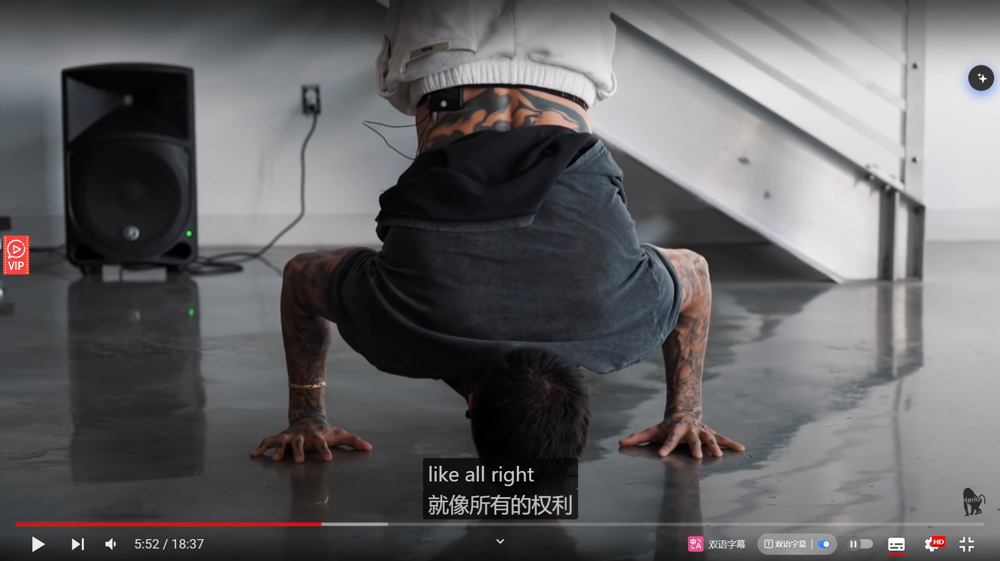

---

title: diary of 2024-7
date:  2024-07-01
abstract:   
tags: 
- 日记
---

# diary_of_2024-7

## 2024-07-01

冥想:

祈祷冥想

总能有一两个地方触动人

---

英语:

精听 16 m

## 2024-07-02

英语:

精听 15 m

## 2024-07-03

英语:

精听 16 m

---

运动:

打篮球 14 分钟 30 球

1-4 5/35
1-3 5/20
1-2 5/10

确实手感又降了

俯卧撑三个 14 应付一下

一开始想放弃俯卧撑来着，万一想到降到 14 个应该也可以

gap 了两三天，感觉运动还是好的

## 2024-07-04

冥想:

祈祷冥想

还是得坚持做，祈祷还是有用的，期待坚持下来的效果

---

英语:

精听 16 m

## 2024-07-06

冥想:

祈祷冥想

这个练习还是很基础、简单的，只需做就好的了

---

英语:

精听 17 m

一是句子长，二是 ted 这个有点学术了，可能看电影，或者那个 new 30 更适合我

    ---

今天看了不少 YouTube 的英语视频
一个感觉就是语言这种东西还是得**多用才能用出来**，而且这种用最好是用输出的方式、写或说，单纯的听相较于输出效果会差一些。

比如你一直都不去尝试去用英语表达，“吃少一点”这个行为，或者从来没听过人说，那肯定就说不出地道的表达，只能先翻译为中文，再翻译为英文，这样一来容易用词不准，二来思考和表达的速度很慢。 相反，你经常用的话，你不会有这种疑惑。比如“ whats the meaning of xxx” 这个句子我几乎天天用来问 gpt，所以不会出现生疏，“you know what i'm saying” 这个句子我也很熟，所以他接在任何语境里，不管什么口音、语速 我在听力中都很自然的识别出来。 所以 `A good way to learn English well is to use it a lot.`

回看 

-   理解了这句话的意思，就是在 123 这种条件加持下都不能顺利复述的话，其实还有很大的进步空间。也确实，一到自己听英语视频和 online chat 的时候，就能发现水平有限

---

运动:

打篮球 14m 27 球

1-4 5/18

俯卧撑 3\*15

运动还是好啊，其它活动替代不了的。出汗什么的，动起来就是不一样，像滚雪球，动起来后就越容易动起来，人也会变积极

## 2024-07-07

冥想:

自由冥想 14

身体扫描 呼吸 慈心

隔了好几天，回到这种冥想。发现这种冥想太可贵了，主动的察觉和帮助回到清醒，gain clarity, focus, clear mind.

但其实状态很一般，前几分钟直接迷失了，确实习惯了脑子一直转，被念头牵着走，没静下来。 但还好平时也有做行禅和一些短暂的呼吸休息，可能这个起到了帮助

这不是有引导的祈祷冥想能做到的，当然祈祷冥想也有他独特的效果，也很有用。

起床后立刻冥想非常好，杂念也相对少，

Plan for tomorrow: 自由冥想

-   生活方式多做点改变
-   冥想开始后，观察杂念的心眼要留
-   冥想前段投入更多专注，帮助静下来
-   前几次 10 次呼吸效果不好的话，可以转到 souheng，或者直接四四呼吸

---

英语:

精听 16

慢慢来，难度还是有

---

运动:

打篮球 14m 20 球

1-3 5/20 左右
1-4 5/31

今天真的太热了，1-4 的 spot 左边的阳光也刺眼。 当然水平确实下降了，或者三分本来就不稳定

俯卧撑 3\*15

## 2024-07-08 清醒度-听、组句和分词

冥想:

自由冥想 14

🎇 今天介绍一个清醒度的概念

杂念还是多，但值得冥想。因为不冥想的话，状态更差。真的是，一旦通过冥想获得过清醒的状态后，就会觉得不冥想就会慢慢失去这种状态，如果有一个数值叫清醒度的话。

每天睡一觉可能会重置 80/100。然后不冥想的话，可能中午就掉到 20-60 了。因为现代人太容易分神，被杂念牵走，难以专注自己想要的事情上。然后起床冥想的话，可能会提升到 85-100，接着这个清醒度掉的速度也会比平常慢。

但因为世俗中的人，还是会被日常琐事、工作、他人关系、内耗等牵扯，所以状态还是会掉。每天 10-20 分钟的冥想的局限就在这里，效果有限。 所以这里会推荐把冥想的文化、概念和一些技巧融合生活，这样日常生活中清醒度会维持的更好。

比如我们选择日常走路、通勤时选择行禅，等电梯、间隔休息等静态的时候可以选择十次呼吸；与人交流时多采取接纳、不评判的态度（接纳和不评判是正念冥想很重要的概念），比如用来处理杂念时就很有用）；还有与人交流还能带着慈心，这既是改变自己的内心、更积极和善良，还能让别人感受到你的友善，促进交流。

其实还有很多不同的把冥想融入生活的方式，我们可以一件件来，就像自己有一幅牌，慢慢打出去，或者自己有武器库，让自己更加强大。总的来说，我眼中的冥想和生活是高度相关的，我冥想的目标也是改善我的日常生活。

---

英语:

精听 20

难就对了，还得加大练习量。其实还是能感受到微小进步的，而且我现在会更注重 `听出来了才是自己的` `独立组句和分词` 这两个重点，感觉这两个既是练习的重点，也是语音思维的能力体现

---

运动:

## 2024-07-09

英语:

精听 20

今天开始开始有点刻意的使用两个降低练习难度的技巧

1. 在下一次盲听中慢慢揭开一个单词
2. 看着已有字幕复述

## 2024-07-10

运动:

打篮球 14m 20 球

1-4 5/35

命中率不行，又到了安慰自己运动的就有健康的时候了
感觉早上没吃饱，投篮的时候没力气，让我投三分时更缺力气了，然后越投负反馈越多。 练前吃饱很重要。 今天运动积极性因为

运动前拿一餐很重要，比如 11 点运动，早餐就很重要

还是那个力气不足，方向什么的也很难保证，姿势也会难以稳定，想着调整姿势加力气来着

俯卧撑 3\*15

## 2024-07-11

冥想:

自由冥想 17

gap 了两天，其实效果一般，感觉也不是杂念的问题，就是静不下来。

又是一种新奇的体验，就是感觉能力退步了？然后对冥想陌生了一点，这同样也是一种新鲜感。

但我还是倾向于每次冥想前和前一天的冥想有联系啊，也就是每天都冥想一次，反正也花不了多久

---

英语:

精听 25

🎉 

但这一部长句也忒多了，虽然语速可能也不算快，但我就是反应不过来，其实练的比较慢。嗐。

然后一部 ted 又太短了，刚刚适应她这个 accent，然后又要去切换素材了，下次练电影好了。

    ---

查了一下 `Categorical perception`，推荐一个视频 https://study.com/academy/lesson/categorical-perception-definition-lesson-quiz.html

省流读法就是看页面 transcript 部分的 Lesson Summary 小节，一下就能看完

个人感想就是，学新语言就得从头练，不管是新的音标（类似拼音），还是句子里同一个单词的各种变音（句子中的发音是更准确的）。还有就是多听，多输入不同类型的发音，毕竟婴儿也是这么学的。虽然现在没有婴儿的学习能力，而且有母语干扰，但还是得学啊

Another related video, which I came across through the articles in the "System Messages" section of the Ting Dian app.

1）岳云鹏的段子，说明我们对于汉字，先建好了范畴性识别，就意识不到它的变音了。
https://www.bilibili.com/video/BV1dg4y1f7gV/?spm_id_from=333.999.0.0

2）因为有“麦格克效应”存在，所以，重新认识语音，一定要练盲听。
【英语听力 为什么一定要练盲听 | 麦格克效应 | 听典英语】
https://www.bilibili.com/video/BV17a4y1Z716/?share_source=copy_web&vd_source=cb804c92cb9aca2966f586712caac3aa

    ---

今天使用 onlinechat 的感想

-   外国人说话的语速听起来快，但这就是他们的正常语速。 就像我和这个初中生说的时候，也是我的**正常语速**
-   **听力很重要**。我听不懂外国人说话，那么外国人其实也很苦恼，感觉聊不下去。就像我也不知道该怎么和它聊
-   其实听不懂很大程度是因为自己没有英语的**范畴听力**。就像我和初中生用汉语听得懂，但英语就听不懂

---

运动:

俯卧撑 15 15 15 15

自重深蹲 20 20 20 20
平板支撑 60

好像没退步太多，挺好的

## 2024-07-12

改进:

---

找工作:

---

冥想:

自由冥想 14

今天更早的从数吸切换到 四四呼吸，果然效果很好

然后心念一动，想玩一下开放式，发现也很有新鲜感，毕竟有一段时间没用这个冥想技巧了，生活中也是用的少，结果就是环境还是单调，但是因为很久没有去注意，所以也会感觉新鲜。 然后其实有一段时间没有用，因为之前有用心练过，所以一些基本的用法，比如开门待客、标价、想象等都很好的用了出来

巧克力也有用

Plan for tomorrow: 自由冥想

-   生活方式多做点改变
    -   今日: 严格控制 infointake
-   冥想开始后，观察杂念的心眼要留
-   冥想前段投入更多专注，帮助静下来
-   前几次 10 次呼吸效果不好的话，可以转到 souheng，或者直接四四呼吸
-   早起冥想，练前吃巧克力，把上呼吸道的异物清理一下

---

英语:

精听 22

开始练 The-Pursuit-of-Happyness

一开始上手感觉好难，比想象中难，这真实的语料。好不适应

练完今天内容后。虽然难，但是短句也多，后面发现多猜猜也能猜对，也算一种辨音练习了

发现一个东西，就是为什么大家包括我在内会**想着把音量调到更大**，原因其实还是自己还没建立对这些音的熟悉感、也就是 categorical reception，所以会希望有一个更大的声音帮助自己听清楚，帮助捕捉细节。 比如今天第九句的 this off 和 this up

还有一种感觉就是，我这个水平太需要精听了，**很多音的辨识都没建立起来**，只能精听中慢慢练起来

---

运动:

10m

俯卧撑 15 15 15 15

自重深蹲 15 15 15

卷腹 15 平板支撑 60

最近运动出现了和冥想差不多的一个状态，就是**遇到瓶颈了**，然后也不太能增加练习时间。 冥想不能增加是因为，确实不太好加。运动的话，是感觉动力不足，另外也是重心不在这。

所以这两个都是一个状态，就是**期待不退步就好了**，就维持现在训练强度，这种情况下带给我的身体上的改善已经很满意了

至于英语听力的话倒是有点不一样，虽然他还是进步很缓慢，但是我对他还是很有信心的感觉，感觉自己只要练下去，后面听力肯定会越来越好，可能也是找对了方法，听典 app 确实设计的不错，相关的学习观念和方法介绍的很完整、我也认同。

从这一点看，我确实最近都没有在冥想和运动上面去找进阶的内容，然后对自己的训练进步目标也不明确，所以才会有这种情况出现。当然现在也不太可能去抽出时间去重新制定计划，去学习新的理论，重心不在这。期待后面腾出时间来优化一下。

## 2024-07-13

冥想:

自由冥想 13 05:47:47

杂念就像一个异世界虫洞，无规则的会把念头弹出来，压都压不住的，一直弹，而且无规律。
对此，心眼还是要留，今天基本是靠本能来维持清醒，忘了去观察杂念了。

做五五呼吸做的比较专注的时候，铃声突然响起来，把我打断了、挺影响状态的。还是太大声了，下次搞小声点，因为环境已经比较安静了，任何声音都比较明显

慈心基本会花 3-4m

Plan for tomorrow:
做一次一日静修的 动静结合晨练

-   今天复习笔记后，发现这个居然没做，值得做一下。

Plan for next's 自由冥想

-   冥想开始后，观察杂念的心眼要留
-   冥想前段投入更多专注，帮助静下来
-   前几次 10 次呼吸效果不好的话，可以转到 souheng，或者直接四四呼吸
-   早起冥想，练前吃巧克力，把上呼吸道的异物清理一下
-   电脑音量调到 34

    ***

祈祷冥想

这么多次练习之后依旧能获得清醒

是好的冥想补充练习。或者说哪天没有什么动力冥想也可以就做一做这个来维持练习。

---

英语:

精听 20

我靠，这真实的对话太陌生了，这个语速和各种变音，还得静下心慢慢来

还有 Chris 这开场有点惨啊
starts with a scene showing a car being towed away for illegal parking.

---

运动:

10m

俯卧撑 15 15 15 15

-   第 1 组就出现了三角肌前束位置，首先感觉做下去会受伤。然后就把双手的位置往前移，降低难度，降低对肩部的负荷

卷腹 20 20
直腿反向卷腹 15 15

## 2024-07-14

冥想:

15m 此刻此地的练习+脊柱向前向后

此刻此地的练习

-   发现很好用，会觉知到一起以前一直忽视的东西，会有一种安定感，更容易回到当下

身体活动

-   提升对身体的感受，减少杂念和执念，回到当下

Plan for next's 一日静修的 动静结合晨练

-   找个一整段时间完整的过完这个，就当新知识学习了
-   有时没动力冥想做做这个也不错

---

英语:

精听 20

今天这些日常随意的真实短句，有点变态啊，变音省略太离谱了。太离谱了，gotta 这轻读的程度。唉，尝试理解一下，代入一下母语者，另外看看他们的视角

It's kinda overwhelming that in the scene where Chris argues with Linda about taxes, Chris appears powerless and Christopher can only remain silent.

---

运动:

10m

俯卧撑 15 15 15 15

直腿反向卷腹 15 15 15
平板支撑 60

明天腿恢复后，深蹲加腹部训练吧，俯卧撑就最后做一组收尾

## 2024-07-15

冥想:

此刻此地的练习+呼吸+Dalio.思考+慈心

断社交平台后的惊喜 - **改变生活方式起效了**

-   因为断了社交平台，今天遇到的一些杂念种类也减少，最多就回到自己看到电视剧 avatar 和一个游戏的几个人物，这样真的舒服很多。
-   **社交平台的信息太碎片了**，也就是量多且种类多，这对于杂念来说无疑是**爆炸式乘法**，个人在冥想时其实是很难处理这些杂念的，能在 10m 左右尽量减少这些杂念就很不错，更不用说去做进一步的思考或者更深入的冥想，因为静不下来的话，其它冥想技巧都用不出来
-   如果冥想的时候都静不下来，杂念纷飞，那么**日常生活其实也容易走神的**，日常干活的话、如果不是很喜欢很投入的活，也很容易走神，甚至会因为杂念不断，而产生难以开始干活的情况。

> Meditation has been invaluable in helping me see things that way. I found that when I **calmed myself down and embraced my realities and dealt with them,** the rewards brought me pleasure and the pain faded.- Dalio

-   意外的好用，即使不能在几分钟的思考中 think through，但也是有帮助了，因为开始静下来了

-   🎇 日常生活 干活也能这么做。

    -   急躁，静不下来，不知道怎么做，不想做了的时候。那就让自己慢下来，做呼吸静下来后，去想一下这个东西，这种情况下，也不用急，自己会慢慢想到一个方向的。而且这样做想东西时也不要求闭眼，和冥想会稍微不同，想的时候卡住了就回看笔记，带着这种冷静、稳定的心态去找新资料，找到后再回到思考。

-   Besides, after calming down, my pain really fades out, because I start to face the reality, my attention starts to transfer to reality and starts to think how to deal with it, other than getting drowned in the pain, tons of different distractions

Plan for next's 此刻此地的练习+呼吸+Dalio.思考+慈心

-   冥想开始后，观察杂念的心眼要留
-   冥想前段投入更多专注，帮助静下来
-   前几次 10 次呼吸效果不好的话，可以转到 souheng，或者直接四四呼吸
-   早起冥想，练前吃巧克力，把上呼吸道的异物清理一下
-   电脑音量调到 34

---

英语:

精听 24

慢慢适应了。
一句太难就限时然后跳过，不要在意一句的失败，不然把时间都投到这一句，性价比很低。又不是所有都很难

---

运动:

10m

自重深蹲 20 20 20 20

直腿反向卷腹 20 20 20 20

俯卧撑 30

## 2024-07-16

英语:

精听 22

还是难 ，脑子里这个音就没对应这个 phrase，或者就没有这个音，真实语料就是如此多变。只能调整心态了

水平不到位。那就走流程，盲听了，复述了、用了学习技巧，代入了就行

还有不要在意一句的失败

plot comment:
Chris is not understood by Linda, and the pursuit of dreams is so difficult.

---

运动:

10m

俯卧撑 15 15 15 15

自重深蹲 15 15 （大腿后侧靠屁股的大腿侧边还没恢复）

直腿反向卷腹 15 15 平板支撑 60

## 2024-07-17

冥想:

此刻此地的练习+呼吸+Dalio.思考+慈心 14

感觉不错 时间过得也很快

然后生活方式的改变确实让我冥想时杂念变少，冥想变轻松了。 然后今天早上起的晚了一点，冥想的时候爸妈在出门前收拾东西时吵了起来，所以就不可避免被环境声影响了一点。

上面这两件事就是告诉我**改变生活方式和一个好的冥想环境，对于冥想来说非常重要**，他是可以和冥想的投入程度同样重要的。 而且有时候甚至更重要，比如李冉说的冥想的深入练习，如果冥想的时候总是被杂事、无关紧要的信息打扰，那就很难静下来，更不用说清醒的想事情、开悟了。 到此我理解了为什么李冉总是强调生活方式的改变了

Plan for tomorrow
此刻此地的练习+呼吸+Dalio.思考+慈心

---

英语:

精听 21

盲听视频的时候发现这语速好快，和分句精练的难度完全不同，根本不留时间给我反应。 还需要多练，多建立对音的联系、辨识

---

运动:

10m

感觉这 10 分钟强度有点适应了，然后感觉 10 分钟确实也很有限 练的。瓶颈了

俯卧撑 15 15 15

自重深蹲 20 20

-   感觉自己的腿恢复慢，还有一个原因是因为自己久坐的习惯，还是要从这一方面也动动手

直腿反向卷腹 20 20 20 20

## 2024-07-18

冥想:

此刻此地的练习+呼吸+Dalio.思考+慈心 17

前面此刻此地的练习到感受屋内的声音时有点走神，然后忘了`思考自己在这里干什么`，进而后面呼吸练习花了更多时间来平静

Plan for tomorrow
此刻此地的练习+呼吸+Dalio.思考+慈心

-   此刻此地的练习最后的思考别忘了
-   呼吸尽早换四四呼吸，这个猛一点
-   冥想开始后，观察杂念的心眼要留，加上标记
-   冥想前段投入更多专注，帮助静下来
-   早起冥想，练前吃巧克力，把上呼吸道的异物清理一下
-   电脑音量调到 34

---

英语:

精听 23

plot comment:
This is too tragic, even the street singer comes to steal the machine.

---

运动:

打篮球 20+

1-4 5/53

打上头了

另外一个经验就是，肩部的举球轨迹可以更靠右一些，这样的话力量会更大。但是这样子是又要重新开始熟悉，下次熟悉吧

俯卧撑 3\*15

## 2024-07-19

冥想:

13
此刻此地的练习+呼吸+Dalio.思考+慈心

日常的练习，静下来和思考，刷新清醒度，加上清醒度持久的 buff

Plan for tomorrow
此刻此地的练习+呼吸+慈心+Dalio.思考

-   改一下顺序思考顺序，思考完的话就直接做重点记录了

-   此刻此地的练习最后的思考别忘了
-   呼吸尽早换四四呼吸，这个猛一点
-   冥想开始后，观察杂念的心眼要留，加上标记
-   冥想前段投入更多专注，帮助静下来

-   早起冥想，练前吃巧克力，把上呼吸道的异物清理一下
-   电脑音量调到 34

---

英语:

精听 20

plot comment:

Daycare lets children watch TV. Chris has a common complaint about this.

---

运动:

10m

俯卧撑 30

自重深蹲 20 20 20 20

直腿反向卷腹 20 20 卷腹 20 20

## 2024-07-20

冥想:

12
此刻此地的练习+呼吸+Dalio.思考+慈心

日常的作用，不可替代。坚持做还是不错的。
生活方式方面，继续控制 infointake，时间管理上更多珍惜时间，穿插身体和大脑的休息

Plan for tomorrow
此刻此地的练习+呼吸+慈心+Dalio.思考

-   此刻此地的练习最后的思考别忘了
-   呼吸尽早换四四呼吸，这个猛一点。可以换到 55（今天 44 结束后居然呼吸还比较顺畅，导致效果差了点）
-   冥想开始后，观察杂念的心眼要留，加上标记
-   冥想前段投入更多专注，帮助静下来

-   早起冥想，练前吃巧克力，把上呼吸道的异物清理一下
-   电脑音量调到 34

---

英语:

精听 21

plot comment:
Chris's bold approach to stopping Jay Twistle for job opportunities is impressive, and his conversation skills are good

---

运动:

10m

自重深蹲 20 20 20 20

直腿反向卷腹 20 20
卷腹 25 25

俯卧撑 30

## 2024-07-21

冥想:

Dalio.思考需要耐心
发现尝试通过冥想来直面思考、解决现实问题其实挺难的。尤其当这个问题是反复出现的。还是需要结合其它现实的方法

但冥想还是有用，能帮助思考的时候更清醒，给自己一个清醒思考的机会，即使想不通，认清现状还是容易的。

---

英语:

精听 22

还是需要精听 基础太差。看视频，只能练练阅读

---

运动:

11m

自重深蹲 25 25 25 25

-   下次尝试负重

俯卧撑 30

直腿反向卷腹 25 20
卷腹 20 25

## 2024-07-22

英语:

精听 23

## 2024-07-23

冥想:

复习【练习】D20-眼不见，心不烦

复习有用，复习到一些遗忘了但有用的点。而且有一种把自己掌握的东西和稍微没怎么掌握的东西**开始尝试融合**的感觉，感觉开始慢慢打磨出自己的冥想知识体系和练习方法了

复习方法，还是推荐自己看文字转录，然后选几个点自己**独自练习**，尽量不要受音频干扰

新复习的点:

> 如果很久都没有什么念头,那就好好**享受**大脑安静下来以后活着的感觉

-   其实这也是**冥想的乐趣**来着，享受这片刻难得的安详。享受这一刻活着的感觉，没有杂念干扰，纯纯只属于自己的时刻

眼不见心不烦，其实和我总结出的狗熊掰棒子差不多，把念头放下，去等待下一个更好的念头，或者没有念头（这个时候适合放松或者沉思）。

除了眼不见心不烦，回到呼吸练习这两个**放下杂念的方法**，去关注身体和环境这两个轨道的信息也可以帮助自己放下杂念。

原理是 `用杂念之外的信息来占满大脑的内存`，然后呼吸、身体和环境这类信息**副作用比较小**，比如你日常走神不会去走神到呼吸上，只会忘记呼吸，忘记周围的环境，忘记自己疲惫、久坐、缺乏运动的身体。做些专注练习，反而能**把注意力放到应该被关注的地方**，比如意识到自己身体疲惫、不健康后，自己就会更容易开始运动、睡觉了。

---

英语:

精听 22

plot comment:
It's amazing how he uses solving a Rubik's Cube to get a job, but in the end, I didn't expect to skip the taxi fare.

---

运动:

10m

俯卧撑 30

自重深蹲 20 25 25 25 25

直腿反向卷腹 20 20 25
卷腹 25 25

想加强强度的话就缩短休息时间，还有做动作的速度。今天明显体会了

## 2024-07-24 宁缺毋滥、信息和注意力管理

冥想:

14 此刻此地-主动呼吸-慈心-放松和思考

不仅是学习资料的选择要宁缺毋滥，任何能主动选择的信息摄入（infointake）也要**宁缺毋滥**

冥想中出现了自己不太想要的信息，那就证明自己最近的日子或者就是说昨天看了太多这类信息了，大脑即使经过睡眠也没把这些信息处理好。如果平时生活中能把自己的注意力管理好，能把摄入的信息控制好，比如集中起来看一个、看一类，且都是自己主动选择的，想看的，那就会舒服很多，不管是冥想中还是生活中。

冥想的时候就很容易检测出来自己近日 infointake 的情况。生活中反而容易被信息淹没，勉强保持清醒做当前要干的事情就很了不起了。
冥想就像一个**检测器**，冥想静下时产生的杂念就是你日常走神的源头

所以当冥想出现了这种情况，就意味着自己生活中需要调整了，而且冥想也给了调整的方向，自己可以思考调整的方法

所以今天我的想法就是宁缺毋滥，比如最近我吃饭会刷信息，这个时候注意力没必要分散，专注吃饭就好；再比如很多历史记录里浏览的很多不重要，点开阅读之前思考一下，自己是否真的需要，**想想自己能不能接受这种信息出现在自己走神、日常思考，还有冥想当中**

所以再分享一个，我听到的一个关于暗时间的一个说法。就是他不是说东西加载到大脑后台去运行了，去调动大脑其他部位的神经元或者什么东西来去思考事情嘛。 其实当自己没有**主动做一件事的时候**，而且自己没往大脑后台主动加载东西，那么此时大脑后台就是在高负荷处理你日常摄入的爆炸信息，一个信息爆炸的时代。

你不去主动管理大脑后台、管理自己的注意力、管理 infointake，那么你就被外在的信息管理，比如各种社交平台，生活中的烦心事等。所以，宁缺毋滥，别被信息淹没了

---

英语:

精听 22

plot comment:
I don't expect him to lose the scanner due to rushing to the subway. What a sad moment! But what comforts me afterward is that he finally got a call from Jay Twistle.

---

运动:

11m

深蹲:自重 30 3.7kg 30 25 20

-   两脚间距可以收窄一点，毕竟投篮有时候不会站那么宽。
-   上重量，减少一组的次数

直腿反向卷腹 25 25
卷腹 30

俯卧撑 30

## 2024-07-25

英语:

精听 21

plot comment:
It makes me laugh and a bit nervous that the guy keeps talking about the score around Chris.

---

运动:

篮球 15m

一/三 二十七中 5
一/四 七中零

又回到原点了，看来换姿势是真的难。这个姿势反而不顺手，力气变小了，而且也有一段时间没有打什么的 生疏了，还有今天一直刮侧边风

俯卧撑 23，22

## 2024-07-26

冥想:

12 此刻此地-主动呼吸-慈心

主动呼吸现在可以轻松坐到 6 拍，也就是说我**对呼吸的控制其实已经提升了**，然后肺活量可能也提升了一点。一开始练习这个的时候，我可是 4 拍，很难去维持

杂念还是有，且散，不是自己想要的。日常还需继续控制 infointake，做好暗时间、大脑后台管理

冥想练习到现在，确实是瓶颈，昨天看到一个评论说自己练习了 1 年多，反而变成 15m 都很难坐住。感觉练习动力很重要，**要坚持练习**，即使是每天练练入定的功夫，比如专注呼吸，让自己静的更快这也是很值得，这是一个熟能生巧的技能

---

英语:

精听 21

plot comment:
Chris somewhat didn't take responsibility; he won't care about Linda's feelings. The words he said, "You're so weak," are very harsh. Then it's sad that he can't pay the rent.

---

运动:

没想到大佬做 handstand push·up 也会有一个手的手指不伸直，可能这个手指的问题比我想象中轻，我可以多尝试一下手掌俯卧撑

自重深蹲 30
高脚杯深蹲 10kg 20 20

-   工作时增加休息频率，减少久坐持续时间。 今天训练时感觉到髂腰肌的位置很紧张，已经有点影响深蹲的运动表现

仰卧起坐 30 20 20

手掌俯卧撑 30

-   虽然大脑做的没问题，但是我做完这三次课之后，明显感觉右手腕比左手腕负荷大，有一点点痛感
-   🎇 还是说我要双手平衡，这样两边手腕、肩部负荷一样大，虽然做俯卧撑的难度变大了，但受伤风险降低了

## 2024-07-27

冥想:

---

英语:

---

运动:

##

冥想:

---

英语:

---

运动:
