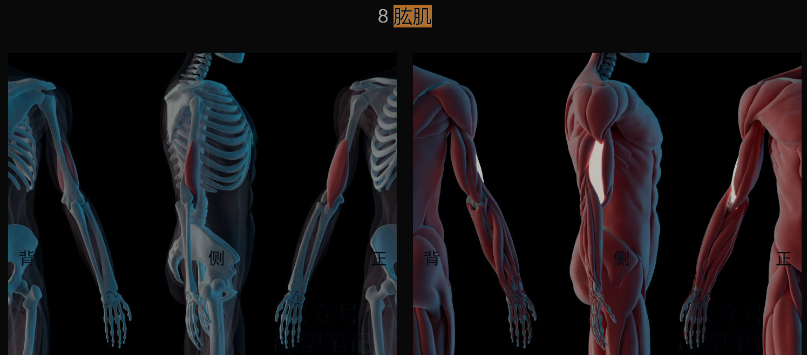

---

title: diary of 2024-9
date:  2024-09-01
abstract:   
tags: 
- 日记
---

# diary_of_2024-9

## 2024-09-01 想要的东西太多

冥想:

13m 此刻·冥想目的·新鲜感和珍惜 专注呼吸 慈心

状态比较一般，但也发现问题所在

想要的东西太多了

-   练原本一直想要的观察杂念都会忘了，或者程度很轻。比如只记得拉回来，不记得注意一下今天都有些什么杂念
-   一个原因就是这两天复习的东西里，其实有很多都没做到，冥想前一股脑涌进脑袋了，冥想中很难做到的
-   解决部分就是一段时间内的冥想**只专注一两个点**，练好了再换下一个点。所有点搞好了再做新内容的复习

---

英语:
208 words 32 sentences

---

运动:

慢波比 10
爬行+俯卧撑 10

-   参考【在家锻炼，您会俯身爬行】 https://www.bilibili.com/video/BV1ae411s7Mm

仰卧起坐 30\*2
三角起身 20
滚动弓箭步 10

感觉确实还不错

## 2024-09-02~10

### 冥想~慈心的好处、第 1 次直播

2024-09-02
13m 此刻·新鲜感和珍惜 专注呼吸 慈心

状态一般

忘了思考冥想的目的，感觉这个比“此刻·新鲜感和珍惜”更重要，毕竟无利不起早，坚持练习的原因就是动力。

但还是会隐约感觉到自己给了自己一段安静的时间。然后今天也做到了专注练习两个点，“用呼吸建立专注，减少杂念，进而静下来”，“感受鼻子、鼻尖、鼻孔的感觉”。 下次加油改进

Plan for tomorrow:

-   开头思考冥想的目的
-   继续专注练习两个点，“用呼吸建立专注，减少杂念，进而静下来”，“感受鼻子、鼻尖、鼻孔的感觉”

---

2024-09-07 慈心的好处

12 此刻·新鲜感和珍惜 专注呼吸 慈心

4 天没冥想 杂念很多都没有主动面对过，走神比较深，也就是拉回来的能力下降了。还是得坚持练，冥想

冥想时想了一下慈心的好处。
一是作为冥想练习里面不理性的部分他可以对冲，前面那些比较理性的对清醒，稳定的清醒。
二是清醒 感受力强在生活中有时候并没有那么有用，有时候人还是会上头，尤其是在社交平台上遇到大量的带情绪的，短短的信息的时候，再加上别人的一些评论，再加上一天中的其他劳累，这个时候很容易就没有清醒，很容易就会散发出对别人的恶意。这个时候慈心就很有用，因为它是非理性的，然后你又是把他经常练习，内化了一部分，这时候他就相当于一个心锚或者一把戒尺，他提醒你，在做出了一些违背你自己一次性练习做的事情。然后你会开始更加去理解对方，至少尝试去理解，然后说的话也会更让别人接受，沟通也会更有效，然后自身的善意也更足，更友善

Plan for tomorrow:

-   开头思考冥想的目的
    -   清醒度 buff。慈心练习。给自己一段时间
-   继续专注练习两个点，“用呼吸建立专注，减少杂念，进而静下来”，“感受鼻子、鼻尖、鼻孔的感觉”

---

2024-09-10 第 1 次直播冥想

14 此刻·新鲜感和珍惜 专注呼吸 慈心

直播的影响。还是会影响到杂念上面的，但是如果一开始不开直播的话，可能今天早上就直接不冥想了。直播是一个手段吧，有点像沉没成本，先把自己推出去。

总结来说就是虽然开播会对冥想有影响啊，但是起码他让我从不想勉强到开始冥想，是值得的。一个手段吧

另外，开直播的缘由也有意思，起床翻手机翻到 bilibili 的时候，发现自己关注的没有一个在直播学习，然后突发奇想，自己开始播，然后就开播了，也确实有用。

Plan for tomorrow:

-   开头思考冥想的目的
    -   清醒度 buff。慈心练习。给自己一段时间
-   继续专注练习两个点，“用呼吸建立专注，减少杂念，进而静下来”，“感受鼻子、鼻尖、鼻孔的感觉”

### 英语:

2024-09-02

225 words 35 sentences

---

2024-09-03
344 words 53 sentences
"Pumbaa runs so fast, and what surprises me is that Simba lost to Nala again."

---

2024-09-04

282 words 41 sentences

"Simba still hasn't grown up mentally; he still hasn't figured out the problem and continues to run away from it, influenced by Scar."

---

2024-09-05

298 words 40 sentences

---

2024-09-06
238 words 37 sentences

---

2024-09-07  
341 words 50 sentences

"Scar is very good at manipulating others; Simba is nearly pushed to death."

---

2024-09-08  
185 words 29 sentences

完成 The Lion King 🎉 

---

2024-09-10 开始 up in the air

234 words 27 sentences

难了很多

---

运动:

打篮球

17 球

1-4 2/18

还是距离一远，姿势不顺手，投篮方向不稳定

运动是真得懈怠了

## 2024-09-11

冥想:

13 此刻·新鲜感和珍惜 专注呼吸 慈心

早上和晚上冥想的区别
杂念多
容易被打扰

还有坚持冥想很好，一段清静的时间，即使冥想途中充满杂念，那也是生活中最清醒的状态了。

慈心是真得好，祝福自己能直接给自己打气，并联想、回想到对应的处理方法，祝福支持自己的人可以把善意给他人。

---

英语:

230 words 43 sentences

今天录自己练习的视频，但是边想起自己的练习方法，一边练习，效率太低了，因为分心

顺便剪了一个练习的视频
【精听练习记录+讲解【听典英语】】 https://www.bilibili.com/video/BV1Xj4CeNETJ

---

运动:

篮球

20 球

1-3 5/20
1-4 5/15

发力更顺了，但 1-2 1-3 1-4 三个点的姿势变化都有点大，可能把这个姿势统一一下，就有可能命中率稳定了。

或者当前点射中两球后，马上到下一个点感受一下发力，投两球，再回来前面这个点去调整姿势。 比如 1-3 射中两球，然后 1-4 射两球，再回来去完成 1-3 剩下射中三球的任务

    ---

运动的动力:

另外，自 9-2 断了锻炼后，后面就感冒或者鼻炎发作了一次，难受了一两天。 感觉还是坚持锻炼，锻炼就等于无身体病痛，比如鼻子不塞了，吃啥都有味，有胃口，这是很可贵的。

## 2024-09-12

冥想:

16 此刻·新鲜感和珍惜 专注呼吸 慈心

遇到新的奇异感觉:
场景是，在刚开始慈心练习的时候，就是闭着眼睛走吧，但是眼**前的方向跟平时不一样了，感觉视线就一直往上走**，注意力也会往上走，就很难集中注意力放到冥想的内容上面，杂念都想不了了，反正就整个人都被吸过去了，再加上当时是冥想后半段了，腰有点酸，就更加难以集中注意力了。

分析原因的话。可能和环境比较光亮有关，也可能是因为自己**切换了冥想环境**啊，平时都是拉着窗帘去，在相对没那么亮的环境去比一下，突然切换的话有点不适应

杂念有，但感觉可以通过坚持练习慢慢改善。主要的话还是**专注当下的冥想内容**吧，因为一般来说杂念带来的想法，其实没有那么重要啊，或者说等冥想后自己做那件事情就会自然的想起来，没必要放到冥想时想。

---

英语:

精听
204 words 23 sentences
今天的句子太难了

学完 【英语自然拼读极简教程（免费、简洁、高效 | 半小时内打牢基础）】 https://www.bilibili.com/video/BV14841117gz

---

运动:

慢波比 20
三角起身 21
滚动弓箭步 20
俯卧撑 15

右膝盖不痛后，滚动弓箭步还是舒服、好玩的

## 2024-09-13

冥想:

12 此刻·新鲜感和珍惜 专注呼吸 慈心

最后一刻 11 分钟的时候定了下来，挺好的。

还有真的就是冥想，然后就是身体越来越热，这是在冥想前做点调整

🎇 杂念还是有，现在总结一下处理杂念的方法:

1. 专注当前冥想内容
2. 观察杂念，然后标记
3. 标记后，放下杂念。告诉自己念头没那么重要，真重要，冥想后会自然想起来
4. 使用效果更强的冥想技巧

Plan for tomorrow:

-   开头思考冥想的目的
    -   清醒度 buff。慈心练习。给自己一段时间
-   继续专注练习两个点，“用呼吸建立专注，减少杂念，进而静下来”，“感受鼻子、鼻尖、鼻孔的感觉
-   冥想前搞个凉爽的环境
-   使用处理杂念的方法：专注当前的冥想内容，放下杂念。

---

英语:

精听
128 words 16 sentences
这好多吞音 难，语速也快

    ---

学完【【合集完结】【最全英语连读规则】英语听力口语发音提高秘诀】 https://www.bilibili.com/video/BV1WW41147bm

感觉会和自然拼读有重叠的地方，还和栗之的听力课有重叠。真就大家总结的规律都不同，反正就多练嘛，规律只是帮助自己去辨别，练会了（能听会说）就可以丢掉规律了，会内化出自己的规律

期待明天的练习会有不同的视角

## 2024-09-14 戒社交平台第一天 🧠

出关日期: 10.13

---

冥想:

13 此刻·新鲜感和珍惜 专注呼吸 慈心

今天发现冥想第一步想太多了，感觉不好，得简化一下。专注到几个点上。还是得一个个点慢慢来，不能什么都想要，不然什么都要不了。

Plan for tomorrow:

-   改为新鲜·冥想目的·回忆练习内容 专注呼吸 慈心
-   开头思考冥想的目的
    -   清醒度 buff。慈心练习。给自己一段时间
-   继续专注练习两个点，“用呼吸建立专注，减少杂念，进而静下来”，“感受鼻子、鼻尖、鼻孔的感觉
-   冥想前搞个凉爽的环境
-   使用处理杂念的方法：专注当前的冥想内容，放下杂念。

---

英语:

226 words 35 sentences
还是难 变音非常多，而且识别也难。终于理解了为什么不建议琢磨规则

    ---

尝试听典 app 的单音节 单词对的功能
学习音标  
/uː/ food
/u/ good foot
[ʌ] money bus
[ə] ago
/ε/ bad bed let get
/æ/ have

---

运动:

10m 1.47km（可能不准，轨迹不规则）
跑步专注呼吸和双脚的时候，其实也算一种冥想。

## 2024-09-15

冥想:

12 新鲜·冥想目的·回忆练习内容 专注呼吸 慈心

杂念还是有，虽然昨天基本戒了社交平台，但各做做过的事情还是无缘由的冒出来，也就是杂念。 总体而言肯定是比以前社交平台那种信息带来的杂念好很多

专注失败的原因可能是最近自然感受呼吸的效果有点弱，注意力没有主动聚焦到呼吸上，得使用更主动的冥想技巧，**让呼吸相关的感受和事情占满大脑内存**，这个以前也说过啊

Plan for tomorrow:

-   开头思考冥想的目的
    -   清醒度 buff。慈心练习。给自己一段时间
-   继续专注练习两个点，“用呼吸建立专注，减少杂念，进而静下来”，“感受鼻子、鼻尖、鼻孔的感觉
-   冥想前搞个凉爽的环境
-   使用处理杂念的方法：专注当前的冥想内容，放下杂念。
-   使用更主动的冥想技巧，比如数吸和主动呼吸

---

英语:

精听: 173 words 21 sentences

复习连音

使用单音节辨音

阅读 [2.1 Mystery of the Walrus &#xB7; Hug61B](https://joshhug.gitbooks.io/hug61b/content/chap2/chap21.html) 20m

-   如果不追求阅读速度，还是挺舒服的，读的，尤其 joshhug 写的也娓娓道来

使用随机聊天平台 20m

---

运动:

其实每天这类运动基本控制在 10+m，可能会热身加拉伸会多 5m 左右

波比跳 20
三角起身 20

-   发现蹲起还可以变蹲跳

滚动弓箭步 20

-   起身还可以优化为先把后脚姿势摆正和左脚平行后，再双脚一起发力了

俯卧撑 30

---

杂学:

西方哲学史 赵林 ~ 2.1.2 希腊哲学发展的梗概

🎇 感觉自己的学习太重了，前期准备什么的，而且自己还不熟练。 下次减轻一下负担，把重心放到知识本身

而且方法放在知识本身就意味着，先看原资料，以原资料为主，ai 总结 别人的笔记这些只能是辅助，不能舍本逐末

## 2024-09-16

冥想:

12 新鲜·冥想目的·回忆练习内容 专注呼吸 慈心

杂念还是有，然后主动的呼吸技巧确实有用，可以练多几天。

冥想前风扇对着有点冷，冥想完后反而其实有点稍热。再次证实我的冥想的话，还是身体发热的情况多一点

做减法，**把冥想前期的的思考化简一下**。现在改为回想三个练习内容了。至于目的，其实有点内化了，不用多想。

后面好奇扫了两眼，14 天课程里的一个月内容的前三节课，发现冥想乐趣我是有内化一部分的；
清醒的冥想其实每段时间都会去实践一点内容，然后明白自己的冥想目的其实已经算比较清醒的冥想了；
比较难的是，精微控制那一部分，我已经有点远离，从这一方面来说，虽然一直在练习，其实有点像退步。 但也不能这么说，毕竟练习重点不一样，怎么说呢，有在练习就会在前进的。

Plan for tomorrow:

-   开头思考冥想的目的
    -   清醒度 buff。慈心练习。给自己一段时间
-   练习内容
    -   “感受鼻子、鼻尖、鼻孔的感觉
    -   使用处理杂念的方法：
        -   专注当前的冥想内容，拉回来，告诉自己重要的事情冥想后会自然想起。
        -   使用更主动的冥想技巧，比如数吸和主动呼吸
-   练习目标: 尽可能入定，身体静下来。不行就尽可能杂念少一点，毕竟就是给自己一段属于自己的时间，也不用要求太高，饭要一口口吃
-   冥想前
    -   冥想前搞个凉爽的环境

---

英语:

387+ words 50 sentences

今天分享写的有点多了，导致练习时间不够。
而且练习和写分享完全两个东西，分心了。分心导致效率降低
所以 35+m + 1h + 碎片时间 才练了这么点，

复习连音

和听典刘总请教出
[练习时遇到一些比较难的音怎么办](/posts/杂学/只言片语_英语.md#练习时遇到一些比较难的音怎么办)

自己总结了
[是否看字幕练习](/posts/杂学/只言片语_英语#是否看字幕练习)

还有一些其它文章

---

运动:

波比跳 25

-   这个真得累，越快越累

三角起身 20

滚动弓箭步 20

-   起身方面，滚动的惯性可以连贯起来。做的更爽，更连贯，省力

俯卧撑 30

---

今天突发奇想搞了 `只言片语系列`，主要是降低自己的写作门槛，把一些笔记和思考快速输出出来，不去追求输出系统、成块的知识。

## 2024-09-17

冥想:

12 新鲜·冥想目的·回忆练习内容 专注呼吸 慈心

昨天的 plan 挺好的，坚持就好。然后可以在拉回来方面多投入一点，

或者**反复出现的同一个杂念、且杂念和现实生活要做的事情有关，可以停下来让自己思考一下处理方式，毕竟这个时候还挺清醒的**

---

英语:

209 words 25 sentences

今天有点累，句子也同样难。
新的大道化简的方法，还是有点没适应

听了[cs61b l3](https://www.youtube.com/playlist?list=PL8FaHk7qbOD7lprwG_xdIMLrwibZDi-Ll) 的 v1，v2

-   主要以学英语的方式看视频，因为知识早掌握了，但自己还是非常不适应英语语音，还得多练。
-   尝试听这个 [\[Lists1, Video 1\] The Mystery of the Walrus](https://www.youtube.com/watch?v=IRwO_wahcsU&list=PL8FaHk7qbOD7lprwG_xdIMLrwibZDi-Ll&index=2) ，发现自己听力完全反应不过来，即使知识我是懂的
-   把字幕的位置移上去和 ppt 的知识更近后，确实更舒服一些

---

运动:

练引体向上

-   弹力带引体 4+2.5+2.5
-   三个等长离心引体

就这么几个，加上俯卧撑热身和事后拉伸，耗费我接近 15m。而且非常累和算，不敢多做，怕过度 doms

下次引体:

-   带凳子 弹力带 手套（确定了，黑色的）
-   尝试可不可以用弹力带替代书包
-   回家找一下那种小学用的折叠椅 替代凳子

-   还是练弹力带引体 + 等长离心，各三组
-   减少弹力带使用就算负重了

## 2024-09-18

冥想:

练了一日静修的一套晨练，感觉很不错，也总结了一遍

复习了一日静修的为什么-如何闭关

看完了加课 `大师之道，红尘炼心`

    ---

发现了清醒度可能的出处

---

英语:

459 words 52 sentences

plot comment:
Ryan is quite assertive, directly confronting the new employee Natalie.

复习了 /English/学习论/听典英语.md#练习时遇到一些比较难的音，怎么办？~-练习方法大道化简:-仍是多听多模仿

-   感觉接下来一个星期的练习之前都可以看看这个笔记，帮助我把那个做错题的坏习惯给改过来，形成一个更好的练习方法

今天练习感受

-   想语音规则这个我已经好了很多了，现在基本是靠多听和模仿原音频
-   但得过且过这个还要多练

现在新方法的练习重点先放到 `为了得过且过多一点，可以**放低自己的要求**。比如盲听和复述的次数都少几次，可以尝试多用降低句子难度的方法。`

---

杂学:

西方哲学史 赵林 ~ 2.2.2 早期希腊哲学之米利都学派 2：阿那克西曼

## 2024-09-19 第一次独自晨练 🙂

冥想:

晨练接近 1h
今天使用的方法是 看文字自己做，冥想开始去听音频。实践下来也挺好的

阶段:
开场练习: 此刻此地明确时空·思考冥想的目的
动态练习: 活动脊柱·拉伸·屏息
冥想: 专注呼吸·开放式冥想·慈心——放松

明确冥想目的阶段，做`描述出一幅我理想生活的途径，然后想这些好处如何帮助实现理想生活`时，值得去多这个地方想想。今天真得感受到了期待的幸福，一种以前没认真想过的事情，有一种很开心的感觉。算是一种直面自己想要的生活，以前大多潜意识逃避了，但一旦面对了，反而会开心

Plan for tomorrow:
继续晨练

-   不用开倒计时提醒自己了。
    -   自己能做多久就做多久，反正不想做就停下来，一整套晨练就是这个感觉。反正这阻断的一个月还是有时间的
    -   脊柱活动可以自己调整做的次数，什么时候不想做就停下来。其它同理
    -   主打一个放松的心态，但又会有一点认真
-   不用开音频了，自己独立做。如果很重要的内容想不起来了就看一眼笔记，没那么重要就跳过，下次再加上。
-   事前复习一下不同阶段的切换

---

英语:

40m+
243 words 29 sentences

难度确实大了啊，另外，还是多注意得过且过，然后把时间发在训练重点上

---

运动:

慢波比 20
三角起身 20.
滚动弓箭步 30

练引体的 doms 还是比较明显

---

杂学:

《DopamineNation》 看了四章

复习[多巴胺：你一定要知道的黑暗面！3 個不為人知的運作機制、 3 件避免多巴胺危害的練習 - YouTube](https://youtu.be/GcnnjvkpEmk)

一算是看一直想看的书
二是给自己找一件事情做，也让自己的专注连成线
三是 这能给我的阻断提供观念和方法的支撑

我还是比较同意 Anna 对成瘾的一些看法的，不算是道德卫士，主要是个人选择，戒只是为了更好的生活。

---

戒社交平台想法:

继续把专注连成线，从晨练后的好状态出发

有稳定感

阻断成功的希望很大

## 2024-09-20

冥想:

晨练

没计时限时，反正就一套做下来了，每个阶段感觉做的差不多了就下一个，反正就是专注到冥想之中，既有着冥想后更重要带来的冥想中的放松，又有投入冥想时的专注。

所以如果时间足够，能这么做一套晨练是真的很好的，至少让我感觉我一天的清醒度的起点更高了，也可以维持更久

还有晨练前，稍微整理打扫房间，把窗帘拉开，真得会感觉好很多。

Plan for tomorrow:
继续晨练

-   不用开倒计时提醒自己了。
    -   自己能做多久就做多久，反正不想做就停下来，一整套晨练就是这个感觉。反正这阻断的一个月还是有时间的
    -   脊柱活动可以自己调整做的次数，什么时候不想做就停下来。其它同理
    -   主打一个放松的心态，但又会有一点认真
-   不用开音频了，自己独立做。如果很重要的内容想不起来了就看一眼笔记，**没那么重要就跳过**，下次再加上。
-   🎇 事前复习一下不同阶段的切换

---

英语:

252 words 29 sentences

感觉没 20m 练习要休息一下，不然大脑好像吸收不来，后半段练的有点效果差。

有点忘了训练重点（学习区的语音加上模仿学习）和得过且过

还有慢就慢吧，确实是遇到难度了，顺其自然

---

运动:

10m 1.77

练引体的 doms 肱桡肌处比较明显。

---

杂学:

DopamineNation 看完了， 5 章

就多实践吧

## 2024-09-21~2024-09-24

冥想:

2024-09-21

晨练 36

今天耐心比较低

呼吸训练前也是随心而动，做了就算做过了，用时比较短
呼吸训练开始到一半想着吃早餐，这杂念还有一点打扰的，因为自己确实想吃。但自己主打心态放松，吃就吃，那今天就快一点练完。

但在思考理想生活时和冥想如何帮助自己实现理想生活时，倒是想了不少

中间有一个念头辅助自己练完整套冥想。就是 DopamineNation 里的先痛苦后快乐，只要自己搞完这个再吃早餐，早餐就会更好吃。

倒是瓶子理论想得少了一些。（瓶子理论就是把清醒度比喻成水，晨练就是往自己的瓶子里装水，后续我会整理一下写点博客）

---

英语:

2024-09-21

1h9m
533 words 89 sentences

感想:

-   真的是，1000 个熟词后面会越听越多，越来越熟练，所以也没必要做笔记
-   复述也不需要太精准，因为只要能模仿到一点，我的听力水平就会更高一点，就刚好足够听出这些语音了

改进:

-   复述前可以尝试不按按钮去复述，等句子说顺了在点录音，然后点录音只点两次，也就是只对比两次录音。限制自己的次数，**得过且过**
-   能方便听出来的句子可以不加复述次数，但听不出来的音还是建议多模仿几次的，这是**训练重点**

    ***

2024-09-22

306 words 32 sentences

到后半段有点忘记了自己的训练方法，容易钻牛角尖。还是那句

对于没有那么作为训练重点的句子，**得过且过**

而且复述也不需要太精准，因为只要能模仿到一点，我的听力水平就会更高一点，就刚好足够听出这些语音了

花太多时间反而效率低，还影响学习体验

    ---

2024-09-24
285 words 35 sentences

还是要明确训练重点，得过且过，肯定会遇到困难区的句子的，得过且过，不陷进去就好。

换句话就是耐心，难得句子听不懂很正常，正视自己的水平，把眼光放长，等下几个月的变化

---

运动:

2024-09-21
10m 1.7

肱肌还是痛

> https://www.diaosubiji.com/9

---

2024-09-24

弹力带引体 6+2.5+3.5+3.5

等长离心 2 个

-   离心有点容易忘记

下次带高点的凳子，不然最后几组都没有力气把带子来下来。而且那个凳子更稳

俯卧撑激活我就不做了，省事。以后想做再做吧

## 2024-09-25

冥想:

12 冥想目的图景 专注呼吸 慈心 默念目标

今天目的 图景想的多一点，但感觉也行吧，毕竟也是相对清醒的想，冥想目的的给自己时间其实就是让自己干这种事情的

Plan for tomorrow:
12 冥想目的图景·回忆练习内容 专注呼吸 慈心 默念目标

-   开头思考冥想的目的
    -   清醒度 buff。慈心练习。给自己一段时间
    -   理想图景，冥想如何帮助
-   练习内容
    -   “感受鼻子、鼻尖、鼻孔的感觉
    -   使用处理杂念的方法：
        -   专注当前的冥想内容，拉回来，告诉自己重要的事情冥想后会自然想起。
        -   使用更主动的冥想技巧，比如默念呼吸、数吸
-   练习目标: 尽可能入定，身体静下来。不行就尽可能杂念少一点，毕竟就是给自己一段属于自己的时间，也不用要求太高，饭要一口口吃
-   冥想前

    -   冥想前搞个凉爽的环境

    ***

以后 Plan for tomorrow: 没什么改动，那就不写了

---

英语:

2h 991 words 125 sentences

今天有点上头，剧情比较上头

感觉遇到难句还是用这几个技巧。点复述前，脑子和嘴巴顺一下。复述了就算过了，得过且过，别卡太久。 反正多听几遍的收益实在太低了

plot comment:
"Natalie gets crushed when talking about marriage. I'm a bit captivated by the movie; Natalie's reaction is just too much."
"you're young" really happens many times at this scene

---

运动:

这次引体倒是没有太多 doms 的感觉了，也就一点点的酸痛，感慨啊。

慢波比 20
三角起身 20
滚动弓箭步 20
俯卧撑 30

另外 10m 的运动好坚持很多，可能多一点我就不想做了

---

## 2024-09-26

冥想:

14 冥想目的图景·回忆练习内容 专注呼吸 慈心 默念目标

今天没什么感觉，就是日常练习。

图景主要想了最近的可能会发生的事情、理想的状态

---

英语:

258 words 32 sentences

练完就放下，去听下一个句子。感觉这是对的，因为人脑不太可能用一个输出材料，就能把这个发音掌握，而且这么做还容易过拟合，而发音变化这么多，用过拟合来掌握听力不太现实。**得过且过**

所以人脑更像神经网络，我们可以持续的给大脑塞优质材料，坚持下来，变化就会发生。**顺其自然**。就像 categorical reception 这个概念一样，categorical listening

至于塞什么，怎么塞。无脑用听典 app 就好，目前而言我还是很认同这个训练方法和理念的

阅读:

-   其实没什么特别的，就是慢慢读，难得就用念的方式、比如默读
-   还有现在有道桌面版取词也方便，可以迅速查词、发音，不会打断阅读

---

运动:

跑步 10m 1.9km

跑步确实轻松很多，有路就能跑，只要专心到双脚和呼吸就行，跑完就结束

## 2024-09-27

冥想:

14 冥想目的图景·回忆练习内容 专注呼吸 慈心

因为没静下来，所以在用主动的技巧专注呼吸，铃声响起时，才意识到，时间过得这么快。

然后冥想最初的思考也帮助了反思了最近的状态。先是明确自己在干什么，然后冥想的目的，然后今天是说希望最近的理想状态是什么

---

英语:

326 words 39 sentences

plot comment:
Its so funny when Natalie got angry to Ryan's 'gauntlet'

虽然长句第一次听不下来，但现在复述的时候已经能够比较一次性完整的复述了

---

运动:

22m

弹力带引体 3 3 6 4 4 （调整了弹力带的磅数，所以次数不是递减，但强度是递减的）

等长离心\*3

弹力带也有缺点，就是它的弹力不能均匀变化 尤其到引体的上半程时候就很容易发现拉不上去的情况。

还有一个解决情况就是做等长离心的时候多点做上半部分的吧。做弹力带引体也尽量把全程做完

## 2024-09-28

##

冥想:

---

英语:

---

运动:

---

杂学:

##

冥想:

---

英语:

---

运动:

---

杂学:

##

冥想:

---

英语:

---

运动:

---

杂学:
