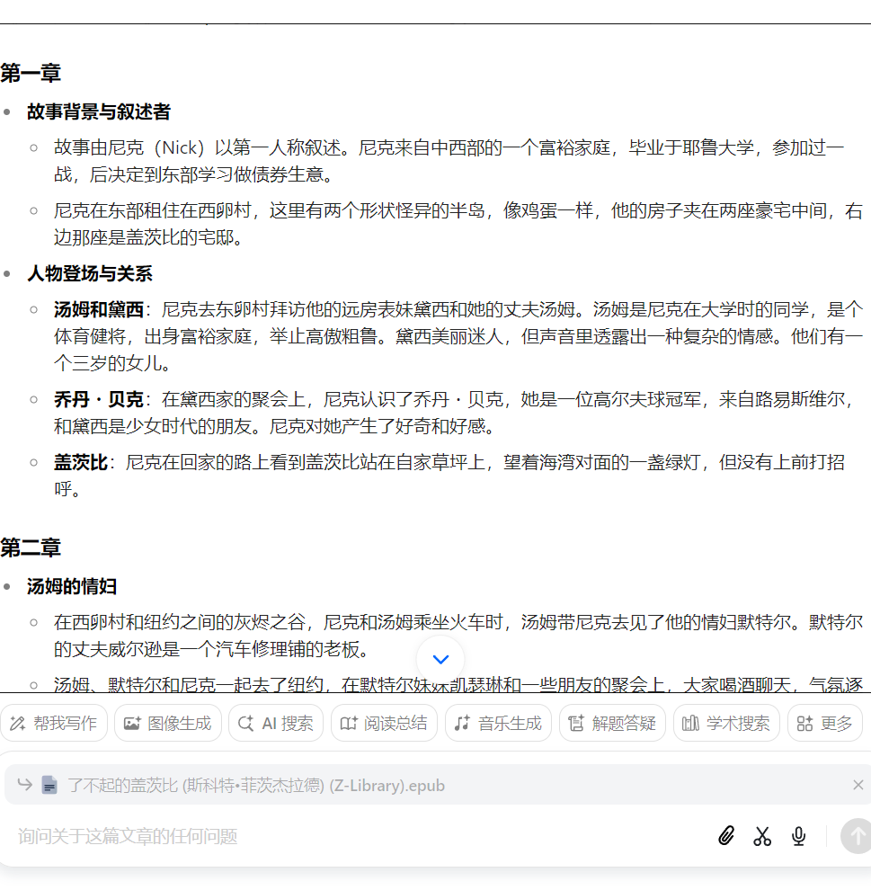

# summary_of_2024-10

## 9-28~10-04

主要还是休息，放松。作息饮食都比较健康

各种做减法，实践上让自己更专注一些，放下细枝末节。

### 冥想·简化了练后的文字记录

冥想 7 天

🎇 做减法-简化了练后的文字记录: 实践后确实感觉没有那么多需要记录的。练完写几个关键词，还有一句话概括就行了，甚至什么都不写也行，真正重要的内容遇到后怎么样都会记住、或者很重要的灵感自己不会让它留走。

主要练习困难和内容还是放下最近发生的事情引起的杂念

### 英语 Up_in_the_Air 完结 🎉

449 words 50 sentences

390 words 49 sentences

320 words 50 sentences

524 words 75 sentences

555 words 71 sentences Up_in_the_Air 完结 🎉

547 words 61 sentences

513 words 47 sentences 开始 sully

阅读了 4 天

---

听力感想:

-   🎇 做减法-简化了听力笔记: 一切交给大脑去学习。有点像可输入理解的阅读方法 理解为王。听力也是盲听 模仿复述为王，其它都不重要
-   前面盲听之所以没听出来，是因为以前完全没有接触过这样的说话方式，但现在可以完全靠模仿来一点点掌握

阅读感想:

-   查词确实可以不急，能理解就不查。参考那位学哲学的 up 的阅读方法，重要的东西会反复提到，所以我可以后面遇到再查，一样可以帮助理解
-   前面读的文本相关的知识点都忘得差不多了（比如生词），可能语言习得就是这样**不断 comprehend it and throw it away**，一切习得发生在 阅读的 comprehend 里面，听力也类似

阅读时阅读和理解最重要，练听力时盲听模仿复述最重要，都不要被细枝末节消耗，其它都是可要可不要

### 运动

打篮球 \*3

-   放弃了数据、进步追求，主要是为了快乐还有健康

跑步 \*1

瑜伽垫徒手 10m \*1

---

引体 \*2

进步缓慢，那就慢慢练 反正也有方向了

新学了

-   【YTWL 肩袖热身训练】 https://www.bilibili.com/video/BV1PW411t7qM/?share_source=copy_web&vd_source=430e5e350b7b924bb2bdeca5d7cbe4de
-   【引体热身流程分享，愿伤病远离每一个人】 https://www.bilibili.com/video/BV1Zz4y197Xf/?share_source=copy_web&vd_source=430e5e350b7b924bb2bdeca5d7cbe4de
-   【从易到难，引体向上 发力技术演示】 https://www.bilibili.com/video/BV1TE411c7pZ/?share_source=copy_web&vd_source=430e5e350b7b924bb2bdeca5d7cbe4de

### 杂学·《无限可能的身体》

读完《无限可能的身体》

-   感觉很新奇，也想尝试。后续可能写点关于这个生活方式的实践吧

---

其它感悟

-   实践出真知。猜想和尝试后的结论经常相差很大。这个和清醒也有很大关系，清醒不只是自己冷静，还需要靠实践得到更多真实的信息。

-   做好减法，精简文字记录，主动放弃，抓重点实践重点 要事第一

    -   比如不要花太多时间思考计划，且计划太多内容。因为实践总是只会抓一两个重点，一步步来，慢慢加。 做笔记、文字记录也是同理，实践会更简单一些

-   计划和实践: 要简单切入

    -   而且当实践有疑问时，自己回来会修改计划，带着实践经验来复习、查阅、整理知识和修改计划这是更自然的方法。比如昨天和今天实践了户外一小时后，回家去查书后，再去整理，这也印象就深刻了。
    -   🎇 所以对于计划或者笔记，非常不建议一开始就搞得详细，一切应该简单开始，实践也是简单开始，方便实践和切入，后续再慢慢加。

-   对于高多巴胺刺激的东西，比如游戏、信息浏览，要保持清醒、主动隔离和约束

## 10-5~10-11

整体而言，这七天的最后有点掉状态。所以为了保持住习惯，那就暂时减少练习内容、时长先。

其实做减法已经比上周好了，保持住这个做事方式吧

### 冥想

冥想 6 天

主要练习困难和内容还是放下最近发生的事情引起的杂念，尝试加了时间，体验确实好一点。但是后面因其他事情又停了冥想 1 天，这次停了一天有点影响练习效果的

后续就多用专注当下、拉回来的技术。 刻意专注一下当下

### 英语

英语 6 天

Charlottes_Web 用有声书的方式进行阅读，不多，但也算进行下去了

英语听力的方法改进
不要在意数据，练够 20m 就行
多练一下第二步，多点模仿原音频，在得过且过的基础上 放慢节奏。可能我现在需要这样才能进步更多

### 运动·快乐的运动

运动 7 天，两次引体向上练习

现在打篮球主要为了快乐与健康

🎇 有点慢慢找到运动的乐趣的感觉。 按照固定的轨迹去重复一个动作模式，那叫做锻炼，但是在不受伤的前提下，按照天性去活动身体，那就叫做运动

还有开始学习赤足行走和跑，发现也是一个要慢慢来的事情。“tendons, joints take longer to strengthen than muscle & (heart)condition”

赤足和运动的乐趣其实都受到了 《无限可能的身体》的启发

### 杂学·看剧

看《Barefoot-Running-Step-by-Step》-Ken Bob

-   如果对赤足感兴趣的话，这本书挺有趣的，不管是技术，里面还包含 Ken 个人的一些观念和做事方法。

看了 《MyBrilliantFriend》s1-3 电视剧

-   小林的几个解读也不错，可以看看
-   > 【《我的天才女友 1》男人暴力 女人恶毒 孩子恐惧的丑陋童年】 https://www.bilibili.com/video/BV1RY4y1H7tV/?share_source=copy_web&vd_source=430e5e350b7b924bb2bdeca5d7cbe4de

-   对我而言这是一个比较陌生的故事背景，闭塞落后、“野蛮”的小镇，途中会有很多为什么，然后随着继续看加上慢慢想想明白一点

## 10-12~18

因为过于专注一些事情，生活方式和状态又掉了一些，好的生活方式还是需要坚持和稳定啊

### 冥想·第一次秋千上冥想

冥想 4.5 天

日常生活虽然还是会用到冥想的一些理念和生活方式，但正式的冥想次数确实少了。这和生活方式的改变也有关系

第一次秋千上冥想

-   其实这个环境也挺好的，而且在秋千上也很新鲜，主要问题还是那个苍蝇很影响人，或者不知道什么虫，反正还是要挑个好环境
-   好环境加之锻炼后，散步后，玩秋千和滑滑梯，人慢下来了。整体感觉就很好，和那次楼下小竹林下冥想一样自然，**自发的想去冥想**

### 英语·加强单句的练习质量

英语 6.5 天

听力练习放慢了速度，加强了每一句的练习质量。
同上周 "不要在意数据，练够 20m 就行"

阅读的话，如果真能坚持下去每天 10~20m，感觉也不错

### 运动·回归投篮练习

篮球 5 天

-   自己打和打比赛还是不一样，对身体要求不一样。还是需要有时候打比
-   又回到了练库里课程的静态 mechanics 投篮练习，现在先专注上半身 手部姿势的调整，把姿势稳定住先；后面加了控球的基础练习，主要练左手

-   🎇 不要关注进球的数量了，专注练习当前要练的内容。从投篮中获得乐趣，正念式的感受投篮。 这样还真挺有意思的

    ***

引体 1 天

-   然后进行一周减载，也就打篮球路过会拉个一组
-   🎇 在身体恢复后+完全热身后，能做到三个了。这比一开始的一个进步很多了。 到四个就开始丢弃弹力带了

    ***

**运动就是舒服**，不可替代的舒服和明显一样都有它不可替代的作用，而且打篮球的时候更加符合天性的活动，比那些固定动作的锻炼会让人或者让我感觉更加自由，更加舒服

🎇 人的天性就是动:
人的天性就是动一个例子，就是一些初中男生或者小学生遇到单干的时候会想着上去拉一下，即使小女孩看到单杠在游乐园也会想着去爬，其实这就是天性

现在打完篮球在回去，路上路过单杠也是这种想法，也是想去拉一下，尤其是在自己有能力做三个的情况下去拉一个，会让我感觉很舒服

这就是下意识的动作，而且他对于健康有作用，所以说是天性啊

### 杂学·读书

《狼与香辛料》看完剩下的 19-25

-   感觉没有第一次看那么投入，感觉就是比较普通的一个故事，如果不是赫萝比较可爱 性格好，我可能都直接不看了。也可能是最近看的作品更好一些，口味变挑剔了 😂
-   🎇 还有这次回看发现好多内容都忘了，越是浅的东西，越是经不住时间考验啊 连笔记都是比较简单

看完 《老夫老妻重返青春》

-   挺有意思的日常番，很适合放松

---

看完《了不起的盖茨比》

-   主要讲男人对爱情的一些想法和做法，比如书中的盖茨比和 Tom，还有社会观念里以家庭背景分人、纸醉金迷的生活、钱欲对人的影响。
-   爱情这种东西。还是尽量想清楚自己要什么，对对方的要求是什么，自己在这段关系中想获取上面，如果只是单纯取悦自己的话，还是要尽量清醒一些，虽然很难，不然上头过多，幻想破灭或看清真相时难免后悔。
-   另外，这又是一种事情在不对的时间发生的例子，也就是命运、因果吧。 有一句总结古希腊神话是这么说的，“因为万物在时间的次序中不公正（也就是事情没有在合适的时机发生、这种事情爱情就很多），所以受到惩罚，并进行补偿”

-   🎇ai 时代读书更简单了，读不懂可以问 ai，降低门槛
    
-   小林的解读也不错。【《了不起的盖茨比》小说和电影哪里不一样】 https://www.bilibili.com/video/BV1y7411j7Zw/?share_source=copy_web&vd_source=430e5e350b7b924bb2bdeca5d7cbe4de
-   值得回看，因为第一遍看的时候很多细节是看不懂的。

---

看完 MyBrilliantFriend 第四本书

-   前三本书看的电视剧，最后一本看的书
-   真挺有意思的，看的时候完全不在意页数，因为有趣投入的一直看下去
-   围绕一位女性的成长，讲了很多关于女性一生可能遇到的各种事情，爱情 婚姻 怀孕 抚养 事业 友情。 又讲到了家庭，小镇对人，教育学习对人的影响。还有很多，毕竟书挺长的
-   李冉推荐看剧的时候，推荐语是找到失落的觉知，大概就包括我上面说的这些，毕竟对生活有更多觉知的话，就会感知到更多这些东西，相反如果过于迟钝（常说的钝感力）的话，又会失去会减少这方面的感知，或者说人变麻木了。
-   Nino 这个人真的很招人恨 😂，但放下偏见看书的话，又会发现这就是现实。或者一些女性的命运，必要经历这一道坎
-   另外译者陈英在豆瓣的帖子也很有意思
    -   [历尽劫波后 她们总是变得更强悍（失踪的孩子）书评](https://book.douban.com/review/9467427/)
    -   [#翻译手记#（我的天才女友）书评](https://book.douban.com/review/8300308/)
-   值得回看，从第一本开始看

## 10-19~26

因为专注其他事情，routine 反而松懈，但也有尽量在维持习惯，毕竟也是自己想做的、主动选择的，也沉没一定成本了

后续调回更健康的生活方式吧，这也意味著对生活更有掌控

### 冥想·松懈了

冥想 2 天

因为专注其它事情，还有起床后加上生活方式的松懈，冥想也掉了。
但还是需要整块的冥想时间的，后续改进吧

### 英语·维持习惯

英语 8 天

听力

-   直接减少了时间，10-15m，但方法和上一周一样。放慢速度，提高单句练习质量
-   另外练后看英文字幕也是能提升英语能力，帮助理解剧情，没必要一直不看

阅读: 有做零散的阅读

### 运动·休息多了

篮球 2 次

引体 1 次

-   减载周是有效的，现在完全恢复+热手后，一次可以拉 3-4 个

赤足

-   要循序渐进，25 号街道上上头跑受伤了。
-   真的是要聆听身体，注意循序渐进啊。
    🎇 最快的捷径就是不受伤

### 杂学·平凡的世界·赤足跑

看完 《平凡的世界》三本

故事还是不错的。两个时代里各种人的变化。

不可避免的女性的刻画会有一些缺陷，女性人物有点过于苦，但其实在文章的背景里也说得通，只能说我们吸取教训吧。

如果只用现代的眼光来阅读、评价，那总会遇到挑刺的地方。相反，如果结合时代背景，就能理解更多事情的缘由，理解为什么事情是这么发展的。 这也就是能看到更多，冥想里是看到实相。 尤其学西哲史，只用现代的眼光那就很容易一叶障目了，比如学古希腊的思想时会发现一眼错，但这样的观念帮助不了自己看到真相，或通俗一点，学习东西

书中讲到的家庭 爱情这些其实和摆脱旧思想、个人独立意识、互相理解会有关系，但想做到这些、又离不开好的家庭环境、物质条件，比如书中的晓霞是相对比较现代的一个人物，但其实脱不开好的成长条件。

至于平凡，主要是视角到普通人身上，写普通人周围的世界。

---

看完 Barefoot-Running-Step-by-Step

豆瓣有个书评，大概说，全书有信息量的地方加起来就一篇文章

但其实这个是极端的，比如用 ai 总结任何书，我都可以总结成只有一篇文章的信息量。但这不能帮助你学到东西

这本书可贵在一有比较全面的技术介绍；二是从原理到实践的覆盖；三是实践上的各种细节、帮助减少弯路、比如学习赤足跑耐心就很重要、也是全书强调；四是有不同赤足者的视角；五是运动的观念传达的很好，运动就是玩，不应该痛苦，痛就停下来，累了就休息，我们是运动者，而不是锻炼者，锻炼是乏味的，我们就是动着玩；六是一些其它的价值观也很有意思；七是行文风趣

至于我为什么选择赤足。一是好奇，这也是一切的开始，还是上一本《无限可能的身体》推荐的赤足跑；二是尝试后发现好玩，感受很新奇。三是发现确实和自己的冥想观念契合，冥想里的行禅、觉知其实和这个都有些关系。 其他的话可能是坚持，我目前还比较认同赤足对健康的各种好处，但有待更长时间的实践验证

---

🎇 独立思考的诞生:

-   这个很有可能就是因为在读书的时候遇到了新的矛盾的观点，这时候就会产生质疑，这时候就需要自己思考，这种过程多了之后就会形成自己独特的看法，慢慢的独立思考就成了习惯
-   一开始是很难的，假如一开始什么书都没看过，就直接看平凡的世界，那很大概率就会被他的价值观影响。但其实问题也不大，只要观念是开放的、接受改变的，总会向更适合自己的方向走，有点 "life finds a way" 的感觉了 😂

##

### 冥想

冥想 天

### 英语

英语 天

### 运动

运动 天

### 杂学
