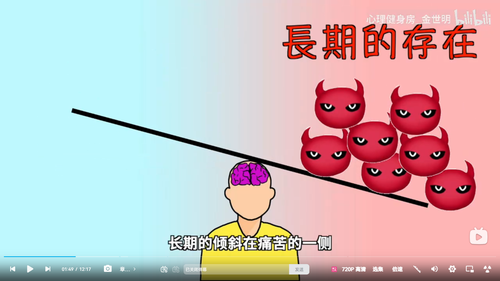

---

title: 只言片语 杂学
date: 2024-09-17
abstract:   
tags: 
- 只言片语 
---

# 只言片语\_杂学

戒社交平台推荐的[史東 183 三个视频](https://space.bilibili.com/300501537/channel/collectiondetail?sid=619119)，主要介绍博主自己的阻断经历。

## 上瘾

我最近主要用于戒社交平台 2024-09-17

### 逃避痛苦·神经性适应和多巴胺·戒断反应

参考视频
【成瘾来自逃避，如何戒掉 上瘾 改掉不良的 生活习惯？】 https://www.bilibili.com/video/BV1YC4y1c7Kr/

#### 上瘾的天平原理

> 00:00 很多人以为人在重复成瘾行为的时候是快乐的 其实人只有在上瘾刚开始那个阶段才能感受到强烈的快乐，之后大脑会很快适应这种快乐 变得不那么快乐 但是不做的话又很痛苦
> 

-   嗐，感觉到了，真实的写照。
-   一开始点开社交平台，看的第一个视频还是很快乐的。但后面真得就不快乐了，但不做也痛苦
-   还有一个不恰当、但类似的感觉就是自我安慰过程里的的刚射前 刚射后，落差极大，推荐读者可以自省体会一下。

---

毒品的例子:

> 02:22 毒品只要服用一次 释放的多巴胺的量是平时的 100 倍左右  
> 这种快乐是在自然界中找不到的 所以只要使用过一次 就会对除了之外的 **其他所有的快乐都会失去兴趣** 即便是性爱也变得没有兴趣 **只有重复的使用** 才能让犒赏系统的天平稍微的维持一下平衡 然后再次的向痛苦倾斜 所以只要染上一次 就要跟所有的快乐道别

#### 现代人的缺陷

进化论的解释:

> 02:54 我们的大脑好像有一些缺陷 其实也不是这样 应该有听说过 人脑其实进化得特别慢 跟不上时代的变化  
> 我们现代人的大脑跟 20 万年前的人 大脑结构是一样的 当时那个年代物质非常的稀缺 也很危险 人如果想吃一个水果的话 就要付出大量的时间和精力 所以如果没有这种犒赏机制的话 古代人不会为了多吃一个水果 多吃一份牛排 付出那么多的努力 只要吃到一次就会想吃 第二次 如果吃不到的话 就让你痛苦 这种犒赏机制和神经性适应的模式呢 是符合那个年代（为了激励人类活下来，去捕猎）  
> 但是到了现代社会 吃的玩的喝的都处于**过剩**的状态 多巴胺分泌过量 过度的刺激了犒赏系统 导致天平中**痛苦的一侧呢积累了大量的痛苦精灵 还是长期的**。大脑为了平衡 需要获得大量的快乐 才能抗衡神经性适应带来的痛苦
> 所以现代人呢不再是为了快乐而寻找快乐 而是想要回避痛苦 才不断的寻找快乐和刺激

大脑的缺点:

> 04:15 这个人的意志力不够 这种想法其实很危险 因为把成瘾行为的原因推到了一个人的性格上 其实**只要环境适合 任何人都有可能上瘾** 因为我们的大脑结构就是这么被设计的

#### 解决 1:拉长快乐和快乐之间的时间间隔·给恢复时间

**尽力的拉长快乐和快乐之间的时间间隔**，间隔越长那天平就越容易恢复

-   这个其实延迟性满足就很好
-   **这也解释了为什么我娱乐后为什么要一段休息时间**，尤其碎片娱乐、刷社交平台，因为痛苦精灵还在那啊，需要时间消化。

> 05:03 相同的快乐和快乐之间 如果这个时间间隔太小的话 不仅感受不到快乐 还会积累大量的痛苦
> 🎇05:18 **如果内心有还想重复上一次快乐的欲望的话 这个天平已经受到了威胁 我们要给大脑一定恢复的时间**

-   **恢复时间**真得就是解药之一了。
-   不是去简简单单的约束自己的放纵行为，而是给自己恢复时间，让自己大脑舒服下来，让这个天平恢复平衡，自然而然就清醒了，然后也不痛苦了

#### 解决 2:彻底的阻断一个月

> 05:38 **因为神经性适应的恢复期就是一个月** 只要过了这段时期 即使你不做成瘾行为 像是不抽烟 不 不喝酒 也不会那么的难受
> 这个时间非常的难熬 我们在很多资料中都能看到 像是戒毒的人 如果一个月碰不到的话 那会是怎样的痛苦 **但这个时间是一定要经历的**

治疗后也尽量彻底隔离，不要相信自己的意志力。

-   > 例如想要戒烟的话 即使阻断了一个月之后 也不要再跟抽烟的人有来往
-   尽量远离社交平台，约束自己的使用
-   比如我使用 bilibili，那么就只在需要的时候再登录，用完的那一刻就退出登录

这不就是往死里管的理论依据嘛，来自 bilibili 的 up 主戒社，对赌瘾感兴趣的推荐去看看

> 07:03 不相信自己意志力的人 才能避免染上各种成瘾行为

-   这也是我的血泪了

#### 解决 3:先痛苦再快乐

无痛苦精灵

类似延迟性满足。

例子:

> 08:09 不仅是运动 像是洗凉水澡 一顿餐跟另一顿餐之间不吃任何东西 或是先付出一定的努力之后再得到的快乐 都不会产生痛苦精灵 像是努力学习之后考上了大学获得的快乐 平时努力之后进了一家很好的公司 这种都属于先痛苦后快乐的模式 都很健康

我试过的，冥想很好，没有副作用。就是回报周期有点长

#### 多巴胺和前额叶皮质相互作用

两种原因上瘾:

-   第一是为了回避当前的痛苦
-   第二是因为好奇心

> 如果前额叶皮质受到伤害的话 这个人就从此会变得很堕落 成瘾行为会降低一个人的前额叶皮质的功能 进一步的降低自控能力
> 自律的人呢会激发前额叶皮质的功能 变得更聪明

---

认识到快乐的本质:

> 10:45 幸福不是一次性释放大量的多巴胺 即使我们有再幸福的事情 大脑会很快适应这种幸福感 变得不那么幸福 这就是我们人脑的结构 **快乐就是这种很瞬间的东西**  
> 所以我们要做的不是一次性的增加大量的快乐 而是要**用健康的方式**增加快乐的频度 获得一次快乐之后呢 再去**努力获得**下一个快乐

---

解释年少得意 人突然中奖为什么会危险？

-   用天平理论 犒赏系统来解释

---

保持清醒，不要回避痛苦

> 11:48 即使我们的生活再累 也不要去回避痛苦 **回避解决不了任何问题**，累的时候呢 我们也可以适当的放纵自己的大脑，**但是大脑中一定要有理性的部分** 时刻提醒自己 知道自己正在做什么

### 杂·上瘾

烟瘾酒瘾赌瘾槟榔瘾 和 游戏瘾看书瘾短视频瘾 信息上瘾 的不同之处

一是成本 第二种成本一般有限，且能零成本，游戏直播疯狂氪金除外，且这里不讨论时间成本。

二是对身体伤害 第一种对身体有明显伤害，且日积月累

三是不可逆性 比如戒断反应，你戒断尼古丁、海洛因和戒断游戏，表现形式不同。所以游戏即使对你产生了负面影响，但这个戒断反应程度会不同

-   用安娜·莱姆克的天平就好理解了，痛苦一边压的太过，一戒断就非常痛苦，为了恢复天平平衡，然后继续使用毒品、继续赌博，而且用人会为了增加多巴胺的分泌，去用更强的毒品，赌更多钱。

---

戒社 up 主的一个视频:

【大学刚毕业，追地下偶像成瘾，哪怕借钱也要去买券和她们握手聊天，给我女朋友和妈妈的感觉。】 https://www.bilibili.com/video/BV13i4y1a7CW/?share_source=copy_web&vd_source=cb804c92cb9aca2966f586712caac3aa

超出能力范围的事情，最后贷还贷，加上上瘾，自己摆脱不出来了

## 杂

### 狮子王·认识自己

狮子王里的认识自己·相信自己·做自己·行动·接受改变

-   参考【“辛巴，你已经忘记我了吗”考研老师张宇深情讲述狮子王（the lion king）经典励志片段，鼓励考研学子永远不要放弃】 https://www.bilibili.com/video/BV1cZ4y1H7B6

只能靠自己，所以要 `remember who u are`。
相信自己，因为 `you r more than what u have become`，`you will be more than who u r right now`

结合其它台词，`It doesn't matter，it's in the past`，不要被过去陷住，比如当自我怀疑 `i am not what i used to be`，我们可以 `learn from it instead of running from it`

真得是好电影 好台词
