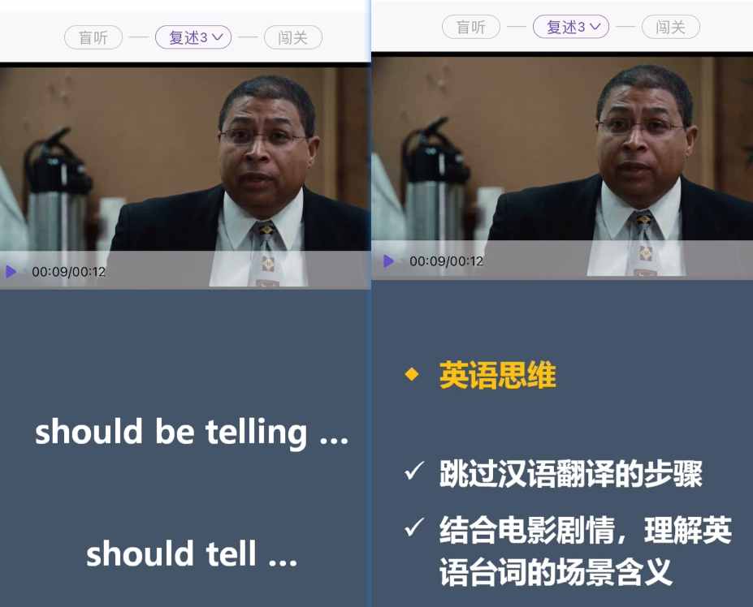

---

title: 只言片语 英语
date: 2024-09-17
abstract:   
tags: 
- 只言片语
---

# 只言片语\_英语

## 听力口语

主要讲围绕听典英语 app 的训练方法

### 练什么和怎么练

【【盲听复述】一部电影搞定英语听力和口语（中） | 听典英语】 https://www.bilibili.com/video/BV13h4y1q73f/?share_source=copy_web&vd_source=430e5e350b7b924bb2bdeca5d7cbe4de

https://ai8rry6n96x.feishu.cn/minutes/obcnq99cd8qw462uvuj3j55c

---

高频词汇的设计理解

-   > 因为高频词汇经常是重复出现的，所以对应的语音现象也是经常重复出现的，我们逐步把高频词汇相关的听力陷阱填平，听力自然就会大幅提升。

---

对单词发音和语块的认识

-   > 我们的英语听力最大的瓶颈就在于认识单词听不懂。可是认识单词为什么会听不懂呢？原因是我们对于单词发音的认识是错的。我们学的是单个单词的发音，而在句子里面单词发音发生了很大变化，它不再是我们最初学习它的时候的样子，所以我们需要通过练习重新认识句子里的发音。
-   语块 

-   > 语块的发音通常会被当作一个整体来处理，语块内部会发生高度的连读和高度省略，对于语块的发音我们也需要重新认识和熟悉。

-   > 所以练听力实际上就是一个重新认识单词发音，重新认识语块发音的过程。

---

为什么先盲听

---

为什么要复述

-   > 因为听懂却复述不出来的句子，不是真正的听懂。自己感觉上好像懂了，但其实只是听懂了一部分单词，然后在汉语层面上把句子组织了一遍，对于句子的英语理解是不完整的，换句话说就是听懂之后不能复述一遍的句子，不是有效输入。

### 口语怎么练

【在云端（1）&【盲听复述】一部电影搞定英语听力和口语（下） | 听典英语】 https://www.bilibili.com/video/BV1bc411f7cw/?share_source=copy_web&vd_source=430e5e350b7b924bb2bdeca5d7cbe4de

https://ai8rry6n96x.feishu.cn/minutes/obcnq9w4572685qcdv7p3xu5

汉语翻译会破坏英语单词 词组的表达力，只用中译英来说口语，自然而然的口语就很受限

-   > 这个句子里面的 in return，不要把它理解成它的汉语翻译回报或者收益或者结果，因为这样翻译会非常破坏英语词汇的表达能力。在以后的场景里面，你如果是从汉语出发想到回报或者结果的时候，你是不会想到用 in return。

---

汉语思维来理解会丢失信息，不够准确

怎么练口语，说什么，怎么说？

-   > 复述电影台词几乎是唯一可以摆脱汉语思维的口语训练

### 是否看字幕练习？

看字幕练习也不错。这样的话会损失一点语音记忆的锻炼 多一点对口语方面的语音准确度、节奏、连音变音的锻炼，可以一下子抓住几个口语要素。 在练非常难的句子时练习体验上会好很多。

不看字幕会侧重语音记忆，造句，听力辨别方面的锻炼。

但其实这里有一个容易忽略的盲区。就是**人类对于陌生知识通常是一个学完再学下一个的，语音也是**，学完（复述模仿完）这个意群分割再学下一个，学完这个变音再学下一个。 相对的，如果想在一次复述里模仿出多个自己陌生的口语要素（节奏 语块 意群分割 情感 语调这些东西），那就可能什么都练不了。 所以两者方式的训练效果会有差异

所以回到训练上，还是采取不看字幕的方式进行盲听和复述。专心听一个想要练的口语要素，专心复述模仿一个想要练的口语要素。**一个个练反而是捷径**。

补充一个细节。有时会一次复述练到好几个口语要素，那是因为这几个口语要素对你来说没那么难，也就是没那么陌生。对应的，我们也可以通过不看字幕的方式把这几个要素给盲听出来，并在复述过程中进行练习

当然也不能一棒子打死，看字幕去复述。因为练习时真得会遇到很难的句子，这个时候用看字幕的方式反而能保持训练热情。当然这种只是非常少的情况。

### 练习时遇到一些比较难的音怎么办？

练习方法大道化简: 仍是多听多模仿

---

🎇 明确训练重点，循序渐进。得过且过，顺其自然。

**人脑练听力时是深度学习的黑箱**，不是单纯的一对一函数映射，具体函数是不知道的，函数是黑箱

因此**选择合适的材料**也比较重要，关系到自己的进步速度，还有训练体验。合适的材料就意味着 句子语音可以被视为训练重点的占比可以达到更高，大部分材料在学习区。不合适的材料就是很多都处于困难区能学到的东西很少，而且学的还很累，正反馈少

---

**听力理解是综合性的结果**
听力识别的情况是叠加脑补能力的过程。**听的多了就会根据语言习惯猜出某一处是某个单词**。然后这个猜的根据又是有很多方面的信息综合得出来的，单纯的语音规则反而不行，而且语音规则还会放慢自己的识别过程。

得过且过 多听多模仿多说就好。大脑会帮忙吸收和进步的
