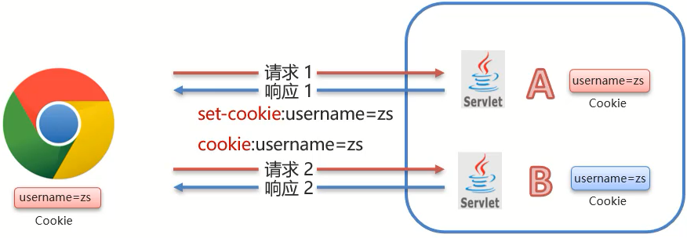
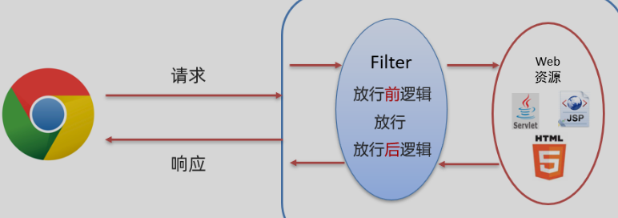
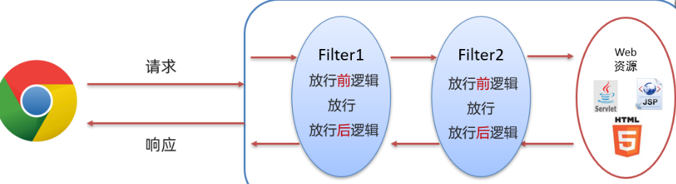

# JavaWeb_MindMap

## 前言

-   [思维导图链接](https://www.processon.com/view/link/63566af75653bb1587539482)
-   此思维导图主要参考黑马 2021JavaWeb 课程，简略部分请参考课程讲义，讲义写的很清楚，课程讲的很明白，思维导图只有整体上快速浏览的作用
-   缺少部分：三件套 vue element 等前端知识点 和 jsp mysql 的后端知识

## Maven

### 特点（feature）

-   标准化的项目结构
    -   不同 IDE 都能用
-   标准化的构建流程
    -   比如编译、测试、打包、发布，这些操作
-   依赖管理
    -   用简单的坐标配置 管理各种依赖

### 组成（component）

-   Maven 模型
    -   项目对象模型 (Project Object Model)
    -   依赖管理模型(Dependency)
    -   插件(Plugin)
-   Repository
    -   Local - Remote - Central
    -   Remote 一开始会下载 Central 大多的 jar 包，让 Local 通过 Remote 下载会下载更快

### 使用

-   常用命令
-   生命周期（lifecycle）
    -   default ：核心工作，例如编译——测试——打包——安装等。
        -   ‘——’ 中间还有其它命令
    -   clean ：清理工作。
    -   site ： 产生报告，发布站点等。这套声明周期一般不会使用。

## Mybatis

### Overview

-   定义：DAO 框架，用于简化 JDBC 开发
-   简化方面
    -   配置文件改数据库的连接信息
    -   SQL 语句简化

### Mapper 代理开发

#### 好处

-   解决原生方式中的硬编码
-   简化后期执行 SQL

#### 代理要求

-   接口名和映射文件名
-   接口和映射文件在同一目录
-   接口和映射文件的参数类型和返回值类型相同

### 使用

#### 核心配置文件

-   多环境配置
-   类型别名：简化映射配置文件中 resultType 属性值的编写

#### 映射配置文件

-   resultMap ：解决 类属性 brandName 和表字段 brand_name 的问题

#### 接口文件（写 SQL）

-   参数占位符
-   XML 的转义字符
-   动态 SQL
    -   if
        -   多个条件 ，多个 if
        -   配合 where，实现多条件查询动态删除 and
        -   配合 set 标签，实现动态修改改数据
    -   choose (when, otherwise)
        -   单个条件的多个选项
        -   相当于 switch-case
    -   trim (where, set)
    -   foreach
        -   遍历要存有删除数据序号的集合 实现删除多行数据
-   返回主键功能的属性
    -   订单和订单项都需要自增
    -   useGeneratedKeys="true" keyProperty="id"
-   注解 SQL

### 参数传递

#### 多个参数

-   在接口文件编写方法时，给形参添加注解 @Param
-   可读性更高

#### 单个参数

-   不同数据类型使用要求不同
-   底层源码实现

## MVC 模式和三层架构

-   联系：把不同框架放在不同的位置，把数据层，展现层，业务层分开
-   好处
    -   分层后分工明确
    -   好维护
    -   好复用

## 知识联系

-   HTTP：浏览器和服务器间的通信规则
    -   Tomcat：服务器，Servlet 容器
-   Servlet，JavaEE 规范
    -   对 Request，和 Response 进行处理，是动态的 Web 资源
    -   可调用数据库
-   Request、Response
    -   浏览器和服务器的请求和响应的对象，数据格式遵守 HTTP 协议是规定了请求和响应数据的格式
    -   作为 Servlet service()方法的参数，可在 service 里写处理 Request、 Response 的逻辑、代码
-   Cookie、Session
    -   解决 HTTP 无状态，无法共享数据问题
-   Filter
    -   对请求的所有资源进行拦截和放行，以实现更复杂的功能
-   SqlSessionFactory 工具类抽取
    -   Mybatis 的基础操作就出现了些重复代码
    -   避免重复创建 SqlSessionFactory 工厂类
-   各个 demo 的复现
    -   加深当前章节知识的理解
    -   有助于理解三层架构，理解 Mybatis 框架的使用，数据库是如何调用的，Servlet 和 service 层如何处理数据，如何把处理后的数据返回给页面等等。
    -   可以提升 debug 能力

## HTTP

### 协议特点

-   安全
-   一次请求一次响应
-   无状态
    -   速度快，当不能共享数据
    -   会话技术解决共享数据问题

### 请求数据格式

### 响应数据格式

## Tomcat 简介

-   是 Web 服务器
    -   可以将 Web 项目部署到服务器中，对外提供网上浏览服务
-   对 HTTP 协议的操作进行封装
-   支持 Servlet/JSP 少量 JavaEE 规范
    -   Tomcat 也被称为 Web 容器、Servlet 容器

## Servlet

-   JavaEE 规范，接口

### 执行流程

-   从 url 路径找到 web 项目对应的类（此类实现了 Servlet）
-   tomcat 为 这个类创建对象，并调用 service 方法

### 生命周期

#### 加载和实例化

-   在 `@WebServlet()` 里配置 loadOnstartup
-   loadOnstartup 定义 Servlet 对象的创建时间。

#### init()

-   只调用一次

#### service()

-   每次请求都调用

#### destroy()

-   内存释放或者服务器关闭的时候，Servlet 对象会被销毁，调用一次

### 体系结构，HttpServlet

-   针对 HTTP 协议的 HttpServlet。简化 Servlet 编写
-   为什么要根据请求方式的不同，调用不同的方法?
    -   两种请求的请求参数的位置不同
-   如何调用 service() 方法？
    -   HttpServlet 底层对 doGet 和 doPost 都写了对应调用 service() 方法的代码
    -   我们继承 HttpServlet 后，只需复写 doGet 和 doPost 方法

### urlPattern 配置规则

-   一个 Servlet 可以配置多个访问路径
-   五种配置的优先级为 精确匹配 > 目录匹配> 扩展名匹配 > /\* > /

## Request&Response

### Request

-   定义：request 对象是用来封装请求数据的对象

#### 使用场景

-   后台服务器[Tomcat]会对 HTTP 请求中的数据进行解析并把解析结果存入到一个对象中，这对象就是 Request 对象

#### 继承体系

-   ServletRequest-->HttpServletRequest-->RequestFacade

#### 使用

-   针对请求数据的不同部分 请求行、请求头和请求体，Request 有对应的 API 方法来获取对应的值
-   获取请求参数的通用方式
    -   GET 方式: String getQueryString()
    -   POST 方式: BufferedReader getReader(); getInputStream()
    -   统一方式： getParameter()
-   请求转发
    -   转发的方法
        -   `req.getRequestDispatcher("资源B路径").forward(req,resp);`
    -   操作 request 对象的方法
        -   存储数据到 request 域[范围,数据是存储在 request 对象]中

```java
void setAttribute(String name,Object o);
```

      - 根据 key 获取值

```java
Object getAttribute(String name);
```

      - 根据 key 删除该键值对

```java
void removeAttribute(String name);
```

### Response

-   response 对象是用来封装响应数据的对象

#### 使用场景

-   业务处理完后，后台就需要给前端返回业务处理的结果即响应数据，响应数据会封装到 **Response 对象**。
-   后台**服务器**[Tomcat]会解析 response 对象,按照[响应行+响应头+响应体]格式拼接**结果**
-   **浏览器解析结果**，把内容展示在浏览器给用户浏览

#### 继承体系

-   ServletResponse-->HttpServletResponse-->ResponseFacade

#### 使用

##### 用 api 设置响应数据

-   响应字符数据
    -   通过 Response 对象获取字符输出流： `PrintWriter writer = resp.getWriter();`
    -   通过字符输出流写数据: `writer.write("aaa");`
    -   设置数据类型及数据的编码 `response.setContentType("text/html;charset=utf-8");`
-   响应字节数据,用工具类优化代码

##### 请求重定向的方法

-

```java
resp.setStatus(302);
resp.setHeader("location","资源B的访问路径");
```

-

```java
    resposne.sendRedirect("/request-demo/resp2")
```

-   需要加虚拟目录：String contextPath = request.getContextPath();
-   动态获取虚拟目录

### 重定向和请求转发对比

-   

## Cookie&Session

### Cookie

-   把数据存储在客户端

#### 基本使用

-   发送 Cookie:
    -   创建 Cookie 对象，并设置值:
        -   `Cookie cookie = new Cookie("key","value");`
    -   发送 Cookie 到客户端使用的是 Reponse 对象:
        -   `response.addCookie(cookie);`
-   获取 Cookie:
    -   使用 Request 对象获取 Cookie 数组:
        -   `Cookie[] cookies = request.getCookies();`
    -   遍历数组, 获取数组中每个 Cookie 对象的值:
        -   `cookie.getName()和 cookie.getValue()`

#### 原理分析

-   
-   对于 Cookie 的实现原理是基于 HTTP 协议的,其中设计到 HTTP 协议中的**两个请求头**信息:
-   响应 1 的响应头:set-cookie
    -   通过这个让浏览器再次获取上次发的数据，被 servlet 设置为 cookie 对象
    -   实现过程：
        -   AServlet 先接收到用户在浏览器上填的数据
        -   然后 AServlet 把数据封装成 Cookie
        -   最后把 Cookie 存到 response 里，发给浏览器
-   请求 2 的请求头: cookie
    -   通过这个让浏览器再次把 cookie 发给 servlet
    -   BServlet 从浏览器的请求中获取到了 Cookie
-   总的来说
    -   Cookie 是把数据存到浏览器中

#### 使用细节

-   设置 Cookie 存活时间 `setMaxAge(int seconds)`
-   Cookie 存储中文：使用 API 对 Cookie 进行编解码

### Session

-   把数据存储在服务端

#### 工作流程


-   在一次会话中，AServlet 获取一个 Session 对象，把数据存入其中。
-   BServlet 获取到相同的 Session 对象，从中取出数据
    就可以实现一次会话中多次请求之间的数据共享了

#### 基本使用

-   获取 Session 对象
-   对 Session 对象进行操作，存储数据，取出数据

#### 原理分析

-   基于 Cookie 实现
    -   根据 Session id 来访问服务器里的 Session
-   什么时候生成 Session id
    -   在第一次获取 session 对象的时候，我们有一个 id
    -   当我要做出响应，在 Tomcat 服务器发现使用了 Session 对象，会把 Session id 加到**响应头**。
    -   这就是 Session id 的诞生过程
-   什么时候获取 Session id？
    -   当我们要获取请求，Tomcat 服务器如果在请求头里获取到 Session id，Servlet 就可以根据 Session id 寻找到对应的 Session
-   为什么两次寻找的 Session 是相同的
    -   当我们关闭浏览器，结束会话时，浏览器存有 Session id 的 Cookie 会被销毁。
    -   重新打开浏览器时，我们没有对应 Session id 的 Cookie，发出的请求也不能帮助服务器找到对应的 Session
-   简述实现过程
    -   在 Cookie 的基础上，我们在 响应头和请求头里加上 Session id，服务器会根据 Session id 找对应的 Session。

### Cookie 和 Session 对比

-   Cookie 和 Session 都是来完成一次会话内多次请求间数据共享的。
-   区别:
    -   存储位置：Cookie 是将数据存储在客户端，Session 将数据存储在服务端
    -   安全性：Cookie 不安全，Session 安全
        -   Cookie 在请求头和响应头传输时，Cookie 的数据有可能被截获。
        -   session 传给浏览器时，不传送数据，只传送 id，这就安全很多。
    -   数据大小：Cookie 最大 3KB，Session 无大小限制
    -   存储时间：Cookie 可以通过 setMaxAge()长期存储，Session 默认 30 分钟
    -   服务器性能：Cookie 不占服务器资源，Session 占用服务器资源
-   应用场景:
    -   购物车:使用 Cookie 来存储
        -   存的更久，用户关闭客户端后，10 天后再登陆客户端，还需要找到对应购物车信息
    -   以登录用户的名称展示:使用 Session 来存储
        -   安全性
    -   记住我功能:使用 Cookie 来存储
    -   验证码:使用 session 来存储
        -   就是把发出的验证码和输入的验证码要一致
        -   比如图片验证码：
            -   用 cookie 的话，我们在 servlet 创建 cookie（验证码信息）后还要传给浏览器，这个传输过程就会被截获
            -   用 session，就只传 id，等浏览器发送包含用户输入信息的请求后，我们在 servlet 里提取 session 的验证码信息和用户输入信息一一比对，这就安全很多了
            -   另外图片验证码的意义在于当时机器不能识别图片，所以不能通过程序暴力登录
-   结论
    -   Cookie 是用来保证用户在未登录情况下的身份识别
    -   Session 是用来保存用户登录后的数据

## Filter

-   对请求的所有资源进行拦截和放行，以实现更复杂的功能

### 作用

-   复用性
    -   每个请求和响应的代码都经过 Filter，可以把这些代码重复的部分写到 Filter 里
-   权限控制
    -   比如登录状态、统一编码处理、 敏感字符处理

### 拦截路径配置

### 过滤器链

-   单个过滤器的执行顺序
    -   
-   多个
    -   
-   执行顺序：按照过滤器类名(字符串)的自然排序

### 登录状态的例子

-   拦截
    -   让没登陆的用户不可以访问其它网站
    -   用 cookie 或 session 保存登录信息，Filter 里查 cookie 和 session 里有没有登录信息，没有就拦截。
-   放行
    -   让没登陆的用户可以登录和注册
    -   放行登录和注册资源
