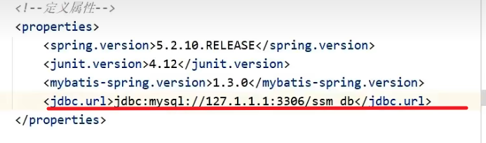
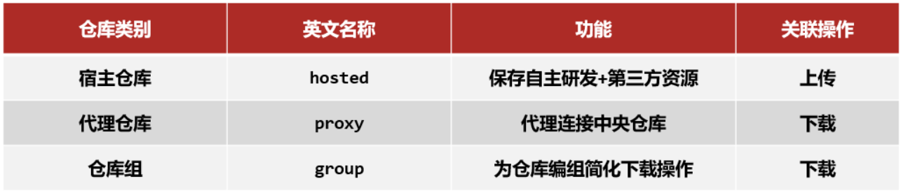

# Maven_MindMap

此思维导图主要参考 [【黑马程序员 SSM 框架教程】](https://www.bilibili.com/video/BV1Fi4y1S7ix) 里的 maven 部分。简略部分请参考课程讲义，讲义写的很清楚，课程讲的很明白，思维导图只有整体上快速浏览的作用

## 特点（feature）

-   标准化的项目结构
    -   不同 IDE 都能用
-   标准化的构建流程
    -   比如编译、测试、打包、发布，这些操作
-   依赖管理
    -   用简单的坐标配置 管理各种依赖

## 组成（component）

-   Maven 模型
    -   项目对象模型(Project Object Model)
    -   依赖管理模型(Dependency)
    -   插件(Plugin)
-   Repository
    -   Local - Remote - Central
    -   Remote 一开始会下载 Central 大多的 jar 包，让 Local 通过 Remote 下载会下载更快

## 常用命令及生命周期

-   常用命令
-   生命周期（lifecycle）
    -   default ：核心工作，例如编译——测试——打包——安装等。
        -   ‘——’ 中间还有其它命令
    -   clean ：清理工作。
    -   site ： 产生报告，发布站点等。这套声明周期一般不会使用。

## 依赖管理

### 分模块开发

-   按照功能拆分
    -   例子：银行的项目分三种
        -   银行柜台或者取款机
        -   网页上登录银行网站
        -   手机 app 银行
    -   容错性：按照功能将项目进行拆分后，app 功能模块出问题不会影响网站的模块
-   按照模块拆分
    -   比如电商的项目中订单和商品两个模块
    -   复用性、可维护性。重复代码可抽取出来做成模块，被其它的项目所依赖
-   意义

    -   将原始模块按照功能拆分成若干个子模块，方便模块间的相互调用，接口共享。

-   实现
    -   在设计阶段把模块拆分好，然后分给不同组来开发
    -   不同组之前可以靠依赖管理等来相互调用，接口共享

### 传递依赖

-   `A依赖B,B依赖C`,`C`通过依赖传递会被`A`使用到
-   主要看图，看视频更快懂，因为本身很简单
-   直接依赖
-   间接依赖

### 依赖冲突

-   定义：项目依赖的某一个 jar 包，有多个不同的版本，因而造成类包版本冲突。
-   冲突的情况

    -   特殊优先：当同级配置了相同资源的不同版本，==后配置的覆盖先配置的==。
    -   路径优先：当依赖中出现相同的资源时，==层级越深，优先级越低==，层级越浅，优先级越高
    -   声明优先：当资源在相同层级被依赖时，配置顺序靠前的覆盖配置顺序靠后的

-   解决
    -   Maven 的`Dependencies`面板中==展示出来==，展示的是哪个版本，也就是说它选择的就是哪个版本
    -   用 Maven 面板中的`show Dependencies`
    -   用聚合和继承进行依赖管理

### 可选依赖和排除依赖

-   问题引入
    -   如果说现在不想让 maven_02_ssm 依赖到 maven_03_pojo，有哪些解决方案?

#### 方案一:可选依赖

-   可选依赖是隐藏当前工程所依赖的资源，隐藏后对应资源将**不具有依赖传递**
-   自身对工程有控制权

#### 方案二:排除依赖

-   引入
    -   第三方给你的依赖，你很难让它加个可选依赖
-   排除依赖指==主动断开依赖==的资源，被排除的资源无需指定版本---不需要
-   自身对第三方工程没控制权

### 小结

-   `A依赖B,B依赖C`,`C`通过依赖传递会被`A`使用到，现在要想办法让`A`不去依赖`C`
-   可选依赖是在 B 上设置`<optional>`,`A`不知道有`C`的存在，
-   排除依赖是在 A 上设置`<exclusions>`,`A`知道有`C`的存在，主动将其排除掉。

## 聚合和继承

### 聚合

-   定义：将多个模块组织成一个整体，同时进行项目构建的过程称为聚合
-   作用：使用聚合工程可以将多个工程编组，通过对聚合工程进行构建，实现对所包含的模块进行同步构建
-   具体实现参考讲义

### 继承

-   引入三个重复配置的问题
-   `spring-webmvc`、`spring-jdbc`在三个项目模块中都有出现，这样就出现了重复的内容
    -   继承后提到 parent 即可
-   `spring-test`只在 ssm_crm 和 ssm_goods 中出现，而在 ssm_order 中没有，这里是部分重复的内容
    -   在 parent 里写 DependenciesManager
    -   需要用的子类导入坐标后不用写版本信息，版本跟随父类变
    -   不需要用的子类不导入坐标即可
-   我们使用的 spring 版本目前是`5.2.10.RELEASE`,假如后期要想升级 spring 版本，所有跟 Spring 相关 jar 包都得被修改，涉及到的项目越多，维护成本越高
    -   继承后在 parent 升级版本子类也全都升级了
-   具体实现参考讲义

### 聚合与继承的区别

两种之间的作用:

-   聚合用于快速构建项目，对项目进行管理
-   继承用于快速配置和管理子项目中所使用 jar 包的版本

聚合和继承的相同点:

-   聚合与继承的 pom.xml 文件打包方式均为 pom，可以将两种关系制作到同一个 pom 文件中
-   聚合与继承均属于设计型模块，并无实际的模块内容

聚合和继承的不同点:

-   聚合是在当前模块中配置关系，聚合==可以感知==到参与聚合的模块有哪些
-   继承是在子模块中配置关系，父模块==无法感知==哪些子模块继承了自己

## 属性

### 普通使用

-   问题引入
    -   更新 Spring 的版本，父模块的 pom 里有很多的 `5.2.10.RELEASE`，一个个手动改容易出错
-   解决：在 `<properties>` 标签中定义属性，需要属性的就引入即可

### 配置文件加载属性的实现步骤

1.  `<properties>` 里写配置文件（jdbc.properties）的数据

2.  `<build>` `<resources>` `<resource>` `<directory>`里写配置文件的目录

3.  配置文件（jdbc.properties） 文件中引用属性

4.  改进：`<directory>` 里用内置属性

## 多环境配置与应用

## 私服

-   私服是一台独立的服务器，用于解决团队内部的资源共享与资源同步问题

### 仓库分类

-   宿主仓库 hosted

    -   保存无法从中央仓库获取的资源
        -   自主研发
        -   第三方非开源项目,比如 Oracle,因为是付费产品，所以中央仓库没有

-   代理仓库 proxy

    -   代理远程仓库，通过 nexus 访问其他公共仓库，例如中央仓库

-   仓库组 group

    -   将若干个仓库组成一个群组，简化配置
    -   仓库组不能保存资源，属于设计型仓库

-   以一个项目团队为例，里面有很多小组。

    -   每个小组有一个 group
    -   hosted 是小组内自己用的
    -   proxy 是所有小组共用的

### 私服安装和配置

-   具体参考讲义，跟着配就行
