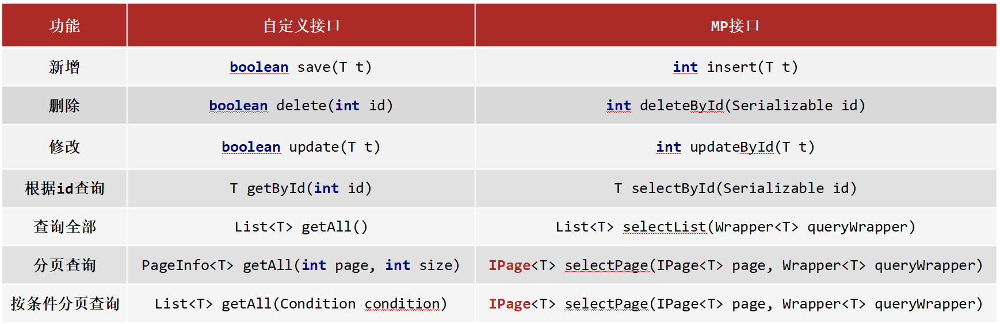
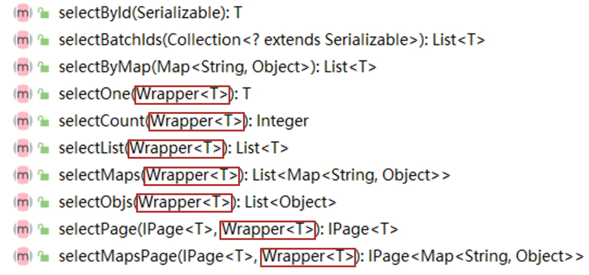
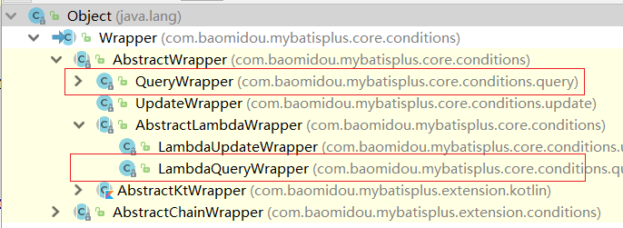
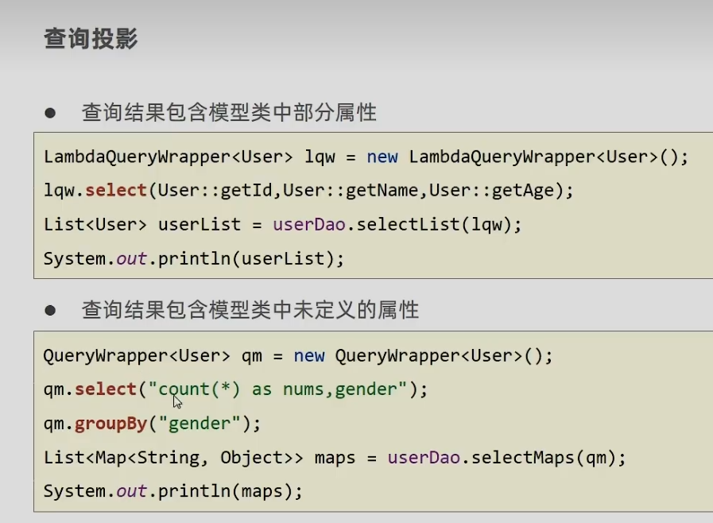
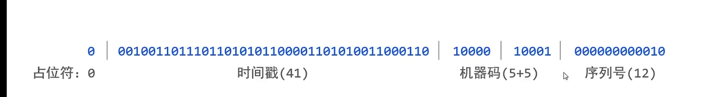

# MyBatisPlus_MindMap

## 前言

-   具体使用在讲义的步骤和视频里有详细描述
-   [思维导图链接](https://www.processon.com/view/link/636a64446376897f2b0fb9fb)
-   课程参考黑马 2022 SSM 课程，省略部分请参考课程视频和讲义，讲的更详细，清楚
    -   省略原因也有思维导图不方便展示，比如长篇代码，和长篇文字

### 简化 SQL 语句的编写

-   
-   MyBatisPlus 底层写好了 BaseMapper\<T> 接口，帮助简化 dao 的开发

### Lombok

-   简化实体类的编写
-   注解
    -   ==@Data:是个组合注解，包含一下的注解的功能==
        -   @Setter:为模型类的属性提供 setter 方法
        -   @Getter:为模型类的属性提供 getter 方法
        -   @ToString:为模型类的属性提供 toString 方法
        -   @EqualsAndHashCode:为模型类的属性提供 equals 和 hashcode 方法
    -   ==@NoArgsConstructor:提供一个无参构造函数==
    -   ==@AllArgsConstructor:提供一个包含所有参数的构造函数==

### 拦截器实现

-   在 MVC 里我们用拦截器拦截动态资源（对应的 url），或给 Controller 方法执行的前后添加业务
-   在 MyBatisPlus 里给对应的 SQL 语句做增强
-   改变后的 SQL 语句可以通过打卡日志查看
    -   开启日志功能性能就会受到影响，调试完后记得关闭。
-   拦截器的底层是 AOP
-   MyBatisPlus 使用
    -   拦截器 MP 已经为我们提供好了，我们只需要将其配置成 Spring 管理的 bean 对象即可。
    -   然后调用对应的方法，拦截器就会把方法做增强

#### 分页功能

-   PaginationInnerInterceptor
    -   里面写好了 beforeQuery
-   用 limits 给 select 语句做增强
-   数据在 Ipages 分页对象里

#### 乐观锁的拦截器

-   用 where 和 version + 1 给 update 做增强

### 代码生成器

## DQL

-   MP 只是对 MyBatis 的增强，如果 MP 实现不了，我们可以直接在 DAO 接口中使用 MyBatis 的方式实现
    -   比如子查询还是在 XML 写轻松

### 条件查询的类

-   不同的查询方法需要传入 Wrapper 来构建查询条件
    -   
-   Wrapper 接口，下有两个构建查询条件对象的实现类
    -   
-   以下是构建查询对象的两个类

#### QueryWrapper

-   可以在 QueryWrapper 的基础上使用 lambda
    -   `qw.lambda().lt(User::getAge, 10);`
    -   这样就不会存在写错名称的情况

#### LambdaQueryWrapper

-   `lqw.lt(User::getAge, 10);`
-   聚合（分组函数）与分组查询，无法使用 lambda 表达式来完成，所以有 QueryWrapper 的使用场景

### 条件查询

#### 单表查询的 SQL 执行顺序

1. from
2. where
3. group by （后续才能用分组函数）
4. having
5. select
6. order by
7. limit..

#### 按条件查询

-   大于小于等于，或和与，like（模糊），排序 等
-   链式编程的编写

#### null 值判定

-   引入：范围查询需要两个值
    -   
-   解决：新建一个模型类 UserQuery ,让其继承 User 类，并在其中添加 age2 属性
    -   `lqw.lt(null!=uq.getAge2(),User::getAge, uq.getAge2());`
    -   `lqw.gt(null!=uq.getAge(),User::getAge, uq.getAge());`

### 查询投影

-   
    -   第二个即实体类有的属性，表中没有对应属性的字段
-   查询投影即不查询所有字段，只查询出指定内容的数据。
-   有三种，用指定字段、分组函数（max()等）和分组查询实现（group by）实现

#### 分组函数

-   可取别名
-   `lqw.select("avg(age) as avgAge");`

#### 分组查询

### 映射匹配兼容性

-   @TableField
    -   value 属性解决 表字段与编码属性设计不同步
    -   exist 属性解决 实体类添加了数据库中未定义的属性
    -   select 属性解决 处理字段查看权限
        -   false 表示默认不查询该字段。
-   @TableName 解决表名与编码开发设计不同步
    -   另外 MyBatisPlus 原本可以对应实体类名称找对应的表

## DML

### ID 生成策略控制

-   @TableId
    -   value(默认)：设置数据库表主键名称
    -   type:设置主键属性的生成策略，值查照 IdType 的枚举值
-   细节
    -   用 Auto 数据库客户端也要开启 auto increment，不同的话要关闭
-   ID 生成策略对比

    -   每一种主键策略都有自己的优缺点，根据自己项目业务的实际情况来选择使用才是最明智的选择。
    -   NONE:
        -   不设置 id 生成策略，MP 不自动生成，约等于 INPUT,所以这两种方式都需要用户手动设置。
        -   手动设置第一个问题是容易出现相同的 ID 造成==主键冲突==，为了保证主键不冲突就需要做很多判定，实现起来比较复杂
    -   AUTO:
        -   数据库 ID 自增,这种策略适合在数据库服务器只有 1 台的情况下使用,不可作为分布式 ID 使用
    -   ASSIGN_UUID:
        -   可以在分布式的情况下使用，而且能够保证唯一，但是生成的主键是 32 位的字符串，==长度过长==占用空间而且还不能排序，查询性能也慢
    -   ASSIGN_ID:

        -   可以在分布式的情况下使用，生成的是 Long 类型的数字，可以==排序性能==也高，但是生成的策略和==服务器时间==有关，如果修改了系统时间就有可能导致出现重复主键

        -   

### 逻辑删除

-   @TableLogic
    -   value：逻辑未删除值 delval:逻辑删除值
-   原理
    -   用日志看 SQL 语句就明白逻辑删除 deleted 的原理是把语句改成 update
    -   所以要查被删除后的记录要重新写 select

### 乐观锁

-   解决秒杀场景
-   实现原理
    -   用拦截器做增强 update 语句
    -   同时两个人得到 version，快的那个人把 version + 1，慢的人就不能根据手中的 version 值修改收据了，因为现在要 version + 1 的数据才能修改
-   实现步骤
    -   @Version 注解字段
    -   添加乐观锁的拦截器

### 简化配置

-   全局配置还有很多可以设置：比如表名的前缀，定义逻辑删除的属性

## 代码生成器

-   原理是模板，由 MP 提供最佳实践。底层是 IO 操作，把模板自定义或导入
-   配置的方向和步骤具体参考讲义
-   配置的方向
    -   全局配置
    -   包名配置
    -   策略配置
