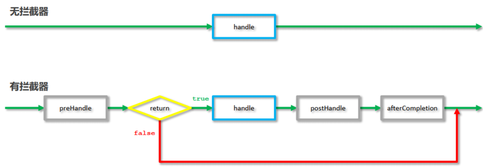

# SpringMVC_MindMap

-   [思维导图链接](https://www.processon.com/view/link/636a64446376897f2b0fb9fb)
-   课程参考黑马 2022 SSM 课程，省略部分请参考课程视频和讲义，讲的更详细，清楚
    -   省略原因也有思维导图不方便展示，比如长篇代码，和长篇文字

## SpringMVC 简介

-   定义：一种基于 Java 实现 MVC 模型的轻量级 Web 框架
-   优点

    -   使用简单、开发便捷(相比于 Servlet)
    -   灵活性强

-   三层架构
    -   将后端服务器 Servlet 拆分成三层，分别是 web、service 和 dao
    -   问题：Servlet 处理请求和数据的时候，一个 Servlet 只能处理一个请求
        -   可以回想 cookie、session 的那些 ServletA 和 ServletB。
    -   进而优化为 MVC
-   MVC 设计模式

    -   
    -   controller 负责接收请求和数据
    -   service 根据需要会调用 dao 对数据进行增删改查
    -   dao 把数据处理完后将结果交给 service,service 再交给 controller

-   SpringMVC 主要负责
    -   controller 如何接收请求和数据
    -   如何将请求和数据转发给业务层
    -   如何将响应数据转换成 json 发回到前端
        -   补充：前端发送异步请求

## SpringMVC 入门案例

### 创建容器

-   `ServletContainersInitConfig extends AbstractDispatcherServletInitializer`
    -   ServletContainersInitConfig 替代 web.xml
    -   web.xml 作用
        -   用来初始化配置信息：比如 Welcome 页面、servlet、servlet-mapping、filter、listener、启动加载级别等
-   ` AbstractDispatcherServletInitializer` 类
    -   是 SpringMVC 提供的快速初始化 Web3.0 容器的抽象类
    -   提供三个接口
        -   createServletApplicationContext()
            -   用来加载 SpringMVC 环境
        -   createRootApplicationContext()
            -   用来加载 Spring 环境
        -   getServletMappings()
            -   设定 SpringMVC 对应的请求映射路径，即 SpringMVC 拦截哪些请求
        -   上述配置方式需要创建`AnnotationConfigWebApplicationContext`对象，不用手动`register`对应的配置类
    -   简化配置方式：使用它的子类`AbstractAnnotationConfigDispatcherServletInitializer`
        -   getRootConfigClasses()
        -   getServletConfigClasses()
        -   getServletMappings()
    -   两种配置方式的区别：父类接口，子类接口优化形式

### 注解

-   @Controller
-   @RequestMapping:
    -   设置当前控制器方法请求访问路径
-   @ResponseBody

    -   设置当前控制器方法响应内容为当前返回值，无需解析
    -   方便返回 JSON 数据

### 工作流程解析

#### 启动服务器初始化过程

-   1.服务器启动，执行 ServletContainersInitConfig 类，初始化 web 容器
-   2.执行 createServletApplicationContext 方法，创建了 WebApplicationContext 对象
    -   加载 SpringMvcConfig 配置类
        -   执行@ComponentScan 加载对应的 bean
    -   加载 UserController，每个 @RequestMapping 的名称对应一个具体的方法
-   3.执行 getServletMappings 方法，设定 SpringMVC 拦截请求的路径规则

#### 单次请求过程

-   1. 发送请求`http://localhost/save`
-   2. web 容器发现该请求满足 SpringMVC 拦截规则，将请求交给 SpringMVC 处理
-   3. 解析请求路径/save
-   4. 由/save 匹配执行对应的方法 save(）
-   5. 执行 save()
-   6. 检测到有@ResponseBody 直接将 save()方法的返回值作为响应体返回给请求方

### bean 加载控制

-   解决问题：让 SpringMVC 和 Spring 不重复加载呢 bean
-   解决思路：加载 Spring 控制的 bean 的时候排除掉 SpringMVC 控制的 bean
-   解决方法
    -   方式一:Spring 加载的 bean 设定扫描范围为精准范围，例如 service 包、dao 包等
    -   方式二:Spring 加载的 bean 设定扫描范围为 com.itheima,==排除==掉 controller 包中的 bean
        -   使用@ComponentScan 的 excludeFilters 属性
    -   方式三:不区分 Spring 与 SpringMVC 的环境，加载到同一个环境中[了解即可]
-   方式一和方式二的区别

    -   Springboot 源码中用到方式二的 Filter 来做 bean 加载的细粒度控制
    -   但日常开发还是用方式一

-   补充：使用 Mybatis 时， Dao 对象由谁加载？
    -   Dao 最终是交给`MapperScannerConfigurer`对象来进行扫描处理
    -   `MapperScannerConfigurer` 是 Mybatis 配置类中处理原始配置文件中的 mappers 相关配置，加载数据层的 Mapper 接口类
    -   可加载 Dao 接口，创建代理对象保存到 IOC 容器中

## 请求与响应

-   SpringMVC 的主要的作用就是用来接收前端发过来的请求和数据然后经过处理并将处理的结果响应给前端，

### 请求

#### 设置请求映射路径

-   @RequestMapping 写到类上，降低耦合度

#### 参数传递

##### 简介

-   把请求参数传到 controller 层的方法里
-   获取请求参数的方式：
    -   写到方法形参中
    -   加形参注解 @RequestParam
-   @RequestParam
    -   作用 绑定请求参数与处理器方法形参间的关系
    -   相关属性
        -   required：是否为必传参数
        -   defaultValue：参数默认值

##### 参数类型

-   后期要把各种数据类型封装成前后端统一敲定的数据格式
-   POJO 和嵌套 POJO，集合
-   日期类型
    -   使用形参注解 @DateTimeFormat
    -   有属性 pattern：指定日期时间格式字符串
-   JSON 数据传输参数
    -   需要在 SpringMVC 的配置类用 @EnableWebMvc
    -   形参注解 @RequestBody
        -   将请求中请求体所包含的数据传递给请求参数

##### 参数的数据类型转换的 内部实现原理

-   SpringMVC 中提供了很多类型转换接口和实现类
-   比如 Converter 接口的实现类
    -   
-   比如 HttpMessageConverter 接口
    -   该接口是实现对象与 JSON 之间的转换工作
    -   可以处理 JSON 数据格式的请求和响应

### 响应

-   响应 JSON 数据
-   @ResponseBody
    -   方法\类注解
    -   设置当前控制器返回值作为响应体
    -   例子
        -   方法的返回值为字符串，会将其作为文本内容直接响应给前端
        -   方法的返回值为对象，会将对象转换成 JSON 响应给前端

## Rest 风格

-   简介
    -   REST 是一种软件架构风格，可以降低开发的复杂性，提高系统的可伸缩性，后期的应用也是非常广泛。

### 开发方式及其注解

-   (1)设定 Http 请求动作(动词)

    -   @RequestMapping(value="",==method== = RequestMethod.==POST|GET|PUT|DELETE==)
    -   简化写法：@GetMapping @PostMapping @PutMapping @DeleteMapping

-   (2)设定请求参数(路径变量)

    -   @RequestMapping(value="/users/=={id}==",method = RequestMethod.DELETE)
    -   简化写法 @DeleteMapping("/{id}")

-   (3)接收参数

    -   public String delete(==@PathVariable== Integer ==id==){}
    -   @PathVariable：绑定路径参数与处理器方法形参间的关系，要求路径参数名与形参名一一对应

-   (4)响应 JSON 数据
    -   使用 @ResponseBody 注解
    -   简化写法：@RestController 注解替换@Controller 与@ResponseBody 注解

### 用于接收参数的注解总结

-   `@RequestBody`、`@RequestParam`、`@PathVariable`

-   区别

    -   @RequestParam 用于接收** url 地址传参，表单传参**【application/x-www-form-urlencoded】
    -   @RequestBody 用于接收 **json 数据**【application/json】
    -   @PathVariable 用于接收路径参数，使用{参数名称}描述路径参数

-   应用
    -   后期开发中，发送 json 格式数据为主，@RequestBody 应用较广
    -   如果发送非 json 格式数据，选用@RequestParam 接收请求参数
    -   采用 RESTful 进行开发，当参数数量较少时，例如 1 个，可以采用@PathVariable 接收请求路径变量，通常用于传递 id 值

## SSM 整合

-   流程分析

### (1) 创建工程

-   创建一个 Maven 的 web 工程
-   pom.xml 添加 SSM 需要的依赖 jar 包
-   编写 Web 项目的入口配置类，实现`AbstractAnnotationConfigDispatcherServletInitializer`重写以下方法
    -   getRootConfigClasses() ：返回 Spring 的配置类->需要==SpringConfig==配置类
    -   getServletConfigClasses() ：返回 SpringMVC 的配置类->需要==SpringMvcConfig==配置类
    -   getServletMappings() : 设置 SpringMVC 请求拦截路径规则
    -   getServletFilters() ：设置过滤器，解决 POST 请求中文乱码问题

### (2) SSM 整合[==重点是各个配置的编写==]

#### SpringConfig

-   标识该类为配置类 @Configuration
-   扫描 Service 所在的包 @ComponentScan
-   在 Service 层要管理事务 @EnableTransactionManagement
-   读取外部的 properties 配置文件 @PropertySource
-   整合 Mybatis 需要引入 Mybatis 相关配置类 @Import
    -   第三方数据源配置类 JdbcConfig
        -   构建 DataSource 数据源，DruidDataSouroce,需要注入数据库连接四要素， @Bean @Value
        -   构建平台事务管理器，DataSourceTransactionManager,@Bean
    -   Mybatis 配置类 MybatisConfig
        -   构建 SqlSessionFactoryBean 并设置别名扫描与数据源，@Bean
        -   构建 MapperScannerConfigurer 并设置 DAO 层的包扫描

#### SpringMvcConfig

-   标识该类为配置类 @Configuration
-   扫描 Controller 所在的包 @ComponentScan
-   开启 SpringMVC 注解支持 @EnableWebMvc

### (3) 功能模块[与具体的业务模块有关]

-   创建数据库表
-   根据数据库表创建对应的实体类 Entity
-   通过 Dao 层完成数据库表的增删改查(接口+自动代理)
-   编写 Service 层[Service 接口+实现类]
    -   @Service
    -   @Transactional
    -   整合 Junit 对业务层进行单元测试
        -   @RunWith
        -   @ContextConfiguration
        -   @Test
-   编写 Controller 层
    -   REST 风格：@RestController
    -   接收请求 @RequestMapping @GetMapping @PostMapping @PutMapping @DeleteMapping
    -   接收数据 简单、POJO、嵌套 POJO、集合、数组、JSON 数据类型
        -   @RequestParam
        -   @PathVariable
        -   @RequestBody
    -   转发业务层
        -   @Autowired
    -   响应结果
        -   @ResponseBody

## 前后端交互

### 统一结果封装

-   需求：对于前端来说，如果后台能够返回一个统一的数据结果，前端在解析的时候就可以按照一种方式进行解析。开发就会变得更加简单。
-   实现思路
    -   为了封装返回的结果数据:==创建结果模型类，封装数据到 data 属性中==
    -   为了封装返回的数据是何种操作及是否操作成功:==封装操作结果到 code 属性中==
    -   操作失败后为了封装返回的错误信息:==封装特殊消息到 message(msg)属性中==

### 统一异常处理

#### 引入

-   需求：代码各个位置，各层都会出现异常，我们需要整合处理
-   实现思路
    -   所有的异常均抛出到表现层统一进行处理
    -   使用异常分类将所有的异常都处理到
    -   使用 AOP 简化同一类异常处理的代码
-   综上：SpringMVC 提供了异常处理器，可集中的、统一的处理项目中出现的异常

#### 异常分类以及解决方案

##### 业务异常（BusinessException）

-   定义
    -   规范的用户行为产生的异常
        -   比如：用户在页面输入内容的时候未按照指定格式进行数据填写，如在年龄框输入的是字符串
    -   不规范的用户行为操作产生的异常
        -   如用户故意传递错误数据，填入不正确的网址
-   解决方案
    -   发送对应消息传递给用户，提醒规范操作
        -   大家常见的就是提示用户名已存在或密码格式不正确等

##### 系统异常（SystemException）

-   定义
    -   项目运行过程中可预计但无法避免的异常
    -   比如数据库或服务器宕机
-   解决方案
    -   发送固定消息传递给用户，安抚用户
        -   系统繁忙，请稍后再试
    -   发送特定消息给运维人员，提醒维护
    -   记录日志
        -   发消息和记录日志对用户来说是不可见的，属于后台程序

##### 其他异常（Exception）

-   定义
    -   编程人员未预期到的异常，如:用到的文件不存在
    -   后续会归类为系统异常和业务异常
-   解决方案
    -   发送固定消息传递给用户，安抚用户
    -   发送特定消息给编程人员，提醒维护（纳入预期范围内）
        -   一般是程序没有考虑全，比如未做非空校验等
    -   记录日志

#### 异常处理器的使用

##### 注解知识

-   类注解 @RestControllerAdvice
    -   相当于 @ResponseBody + @Componen + @ControllerAdvice
    -   为 Rest 风格开发的控制器类做增强
-   方法注解 @ExceptionHandler
    -   设置指定异常的处理方案，功能等同于控制器方法，出现异常后终止原始控制器执行,并转入当前方法执行

##### 步骤

-   

-   1.自定义异常处理器，用于封装异常信息，对异常进行分类
    -   比如写 SystemException 和 BusinessException 的类
-   2.将其他异常包成自定义异常
    -   在 throw new 后面写自己定义的异常类型
-   3.在处理器类中处理自定义异常
    -   在类上写上 @RestControllerAdvice 做增强
    -   对应三种异常写三个带有 @ExceptionHandler 的方法

## 拦截器

### 简介

-   需求引入：在每个 Controller 方法执行的前后添加业务
-   拦截器定义（Interceptor）：
    -   是一种动态拦截方法调用的机制，在 SpringMVC 中动态拦截控制器方法的执行
    -   底层是 AOP
-   作用:
    -   在指定的方法的执行拦截或放行
    -   总结：拦截器就是用来给 controller 做增强

### 与过滤器 Filter 的区别

-   
-   归属不同：Filter 属于 Servlet 技术，Interceptor 属于 SpringMVC 技术
    -   有些 Interceptor 很容易实现的功能，Filter 不好实现
-   拦截内容不同：Filter 对所有访问进行增强，Interceptor 仅针对 SpringMVC 的访问进行增强
    -   能拦截的路径不同
    -   Interceptor 只能拦截 SpringMvc 获取的路径
    -   而 Filter 是在 tomcat 服务器前拦截的，能获取所有路径，拦截所有路径

### 执行流程

-   
-   当有拦截器后，请求会先进入 preHandle 方法
-   如果方法返回 true，则放行继续执行后面的 handle[controller 的方法]和后面的方法
-   如果返回 false，则直接跳过后面方法的执行。

### 前置处理方法的返回值和参数

`boolean preHandle(HttpServletRequest request, HttpServletResponse response, Object handler)`

-   执行顺序：原始方法之前运行 preHandle()
-   返回值
    -   通过返回值来决定是否要进行放行，我们可以把业务逻辑放在该方法中，如果满足业务则返回 true 放行，不满足则返回 false 拦截。
-   参数
    -   request:请求对象
    -   response:响应对象
    -   ==handler==:被调用的处理器对象，本质上是一个方法对象，对==反射==中的 Method 对象进行了再包装
        -   使用 handler 参数，可以获取方法的相关信息

### 拦截器链配置

-   创建多个拦截器类，并把它用 @Autowired 配置到配置拦截器的配置类中
-   具体使用参考黑马的 demo
