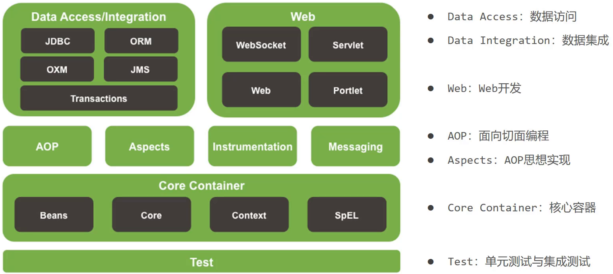
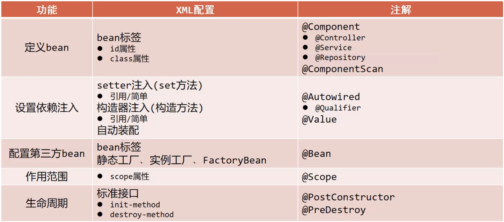
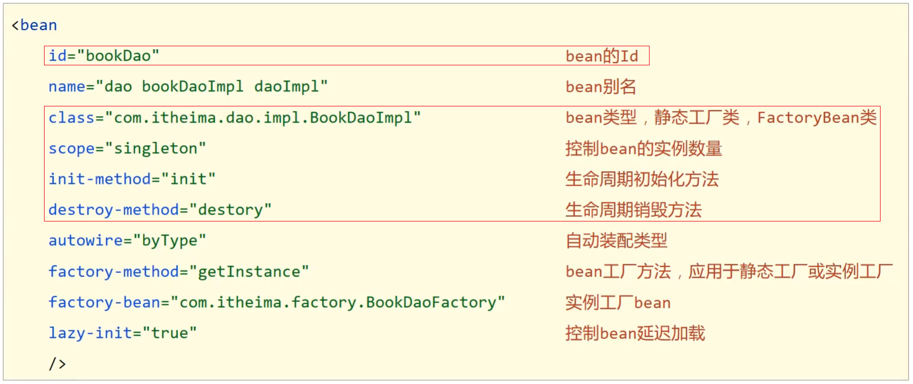
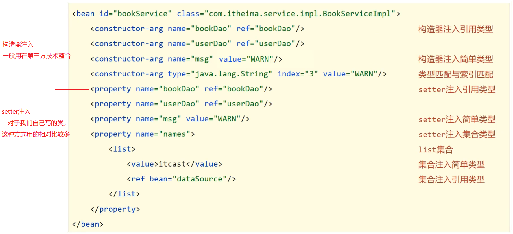
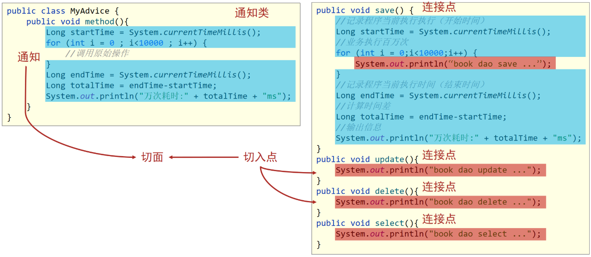
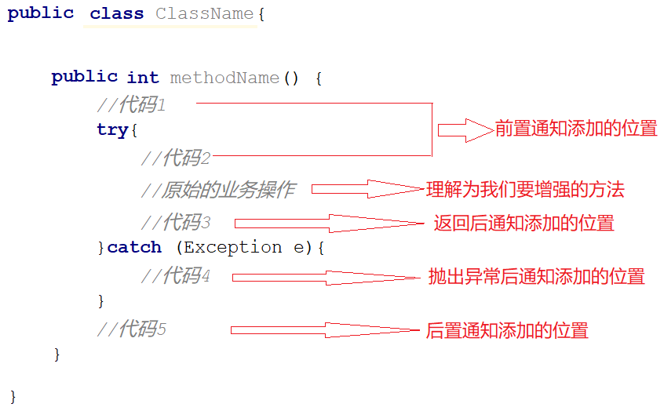
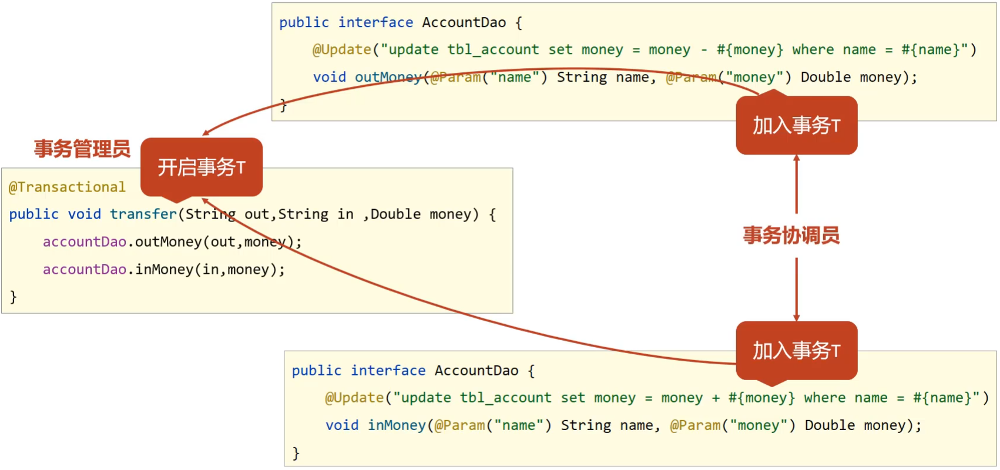
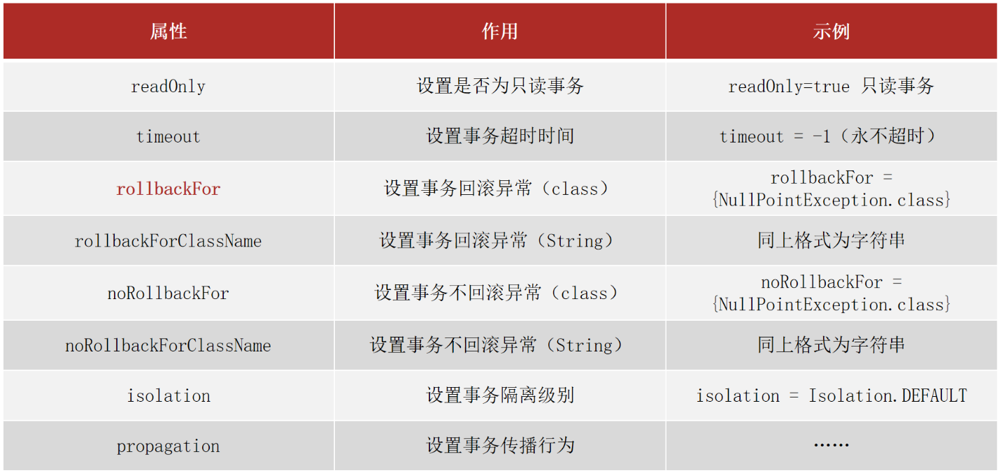
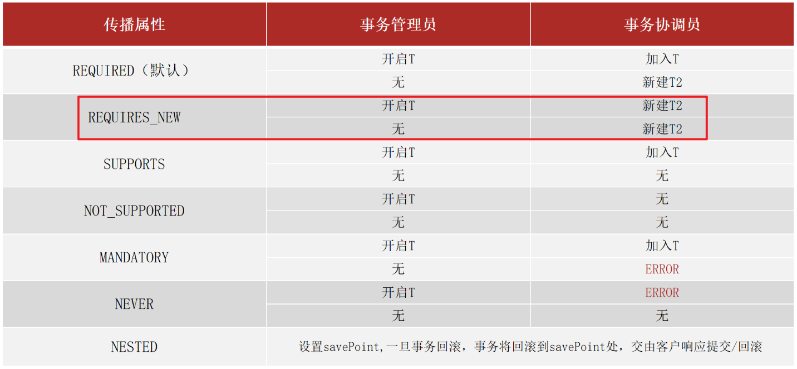

# Spring_MindMap

-   [思维导图链接](https://www.processon.com/view/link/635cc8d60791295cf8d6418d)
-   课程参考黑马 2022 SSM 课程，省略部分请参考课程视频和讲义，讲的更详细，清楚

-   Spring 4 系统架构
    -   

## IOC/DI

-   技术目的：充分解耦
-   开发模式主要分为注解和 XML 配置。
    -   

### IOC

#### 简介

-   Spring 实现了 IOC 思想，提供了 IOC 容器

##### IOC 思想是什么？

-   使用对象时，由主动 new 产生对象转换为==由外部提供对象==，此过程中对象创建控制权由程序转移到外部，此思想称为控制反转。
-   控制反转的是==对象的创建权==

##### IOC 容器的作用？

-   负责对象的创建、初始化等一系列工作，其中包含了数据层和业务层的类对象

##### IOC 容器内部存放的是什么？

-   放的就是一个个的 Bean 对象，被创建或被管理的对象在 IOC 容器中统称为==Bean==

#### 接口

-   BeanFactory 顶层接口
-   ApplicationContext 核心接口
-   初始化时 bean 立即加载，而 BeanFactory 延迟加载
-   ApplicationContext 接口提供基础的 bean 操作相关方法，通过其他接口扩展其功能
-   常用初始化类
    -   **==ClassPathXmlApplicationContext(常用)==**
    -   FileSystemXmlApplicationContext

### Bean

#### XML 及属性配置

-   

##### name

-   和 id 时同等的
-   获取 bean 无论是通过 id 还是 name 获取，如果无法获取到，将抛出异常 NoSuchBeanDefinitionException

##### scope

-   为何 bean 默认为单例？
    -   单例意味着 Spring 的 IOC 容器中只会有该类的一个对象
    -   bean 对象只有一个就避免了对象的频繁创建与销毁，达到了 bean 对象的==复用，性能高==
-   bean 在容器中是单例的，会不会产生线程安全问题?
    -   如果对象是有状态对象
        -   即该对象有成员变量可以用来存储数据的，
        -   因为所有请求线程共用一个 bean 对象，所以会存在线程安全问题。
    -   如果对象是无状态对象
        -   即该对象没有成员变量没有进行数据存储的，
        -   因方法中的局部变量在方法调用完成后会被**销毁**，所以不会存在线程安全问题。
-   哪些 bean 对象适合交给容器进行管理?
    -   可复用的
    -   表现层对象
    -   业务层对象
    -   数据层对象
    -   工具对象
-   哪些 bean 对象不适合交给容器进行管理?
    -   ==封装实例的域对象==，因为会引发线程安全问题，所以不适合。

##### bean 实例化：class

-   bean 是如何创建的呢?
    -   构造方法
-   实例化对象的三种方式
    -   构造方法(常用)
    -   静态工厂(了解)
    -   实例工厂(了解)
        -   FactoryBean(实用)

##### bean 生命周期`init-method`和`destroy-method`

-   主要理解 bean 在代码运行中的位置
-   初始化容器
    -   1.创建对象(内存分配)
    -   2.执行构造方法
    -   3.执行属性注入(set 操作)
    -   ==4.执行 bean 初始化方法==
-   使用 bean
    -   5.执行业务操作
-   关闭/销毁容器
    -   ==6.执行 bean 销毁方法==
-   关闭容器的两种方式:
    -   ConfigurableApplicationContext 是 ApplicationContext 的子类
    -   close()方法
    -   registerShutdownHook()方法

#### Annotation

##### 定义 bean

-   @Controller、@Service、@Repository 方便我们后期在编写类的时候能很好的区分出这个类是属于表现层、业务层还是数据层的类。

##### bean 管理

-   @Configuration
    -   定义为配置类
    -   语法对比
        ```java
        //加载配置文件初始化容器
        ApplicationContext ctx = new ClassPathXmlApplicationContext("applicationContext.xml");
        //加载配置类初始化容器
        ApplicationContext ctx = new AnnotationConfigApplicationContext(SpringConfig.class);
        ```
-   @ComponentScan
    -   对应 XML，`<context:component-scan/>`的作用是指定扫描包路径

##### 生命周期和作用范围

-   

### DI

-   给容器内不同 Bean 对象注入依赖关系

#### XML

-   

##### setter 注入

-   对于引用数据类型使用的是`<property name="" ref=""/>`
-   对于简单数据类型使用的是`<property name="" value=""/>`

##### 构造器注入

-   标准书写`<constructor-arg name="" ref或value="">`
    -   耦合高
    -   name 属性对应的值为构造函数中方法形参的参数名，必须要保持一致。
    -   ref 属性指向的是 spring 的 IOC 容器中其他 bean 对象。
-   其他书写：使用 type 属性；加入 index 属性

##### 自动装配

-   定义：IoC 容器根据 bean 所依赖的资源在容器中自动查找并注入到 bean 中的过程称为自动装配
-   两种方式
    -   byType。
        -   必须保障容器中相同类型的 bean ==唯一==
        -   例子：`<bean id="bookService" class="com.itheima.service.impl.BookServiceImpl" autowire="byType"/>`
        -   BookDaoImlp 依旧要提供 setter 方法
            -   虽然不是自己 new，但也要给 IOC，怎么给呢，用 setter 给
    -   byName：
        -   必须保障容器中具有指定名称的 bean，因变量名与配置耦合，不推荐使用
-   优先级
    -   自动装配优先级低于 setter 注入与构造器注入，同时出现时自动装配配置失效

##### 集合注入

#### Annotation

##### 关于反射和自动装配

-   自动装配基于反射设计创建对象并通过暴力反射为私有属性进行设值

    -   如下列代码：我们对 BookServiceImpl 进行暴力反射，并对 `private BookDao bookDao` 进行设置

        ```java
        @Service
        public class BookServiceImpl implements BookService {
            @Autowired
            private BookDao bookDao;

        //	  public void setBookDao(BookDao bookDao) {
        //        this.bookDao = bookDao;
        //    }
            public void save() {
                System.out.println("book service save ...");
                bookDao.save();
            }
        }
        ```

-   暴力反射是什么？
    -   可以可以访问类中**private**构造器/方法/属性

##### 注入类型

-   按照类型注入： @Autowired
-   按照名称注入
    -   使用到`@Qualifier`来指定注入哪个名称的 bean 对象。

#### 注解读取 properties 配置文件

-   @PropertySource
    -   加载配置文件
-   @Value
    -   读取配置文件中的内容

### IOC/DI 注解管理第三方 bean

-   第三方 bean 定义为 @Bean
-   @Import 导入多个配置类，配置类里有第三方 bean
-   配置类中的简单数据类型的注入
    -   在有`@PropertySource` 的基础上用 `@Value(${key})` 来注入
-   配置类中的引用类型的注入
    -   1.@ComponentScan()扫描引用类型
    -   2.为 bean 定义方法设置形参即可，容器会根据类型自动装配对象。

## AOP

### 简介

-   定义： Aspect Oriented Programming，一种编程范式，编程思想
-   作用：在不惊动原始设计的基础上为其进行功能增强。对应的编程理念：无入侵式

#### 核心概念

-   代理（Proxy）：SpringAOP 的核心本质是采用代理模式实现的
    -   目标对象无法直接完成工作，需要对其进行功能回填，通过原始对象的代理对象实现
-   目标对象（Target）：被代理的原始对象成为目标对象
    -   原始功能去掉共性功能对应的类产生的对象，这种对象是无法直接完成最终工作的
-   连接点（JoinPoint）：在 SpringAOP 中，理解为任意方法的执行
-   切入点（Pointcut）：
    -   匹配连接点的式子，也是具有共性功能的方法描述
-   通知（Advice）：若干个方法的共性功能，在切入点处执行，最终体现为一个方法
    -   通知是一个方法，方法不能独立存在需要被写在一个类中，这个类我们也给起了个名字叫==通知类==
-   切面（Aspect）：描述通知与切入点的对应关系
-   

### 工作流程

-   流程 1:Spring 容器启动
-   流程 2:读取所有切面配置中的切入点
    -   不匹配的连接点不会被读取
-   流程 3:初始化 bean
    -   判定 bean 对应的类中的方法是否匹配到任意切入点
    -   匹配失败：创建原始对象，但没有创建对应的代理对象。（匹配失败说明不需要增强，直接调用原始对象的方法即可。）
    -   匹配成功，创建原始对象（==目标对象==）的==代理==对象
-   流程 4:获取 bean 执行方法

### 切入点表达式

-   标准格式：动作关键字(访问修饰符 返回值 包名.类/接口名.方法名（参数）异常名)
    -   `execution(* com.itheima.service.*Service.*(..))`
    -   （参数）前必是方法名
    -   阅读方法：反着看
-   通配符
    -   `*`：匹配任意符号（常用）
    -   `..` ：匹配多个连续的任意符号（常用）
    -   `+`：匹配子类类型
-   书写技巧

    -   多用多体会，目的是追求高效

    1. 按==标准规范==开发
    2. 查询操作的返回值建议使用\*匹配
    3. 减少使用..的形式描述包
    4. ==对接口进行描述==，使用\*表示模块名，例如 UserService 的匹配描述为\*Service

        - 耦合更低

    5. 方法名书写保留动词，例如 get，使用\*表示名词，例如 getById 匹配描述为 getBy\*

    -   参数根据实际情况灵活调整

### 五种通知类型

-   

-   前置通知
-   后置通知
-   ==环绕通知（重点）==
    -   环绕通知依赖形参 ProceedingJoinPoint（作为形参第一位） 才能实现对原始方法的调用
        -   通知中如果未使用 ProceedingJoinPoint 对原始方法进行调用将跳过原始方法的执行
    -   环绕通知可以**隔离**原始方法的调用执行
        -   做权限校验
    -   环绕通知返回值设置为 Object 类型
        -   如果对原始方法的调用可以不接收返回值，通知方法设置成 void 即可
    -   环绕通知中可以对原始方法调用过程中出现的异常进行处理
        -   由于无法预知原始方法运行后是否会抛出异常，因此环绕通知方法必须要处理 Throwable 异常。
        -   也就是环绕通知不帮原始方法擦屁股，要处理异常
-   返回后通知
-   抛出异常后通知

### 通知中获取参数

-   获取切入点方法的参数，所有的通知类型都可以获取参数
    -   JoinPoint：适用于前置、后置、返回后、抛出异常后通知
    -   ProceedingJoinPoint：适用于环绕通知
-   获取切入点方法返回值，前置和抛出异常后通知是没有返回值，后置通知可有可无，所以不做研究
    -   返回后通知
    -   环绕通知
-   获取切入点方法运行异常信息，前置和返回后通知是不会有，后置通知可有可无，所以不做研究
    -   抛出异常后通知
    -   环绕通知

## Transaction

### 简介

-   事务作用：在数据层保障一系列的数据库操作同成功同失败
-   Spring 事务作用：在数据层或**==业务层==**保障一系列的数据库操作同成功同失败
    -   业务层的事务管理器，保证一个业务类方法中的所有方法同成功同失败
    -   比如保证加钱和减钱同时成功或者同时失败
-   事务管理器
    -   接口`interface PlatformTransactionManager`
        -   
        -   有 commit 和 rollback
    -   实现类 `DataSourceTransactionManager`
        -   可以在业务层管理事务。其内部采用的是 JDBC 的事务。

### 事务管理

-   三句话学会事务管理（课程代码 spring_24_case_transfer）
    -   SpringConfig 开启事务管理
        -   @EnableTransactionManagement
    -   jdbc.config 里配置事务管理器（@Bean）
        -   PlatformTransactionManager 和 DataSourceTransactionManager
    -   在对应的接口或类上注解事务
        -   @Transactional

### 事务角色和事务属性

#### 事务角色



-   事务管理员：发起事务方，在 Spring 中通常指代业务层开启事务的方法
-   事务协调员：加入事务方，在 Spring 中通常指代数据层方法，也可以是业务层方法

#### 事务属性

##### 事务配置

-   使用：在@Transactional 注解的参数上进行设置
    -   
-   关于 `rollbackFor`
    -   Spring 的事务只会对 Error 异常和 RuntimeException 异常及其子类进行事务回顾

##### 事务的传播行为

-   定义：事务协调员对事务管理员所携带事务的处理态度。
-   使用：在@Transactional 注解的参数上进行设置
    -   

## 框架整合

### Mybatis

-   具体参考讲义的案例实现步骤
-   Mybatis 的整合思路和步骤

    1.  创建 MybatisConfig 配置类
    2.  Spring 要管理 MyBatis 中的 SqlSessionFactory

        -   定义 bean，SqlSessionFactoryBean，用于产生 SqlSessionFactory 对象

    3.  Spring 要管理 Mapper 接口的扫描

        -   定义 bean，返回 MapperScannerConfigurer 对象

### Junit
