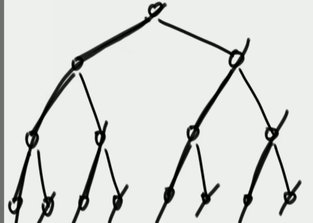
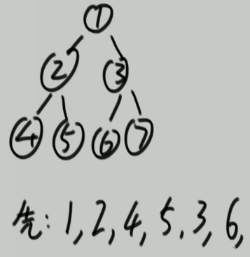

# 中序遍历的迭代法

> 思路参考：左程云算法课
> [94. 二叉树的中序遍历 leetcode 链接](https://leetcode.cn/problems/binary-tree-inorder-traversal/)

## 总体思路：

-   把二叉树划分为一条条左边界，把所有左边界遍历完，二叉树就遍历完了。
-   具体到结点的遍历，左中结点的遍历可以靠左右边界，右节点的可以看作左边界的第一个结点
-   下图向左下指向的线即左边界

-   

## 代码

```java
class Solution {
    public List<Integer> inorderTraversal(TreeNode root) {
        List<Integer> ans = new LinkedList<>();
        Stack<TreeNode> st = new Stack<>();

        // ‘root != null ’保证能开始遍历
        while (root != null || !st.isEmpty()) {
            if (root != null) { // 把现有的左边界压进栈
                st.push(root); // root 不空就把 root 压进栈
                root = root.left; // 然后 root 就能往左窜。
            } else { // 把左边界部分结点弹出，并形成新的左边界，
                root = st.pop();
                ans.add(root.val); // root 空了弹出把值加进 ans
                root = root.right; // 然后让 root 往右窜，看能否形成新的左边界。但第一次往右窜还可能会窜空，这时就回到‘中’结点
            }
        }
        return ans;
    }
}
```

## 几个问题

1. 左中结点如何按序弹出，且如何遍历到右结点，又如何窜到中结点？

    - 

    - 如下图当代码中的 root 随循环遍历到结点 ‘4’ 的位置（后续用 ‘’ 表示结点）。
    - 此时 `root != null` 我们先执行第一个分支 `` ,把 ‘4’ 压进栈，并把 root 设为 ‘4’ 的左结点
    - 此时 `root == null` 我们执行第二个分支，把 ‘4’ 弹出，并把 root 设为 ‘4’ 的右结点
    - 此时 `root == null` 我们执行第二个分支，把 ‘2’ 弹出，并把 root 设为 ‘2’ 的右结点（==窜到‘中’结点了==）
    - 如此我们就把 ‘2’ ‘4’ 按入栈的逆序弹出了，而且实现了==把 root 移动到右结点==，让 ‘5’ 作为新左边界的第一个结点

2. while 边界条件的设置依据

    - `!st.isEmpty()；`root 一直按序的把所有结点加进栈中，如果栈空了，那肯定也遍历完了
    - `root != null;` 一开始，栈是空的，root 还是根节点，此时要这个条件开始遍历

## 时间复杂度

-   O(N) 每个结点都被操作的基本动作只有 push 和 pop 两种，ans 的 add 动作也是与 N 成正比
