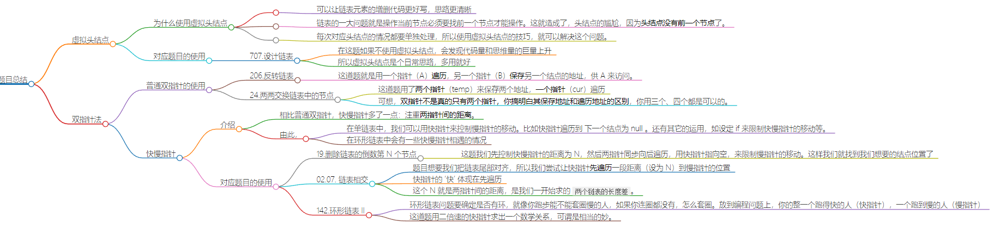

# 链表题目解法总结

## 虚拟头结点

### 为什么使用虚拟头结点

-   可以让链表元素的增删代码更好写，思路更清晰

> 链表的一大问题就是操作当前节点必须要找前一个节点才能操作。这就造成了，头结点的尴尬，因为**头结点没有前一个节点**了。

> 每次对应头结点的情况都要单独处理，所以使用虚拟头结点的技巧，就可以解决这个问题。

### 对应题目的使用

-   707.设计链表
    -   在这题如果不使用虚拟头结点，会发现代码量和思维量的巨量上升
    -   所以虚拟头结点是个日常思路，多用就好

## 双指针法

### 普通双指针的使用

-   206.反转链表
    -   这道题就是用一个指针（A）**遍历**，另一个指针（B）**保存**另一个结点的地址，供 A 来访问。
-   24.两两交换链表中的节点
    -   这道题用了**两个指针**（temp）来保存两个地址，**一个指针**（cur）遍历
    -   可想，**双指针不是真的只有两个指针，你搞明白其保存地址和遍历地址的区别**，你用三个、四个都是可以的。

### 快慢指针

#### 介绍

-   相比普通双指针，快慢指针多了一点：注重**两指针间的距离**。
-   由此，
    -   在单链表中，我们可以用快指针来控制慢指针的移动。比如快指针遍历到 下一个结点为 null 。还有其它的运用，如设定 if 来限制快慢指针的移动等。
    -   在环形链表中会有一些快慢指针相遇的情况

#### 对应题目的使用

-   19.删除链表的倒数第 N 个节点
    -   这题我们先控制快慢指针的距离为 N，然后两指针同步向后遍历，用快指针指向空，来限制慢指针的移动。这样我们就找到我们想要的结点位置了
-   02.07. 链表相交
    -   题目想要我们把链表尾部对齐，所以我们尝试让快指针**先遍历**一段距离（设为 N）到慢指针的位置
    -   快指针的 ‘快’ 体现在先遍历
    -   这个 N 就是两指针间的距离，是我们一开始求的 `两个链表的长度差`。
-   142.环形链表 II

    -   环形链表问题要确定是否有环，就像你跑步能不能套圈慢的人，如果你连圈都没有，怎么套圈。放到编程问题上，你的整一个跑得快的人（快指针），一个跑到慢的人（慢指针）
    -   这道题用二倍速的快指针求出一个数学关系，可谓是相当的妙。

-   参考：[代码随想录-链表总结篇](https://programmercarl.com/%E9%93%BE%E8%A1%A8%E6%80%BB%E7%BB%93%E7%AF%87.html)
