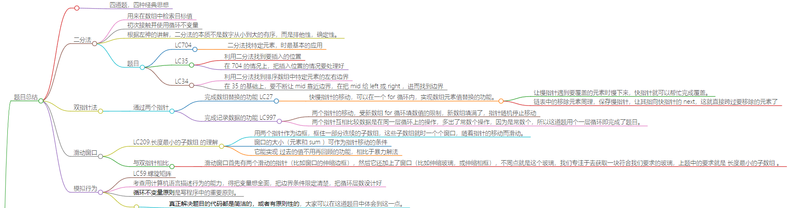

# 数组题目总结

具体题解建议参考[代码随想录](https://programmercarl.com/%E6%95%B0%E7%BB%84%E6%80%BB%E7%BB%93%E7%AF%87.html#%E6%95%B0%E7%BB%84%E7%90%86%E8%AE%BA%E5%9F%BA%E7%A1%80)

## 题目总结

-   四道题，四种经典思想

### 二分法

-   用来在数组中检索目标值
-   初次接触并使用**循环不变量**
    -   定义搜索的区间为左闭右闭或左闭右开
    -   后续要遵循前面区间的定义
-   根据左神的讲解，二分法的本质不是数字从小到大的有序，而是排他性，确定性。
-   题目
    -   LC704
        -   二分法找特定元素，时最基本的应用
    -   LC35
        -   利用二分法找到要插入的位置
        -   在 704 的情况上，把插入位置的情况要处理好
    -   LC34
        -   利用二分法找到排序数组中特定元素的左右边界
        -   在 35 的基础上，要让 mid 不断靠近边界，再把 mid 给 left 或 right ，进而找到边界

### 双指针法

-   通过两个指针
    -   完成数组替换的功能 LC27
        -   **快慢指针**的移动，可以在一个 for 循环内，实现数组元素值替换的功能。
            -   让慢指针遇到要覆盖的元素时慢下来，快指针就可以帮忙完成覆盖。
            -   链表中的移除元素同理，保存慢指针，让其指向快指针的 next，这就直接跨过要移除的元素了
    -   完成记录数据的功能 LC997
        -   这题也可以叫做**首尾指针**
        -   两个指针的移动，受新数组 for 循环填数值的限制，新数组填满了，指针随机停止移动
        -   两个指针互相比较数据是在同一层循环上的操作，多出了常数个操作，因为是常数个，所以这道题用个一层循环即完成了题目。

### 滑动窗口

-   LC209.长度最小的子数组 的理解
    -   用两个指针作为边框，框住一部分连续的子数组，这些子数组就时一个个窗口，随着指针的移动而滑动。
    -   窗口的大小（元素和 sum ）可作为指针移动的条件
    -   它能实现 过去的值不用再回顾的功能，相比于暴力解法
-   与双指针相比
    -   滑动窗口首先有两个滑动的指针（比如窗口的伸缩边框），然后它还加上了窗口（比如伸缩玻璃，或伸缩相框），不同点就是这个玻璃，我们专注于去获取一块符合我们要求的玻璃，上题中的要求就是 长度最小的子数组 。
